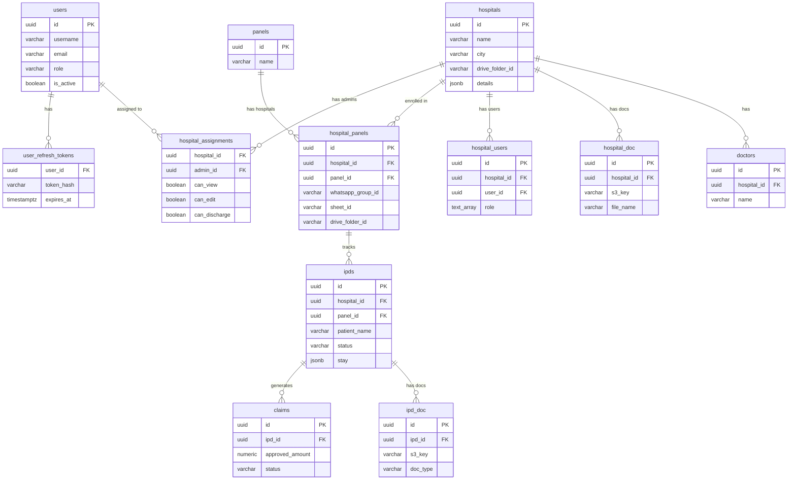
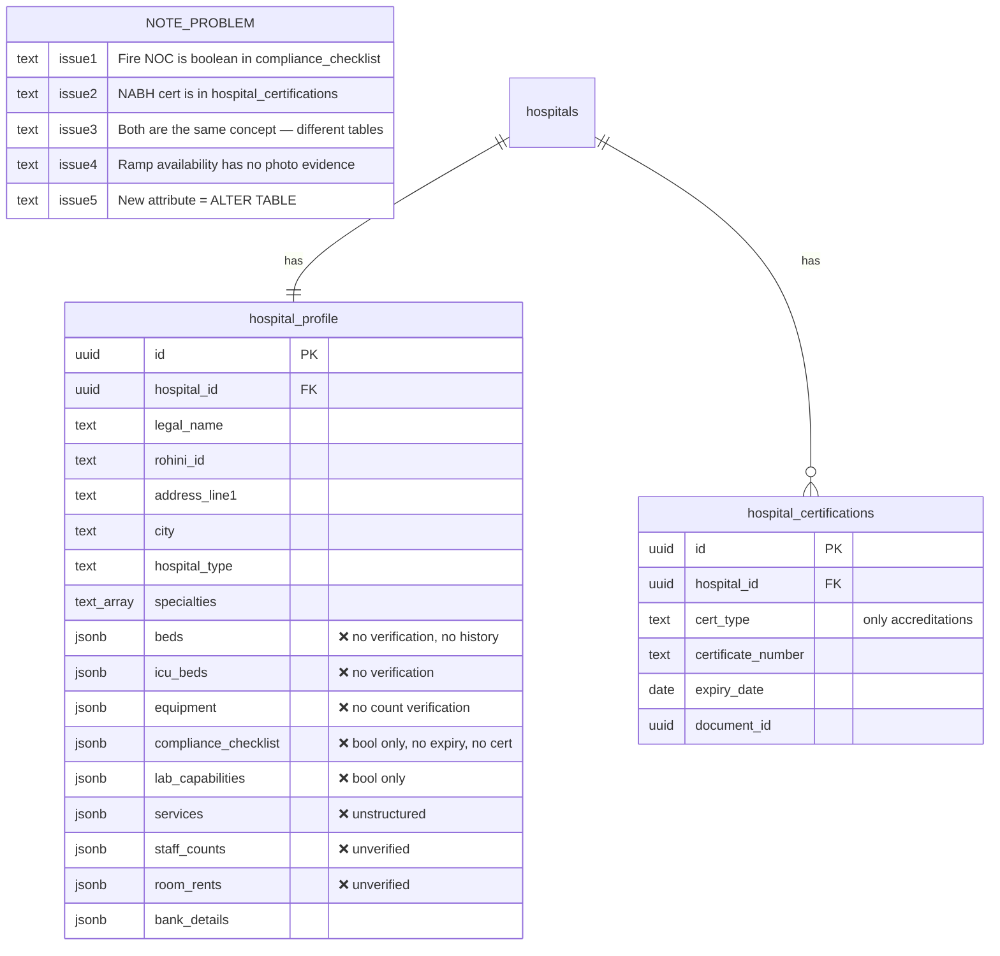
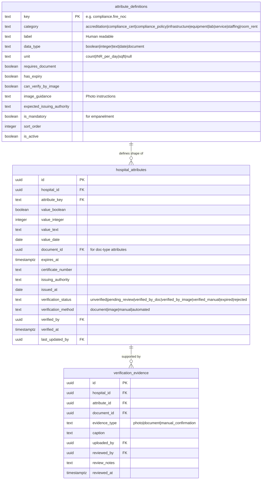
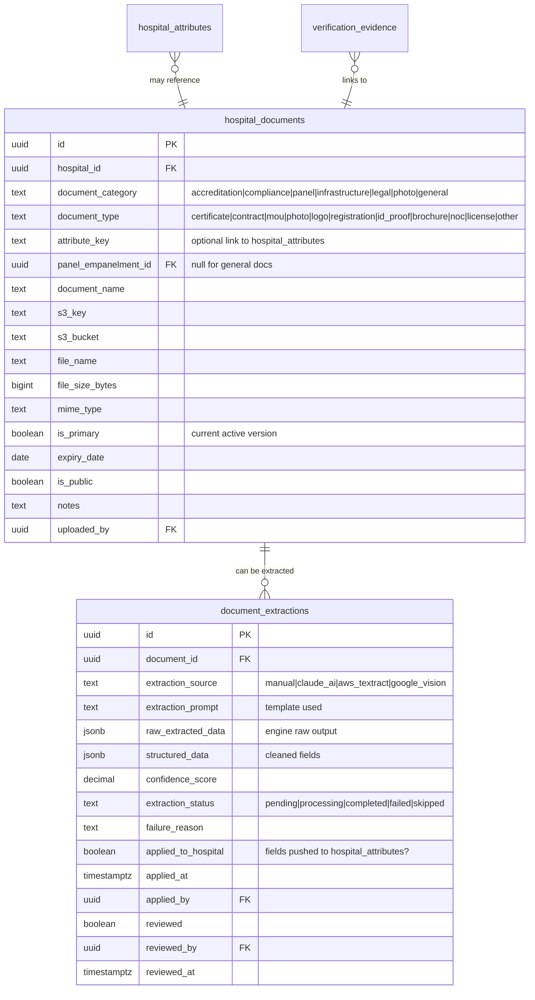
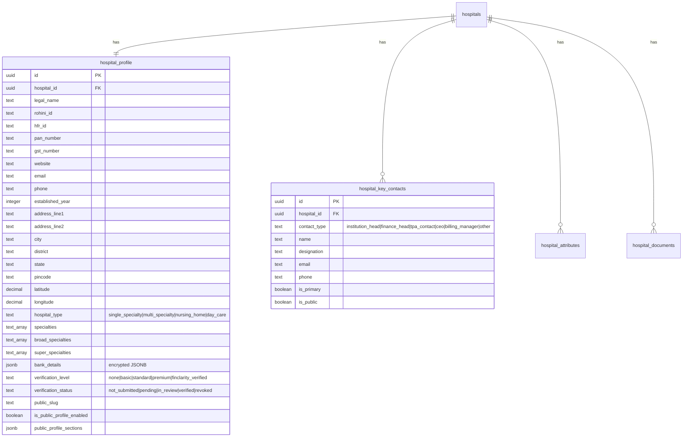
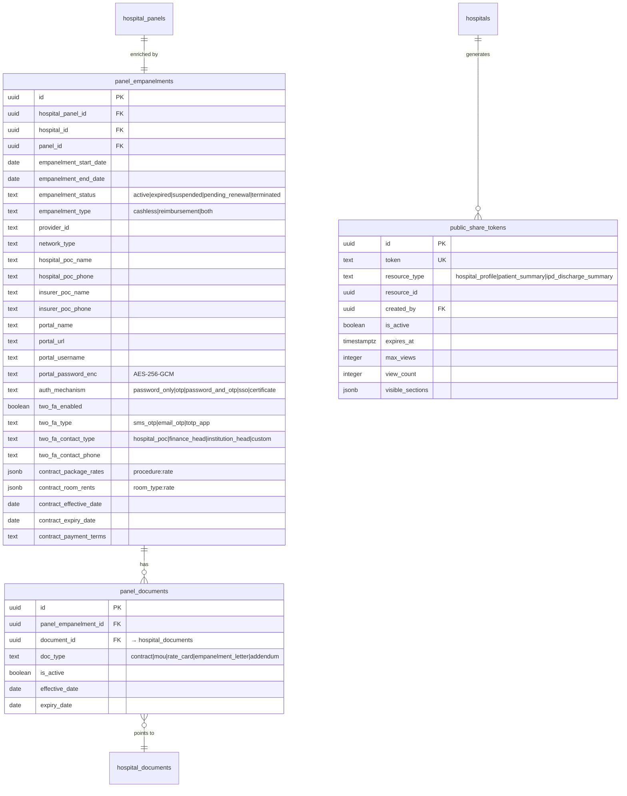
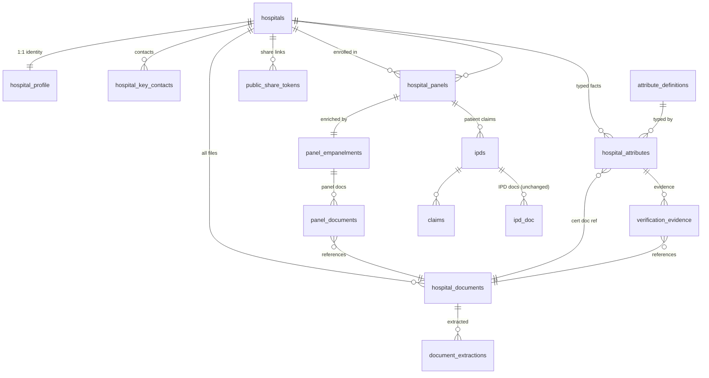

# ADR-001: Hospital Profile Data Architecture — v2

**Status:** Proposed  
**Date:** April 2026  
**Replaces:** `HOSPITAL_PROFILE_FEATURE.md` (v1 design)  
**Deciders:** Engineering, Product

---

## Context

The v1 design introduced `hospital_profile` with roughly 15 JSONB columns covering beds, ICU, equipment, compliance checklist, services, lab capabilities, staff counts, and room rents. While this avoids schema lock-in, it creates a different category of problems:

| v1 Problem | Consequence |
|------------|-------------|
| Compliance checklist as `JSONB { fire_protection_system: true }` | No expiry date, no certificate, no document link — a Fire NOC is a legal document with a renewal date, not a checkbox |
| Separate `hospital_certifications` table for accreditations + boolean JSONB for compliance | Same concept (certified compliance) modeled in two different ways |
| All infrastructure as JSONB blobs | Cannot attach verification evidence (photos) to individual items — "Ramp Availability" can't be verified by an image |
| No extraction pipeline for certificates | A Fire NOC PDF lands in S3 but its validity date stays locked in the PDF |
| Adding new attribute type = `ALTER TABLE` | Every new insurer requirement or regulatory change requires a migration |

The core insight: **compliance items, infrastructure attributes, equipment, beds, and accreditations are all the same conceptual object** — a verifiable, optionally time-bounded, optionally document-backed fact about a hospital. The only difference is category and data type.

---

## Decision

Replace all JSONB operational data blobs in `hospital_profile` with a typed **Attribute Store** pattern backed by an admin-managed **Attribute Definitions Catalog**. Pair it with a unified **Document Store** and an **Evidence + Extraction** pipeline.

`hospital_profile` retains only stable identity/address/banking data that never needs to be queried or filtered individually.

---

## Options Considered

### Option A: Keep JSONB blobs (v1)

| Dimension | Assessment |
|-----------|------------|
| Complexity | Low — simple to write |
| Queryability | Poor — cannot index or filter inside JSONB blobs |
| Extensibility | Adding a field = code change + doc change, no migration |
| Verification | Not supported — booleans have no evidence model |
| Document extraction | Not supported — no linkage between a JSONB value and a document |

**Verdict:** Rejected. Doesn't solve the core problem.

### Option B: Full normalization — one table per category

Create `hospital_beds`, `hospital_equipment`, `hospital_compliance_certs`, `hospital_accreditations`, `hospital_services`, etc.

| Dimension | Assessment |
|-----------|------------|
| Type safety | High — each table has correct column types |
| Migrations | Every new requirement = new table or new column |
| Code duplication | High — same CRUD logic in 8 tables |
| Verification model | Must be replicated across all tables |

**Verdict:** Rejected. Inflexible; we'll be writing migrations for every new insurer requirement.

### Option C: Typed Attribute Store + Catalog (selected)

One `attribute_definitions` catalog defines all possible attributes (admin-managed). One `hospital_attributes` table stores per-hospital values with typed columns (`value_boolean`, `value_integer`, `value_text`, `value_date`) plus cert-specific fields (`expires_at`, `certificate_number`, `issuing_authority`). Evidence (images, documents) is tracked per-attribute in `verification_evidence`.

| Dimension | Assessment |
|-----------|------------|
| New attribute type | Admin adds a row to `attribute_definitions` — zero code change, zero migration |
| Verification | Per-attribute evidence model — images attach to specific attributes |
| Querying | Attribute key indexed; JSON is gone |
| Expiry monitoring | `expires_at` on every cert-type attribute enables a single cross-category expiry query |
| Document extraction | Extracted fields map to `attribute_key` — one extraction pipeline for all document types |
| Complexity | Higher upfront, lower long-term |

**Verdict:** Selected.

---

## ERD 1 — Base ClaimOS Schema (Existing)



---

## ERD 2 — v1 Hospital Profile (The Problem)

Highlights the JSONB overuse and the split compliance model.



---

## ERD 3 — v2 Scalable Architecture (The Solution)

### 3a — Attribute System



### 3b — Document + Extraction System



### 3c — Hospital Profile (Stable Identity Only)



### 3d — Panel Empanelment



---

## Full v2 Schema Map



---

## Attribute Catalog Design

The `attribute_definitions` table is the heart of extensibility. Here is the initial seed data covering all categories:

### Category: `compliance_cert` — Regulatory certificates with expiry

| key | label | data_type | has_expiry | requires_document | can_verify_by_image |
|-----|-------|-----------|------------|-------------------|---------------------|
| `compliance_cert.fire_noc` | Fire NOC | document | ✅ | ✅ | ❌ |
| `compliance_cert.biomedical_waste` | Biomedical Waste Authorization | document | ✅ | ✅ | ❌ |
| `compliance_cert.pcpndt_license` | PCPNDT License | document | ✅ | ✅ | ❌ |
| `compliance_cert.clinical_establishment` | Clinical Establishment License | document | ✅ | ✅ | ❌ |
| `compliance_cert.lift_inspection` | Lift Inspection Certificate | document | ✅ | ✅ | ❌ |
| `compliance_cert.blood_bank_license` | Blood Bank License | document | ✅ | ✅ | ❌ |
| `compliance_cert.pharmacy_license` | Pharmacy License | document | ✅ | ✅ | ❌ |
| `compliance_cert.water_test_report` | Water Quality Test Report | document | ✅ | ✅ | ❌ |

### Category: `compliance_policy` — Internal policies, verifiable by document

| key | label | data_type | has_expiry | can_verify_by_image |
|-----|-------|-----------|------------|---------------------|
| `compliance_policy.infection_control` | Infection Control Policy | boolean | ❌ | ❌ |
| `compliance_policy.waste_management_system` | Waste Management System | boolean | ❌ | ❌ |
| `compliance_policy.hims` | Hospital Information Management System | boolean | ❌ | ❌ |
| `compliance_policy.coding_practices` | Coding Practices (ICD/CPT) | boolean | ❌ | ❌ |
| `compliance_policy.record_archiving` | Record Storage & Archiving | boolean | ❌ | ❌ |
| `compliance_policy.tpa_connectivity` | TPA Online Connectivity | boolean | ❌ | ❌ |

### Category: `infrastructure` — Physical infrastructure, verifiable by image

| key | label | data_type | can_verify_by_image | image_guidance |
|-----|-------|-----------|---------------------|----------------|
| `infrastructure.generator_backup` | Full Generator Back-up | boolean | ✅ | Upload photo of generator room showing capacity plate |
| `infrastructure.lift` | Lifts Available | boolean | ✅ | Upload photo of lift interior showing capacity and inspection cert |
| `infrastructure.ramp` | Ramp Availability | boolean | ✅ | Upload photo of ramp with visible slope and handrails |
| `infrastructure.parking` | Parking Capacity | integer | ✅ | Upload photo of parking area with visible capacity signs |
| `infrastructure.central_gas` | Central Gas Supply | boolean | ✅ | Upload photo of central gas manifold |
| `infrastructure.cssd` | Central Sterile Services Dept | boolean | ✅ | Upload photo of CSSD area |
| `infrastructure.air_conditioning` | Fully Air-Conditioned | boolean | ✅ | |
| `infrastructure.kitchen_canteen` | In-House Kitchen & Canteen | boolean | ✅ | |
| `infrastructure.housekeeping_laundry` | Housekeeping & Laundry | boolean | ✅ | |
| `infrastructure.fire_protection_system` | Fire Protection System | boolean | ✅ | Upload photo of fire panel/sprinkler installation |
| `infrastructure.water_purification` | Water Purification & Filtration | boolean | ✅ | Upload photo of filtration system |
| `infrastructure.gas_plant` | Gas Plant/Boiler/Sterilizers | boolean | ✅ | |

### Category: `beds` — Bed counts per type

| key | label | data_type | unit |
|-----|-------|-----------|------|
| `beds.general_ward` | General Ward Beds | integer | count |
| `beds.sharing` | Sharing Room Beds | integer | count |
| `beds.private` | Private Room Beds | integer | count |
| `beds.deluxe` | Deluxe Room Beds | integer | count |
| `beds.burns` | Burns Unit Beds | integer | count |
| `icu.micu` | MICU Beds | integer | count |
| `icu.iccu` | ICCU Beds | integer | count |
| `icu.nicu` | NICU Beds | integer | count |
| `icu.picu` | PICU Beds | integer | count |
| `icu.neuro` | Neuro ICU Beds | integer | count |
| `icu.sicu` | SICU Beds | integer | count |
| `ot.emergency_room` | Emergency Room | integer | count |
| `ot.trauma` | Trauma Bays | integer | count |
| `ot.minor_ot` | Minor OT | integer | count |
| `ot.major_ot` | Major OT | integer | count |
| `ot.cath_lab` | Cath Lab | integer | count |

### Category: `equipment`

| key | label | data_type | unit | can_verify_by_image |
|-----|-------|-----------|------|---------------------|
| `equipment.ventilator` | Ventilator | integer | count | ✅ |
| `equipment.c_arm` | C-Arm | integer | count | ✅ |
| `equipment.ct_scan` | CT Scan | integer | count | ✅ |
| `equipment.mri` | MRI | integer | count | ✅ |
| `equipment.pet_ct` | PET CT | integer | count | ✅ |
| `equipment.angiography` | Angiography Machine | integer | count | ✅ |
| `equipment.usg` | USG Machine | integer | count | ✅ |
| `equipment.echo` | Echo Machine | integer | count | ✅ |
| `equipment.linear_accelerator` | Linear Accelerator | integer | count | ✅ |
| `equipment.gamma_knife` | Gamma Knife | integer | count | ✅ |

### Category: `accreditation`

| key | label | has_expiry | expected_issuing_authority |
|-----|-------|------------|---------------------------|
| `accreditation.nabh_full` | NABH Full Accreditation | ✅ | NABH |
| `accreditation.nabh_entry` | NABH Entry Level | ✅ | NABH |
| `accreditation.jci` | JCI Accreditation | ✅ | Joint Commission International |
| `accreditation.nabl` | NABL Lab Accreditation | ✅ | NABL |
| `accreditation.cghs` | CGHS Empanelment | ✅ | CGHS |
| `accreditation.state_govt` | State Govt Registration | ✅ | State Health Department |
| `accreditation.min_of_health` | Ministry of Health | ✅ | MoHFW |
| `accreditation.iso_9001` | ISO 9001 | ✅ | ISO Certifying Body |

### Category: `room_rent`

| key | label | data_type | unit |
|-----|-------|-----------|------|
| `room_rent.general_ward` | General Ward Daily Rate | integer | INR/day |
| `room_rent.sharing` | Sharing Room Daily Rate | integer | INR/day |
| `room_rent.private` | Private Room Daily Rate | integer | INR/day |
| `room_rent.deluxe` | Deluxe Room Daily Rate | integer | INR/day |
| `room_rent.icu` | ICU Daily Rate | integer | INR/day |

---

## Verification Flows

### Flow 1: Certificate with expiry (Fire NOC)

```
Hospital uploads Fire_NOC_2024.pdf
  → hospital_documents record created
      document_category = 'compliance'
      document_type = 'noc'
      attribute_key = 'compliance_cert.fire_noc'

  → document_extractions job queued
      extraction_source = 'claude_ai'
      extraction_prompt = FIRE_NOC_TEMPLATE
      → AI returns: { certificate_number, issue_date, expiry_date, issuing_authority, property_address }
      structured_data = { cert_no: "NOC/MP/2024/1234", issue_date: "2024-03-15", expiry_date: "2027-03-14", authority: "Bhopal Fire Dept" }

  → Admin reviews extraction → clicks "Apply"
      → hospital_attributes upsert:
          attribute_key = 'compliance_cert.fire_noc'
          value_boolean = true
          document_id = <doc_id>
          expires_at = 2027-03-14
          certificate_number = 'NOC/MP/2024/1234'
          issuing_authority = 'Bhopal Fire Dept'
          verification_status = 'verified_by_doc'
          verification_method = 'document'
```

### Flow 2: Physical attribute verified by image (Ramp Availability)

```
Hospital uploads ramp_photo.jpg
  → hospital_documents record created
      document_category = 'infrastructure'
      document_type = 'photo'
      attribute_key = 'infrastructure.ramp'

  → verification_evidence record created
      attribute_key = 'infrastructure.ramp'
      document_id = <photo_doc_id>
      evidence_type = 'photo'

  → Admin views photo, confirms ramp is present
      → hospital_attributes upsert:
          attribute_key = 'infrastructure.ramp'
          value_boolean = true
          verification_status = 'verified_by_image'
          verification_method = 'image'
          verified_by = <admin_user_id>
          verified_at = NOW()
```

### Flow 3: Integer count verified by image (Equipment)

```
Hospital uploads ventilator_room.jpg, claims count = 5
  → hospital_attributes upsert (unverified):
      attribute_key = 'equipment.ventilator'
      value_integer = 5
      verification_status = 'unverified'

  → verification_evidence record created
      attribute_key = 'equipment.ventilator'
      evidence_type = 'photo'

  → Admin reviews image → confirms count visible in photo
      → hospital_attributes update:
          verification_status = 'verified_by_image'
```

---

## Document Extraction Templates

Each document type has an extraction template (prompt for Claude API or schema for Textract):

```typescript
// services/extraction/templates.ts

export const EXTRACTION_TEMPLATES: Record<string, ExtractionTemplate> = {
  'compliance_cert.fire_noc': {
    attributeKey: 'compliance_cert.fire_noc',
    prompt: `Extract the following from this Fire NOC document:
      - certificate_number (string)
      - issue_date (ISO date)
      - expiry_date (ISO date) 
      - issuing_authority (string - name of fire department)
      - property_name (string)
      - property_address (string)
      Return as JSON only.`,
    requiredFields: ['certificate_number', 'expiry_date'],
  },

  'compliance_cert.biomedical_waste': {
    attributeKey: 'compliance_cert.biomedical_waste',
    prompt: `Extract from this Biomedical Waste Authorization certificate:
      - authorization_number
      - issue_date (ISO date)
      - expiry_date (ISO date)
      - issuing_authority (State Pollution Control Board name)
      - waste_category (list of categories authorized)
      - beds_authorized (integer - max beds covered)
      Return as JSON.`,
    requiredFields: ['authorization_number', 'expiry_date'],
  },

  'accreditation.nabh_full': {
    attributeKey: 'accreditation.nabh_full',
    prompt: `Extract from this NABH accreditation certificate:
      - accreditation_number
      - accreditation_scope (departments/units covered)
      - valid_from (ISO date)
      - valid_until (ISO date)
      - hospital_name (as on certificate)
      Return as JSON.`,
    requiredFields: ['accreditation_number', 'valid_until'],
  },

  'panel.contract': {
    attributeKey: null,  // Panel-level, not hospital_attribute
    prompt: `Extract from this hospital-insurer contract/rate card:
      - effective_date (ISO date)
      - expiry_date (ISO date)
      - room_rents (object: room_type -> INR per day)
      - package_rates (object: procedure_name -> INR)
      - payment_terms (string)
      - pre_auth_validity (string)
      - query_resolution_tat (string)
      - settlement_tat (string)
      - exclusions (array of strings)
      Return as JSON.`,
    requiredFields: ['effective_date'],
  },
};
```

---

## Migration Plan (Revised)

### Order of execution

```
001_add_s3_support.sql          (existing — no change)
002_core_new_tables.sql         (replaces old 002)
002b_hospital_table_updates.sql (same as before)
002c_attribute_definitions_seed.sql (new — seeds the attribute catalog)
003_migrate_hospital_details.sql (same data migration)
003b_cashless_everywhere_seed.sql (same)
```

### 002_core_new_tables.sql — Updated table list

Removes from v1:
- `hospital_certifications` (merged into `hospital_attributes` with category = `accreditation`)

Adds vs v1:
- `attribute_definitions` (new)
- `hospital_documents` (unified — replaces `hospital_doc` extensions + panel_documents S3 fields)
- `document_extractions` (new)
- `verification_evidence` (new)

Keeps from v1:
- `hospital_profile` (slimmed — no more JSONB blobs)
- `hospital_key_contacts`
- `panel_empanelments`
- `panel_documents` (simplified — just links `panel_empanelment_id` → `hospital_documents` now)
- `public_share_tokens`

### Key change: `hospital_profile` shrinks

**Before (v1):** 25+ columns including 8 JSONB blobs  
**After (v2):** 18 columns — identity, address, type, specialties, banking, badge, public config

All the removed JSONB columns move to `hospital_attributes` rows.

---

## Expiry Monitoring Query

With this design, a single query covers ALL expiring certificates across all categories:

```sql
-- All attributes expiring in the next 60 days, across all hospitals
SELECT
  h.name AS hospital_name,
  h.id AS hospital_id,
  ad.label AS attribute_label,
  ad.category,
  ha.expires_at,
  ha.certificate_number,
  ha.issuing_authority,
  ha.verification_status,
  hkc.phone AS tpa_contact_phone
FROM hospital_attributes ha
JOIN hospitals h ON h.id = ha.hospital_id
JOIN attribute_definitions ad ON ad.key = ha.attribute_key
LEFT JOIN hospital_key_contacts hkc ON hkc.hospital_id = ha.hospital_id
  AND hkc.contact_type = 'tpa_contact' AND hkc.is_primary = TRUE
WHERE ha.expires_at BETWEEN NOW() AND NOW() + INTERVAL '60 days'
  AND ha.verification_status NOT IN ('rejected', 'expired')
ORDER BY ha.expires_at ASC;
```

This single query replaces what would have been 5 separate queries across 5 different tables/JSONB blobs in the v1 design.

---

## Consequences

**Becomes easier:**
- Adding a new attribute (new insurer requirement, new compliance cert) = insert a row in `attribute_definitions`, zero code change
- Querying all expiring certificates across all categories with one query
- Attaching photos to any individual infrastructure item for verification
- Extracting and applying structured data from any certificate type through one pipeline
- Public profile can show "verified attributes" with the exact verification method

**Becomes harder:**
- Initial setup complexity — more tables, more joins
- API response assembly requires joining `hospital_attributes` rows back into a structured response shape
- Frontend must render attributes dynamically based on `attribute_definitions` catalog

**To revisit later:**
- If attribute counts per hospital grow very large (1000+), consider partitioning `hospital_attributes` by `hospital_id`
- AI extraction quality for low-quality scanned PDFs — may need Textract as fallback for image-based documents
- Consider a caching layer (Redis) for the public profile response since it requires many joins

---

## Action Items

**Phase 1 — Core Infrastructure**
- [ ] Write `002_core_new_tables.sql` based on v2 ERD (replaces old 002)
- [ ] Write `002c_attribute_definitions_seed.sql` with all catalog entries above
- [ ] Create `AttributeDefinitionsService` — cached in memory at startup (rarely changes)
- [ ] Create `HospitalAttributesController` — CRUD with validation against attribute_definitions
- [ ] Create `HospitalDocumentsController` — unified upload replacing hospital_doc extensions

**Phase 2 — Extraction Pipeline**
- [ ] Create `DocumentExtractionService` — queues extraction jobs per document type
- [ ] Implement extraction worker using Claude API with templates above
- [ ] Admin UI: review extracted fields, one-click "Apply to Profile"

**Phase 3 — Verification + Evidence**
- [ ] `VerificationEvidenceController` — attach images to attributes
- [ ] Admin verification queue — list all `pending_review` attributes with their evidence
- [ ] Expiry monitoring cron — daily scan, WhatsApp alert to hospital TPA contact

**Phase 4 — Public Profile**
- [ ] Render verified attributes with method badge (Verified by Document / Verified by Image)
- [ ] Expiry warnings on public profile if cert is within 30 days of expiry

---

*ADR-001 — Finclarity / ClaimOS — April 2026*
