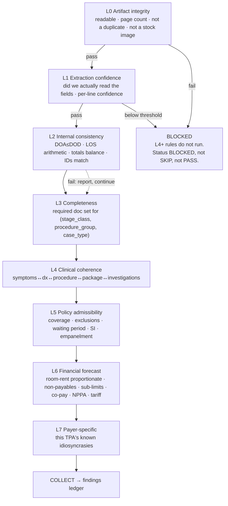
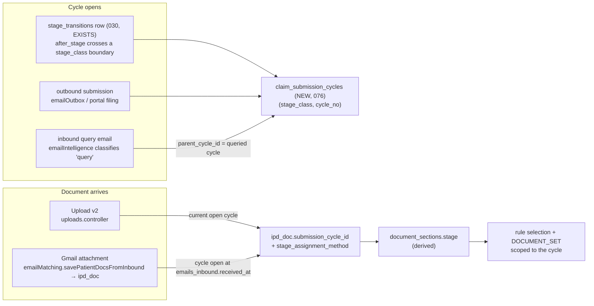
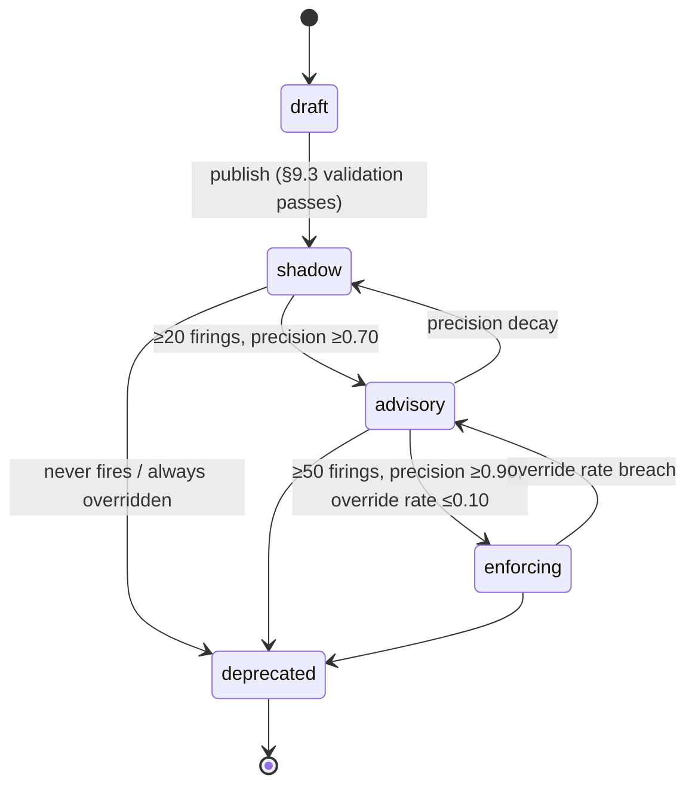
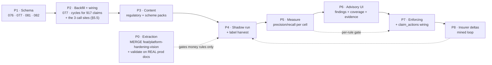

# Pre-Insurance Adjudication Engine — Technical Architecture

**Date:** 2026-09-14
**Method:** Design derived from the three research dossiers (world adjudication engines, Indian cashless domain, agentic claims automation) and reconciled line-by-line against the live codebase — `Backend/src/Services/rules/`, `Backend/src/Services/adjudication/`, `Backend/src/Services/context/`, `Backend/src/Services/extractor/`, and migrations `000`–`075`. Prod reality: 18 hospitals, 917 claims, **every rule table empty on production** (migration `044` does seed three rule sets into the ledger — §1). **Every table, column and file path below is either verified to exist today and named as such, or labelled NEW with its allocated migration number from `NEXT_PHASE_ROADMAP.md` §4. Nothing is referenced as if it existed.**

**Companion docs:** [`E2E_ARCHITECTURE.md`](./E2E_ARCHITECTURE.md) (the system as built) · [`EXTRACTION_LANDSCAPE_FIX.md`](./EXTRACTION_LANDSCAPE_FIX.md) (the upstream quality gate this engine depends on) · [`NEXT_PHASE_ROADMAP.md`](./NEXT_PHASE_ROADMAP.md) (the single sequencing and migration ledger this doc conforms to) · [`AGENTIC_FILING_ARCHITECTURE.md`](./AGENTIC_FILING_ARCHITECTURE.md) (the consumer of this engine's output) · [`research/ADJUDICATION_ENGINES.md`](./research/ADJUDICATION_ENGINES.md) · [`research/INDIAN_CLAIMS_DOMAIN.md`](./research/INDIAN_CLAIMS_DOMAIN.md) · [`research/AGENTIC_CLAIMS_AUTOMATION.md`](./research/AGENTIC_CLAIMS_AUTOMATION.md) · [`FROZEN_CONTRACTS.md`](./FROZEN_CONTRACTS.md) (OD2 stage vocabulary, OD4 evaluator registry, OD5 interpret-not-decide)

---

## 0a. Two things this document is the single source of truth for

Both of these exist because four next-phase documents were written in parallel and three of them invented their own stage vocabulary. They are stated here, once, and every companion doc references this section rather than restating it.

### 0a.1 The stage taxonomy — **`StageClass`, extended to seven, and nothing else**

> **There is exactly one coarse stage axis in this system: the `StageClass` union in `Backend/src/Services/context/types.ts:38`, derived by `stageClass(ipdStage)` at `Services/context/resolver.ts:34`. It is `FROZEN_CONTRACTS` OD2's own list of canonical stage classes, already shipped in TypeScript and already in use. This phase extends it from five values to seven. It does not replace it, shadow it, or add a parallel category.**
>
> ```ts
> // today  (context/types.ts:38 — OD2 "canonical stage classes")
> type StageClass = 'preauth' | 'enhancement' | 'discharge' | 'claim' | 'other';
> // this phase — a refinement OF OD2, adding two classes, keeping all five
> type StageClass = 'intimation' | 'preauth' | 'enhancement' | 'discharge'
>                 | 'claim' | 'appeal' | 'other';
> ```
>
> The 19 `master_options(category='ipd_stage')` codes (mig 024, `IPD_STAGE_CODES` at `context/types.ts:13`) remain the **claim state machine**, unchanged and unextended by this document. `StageClass` is a *derivation* of them, not a second vocabulary: nothing is ever authored in it, and no row is ever the source of truth for it.

**Explicitly rejected**, so no companion doc re-proposes them:

| Rejected | Why |
|---|---|
| A new `master_options(category='stage_kind')` with 7 `UPPER_SNAKE` values | This is what an earlier draft of *this* document proposed (§5.1). It is a second vocabulary for a concept OD2 already names and `stageClass()` already derives. Withdrawn. |
| `S00`–`S17` workflow states as the rule-selection axis | Selection runs against `insurer_rule_sets.applicable_stages`, which holds `ipd_stage` codes (068). S-codes match nothing. They are also a `CONTRACT_DRIFT` event under OD2 with no sign-off. |
| Eight new `ipd_stage` codes to carry sub-states | Sub-states that repeat (enhancement #2, query round #3) are **cycles**, modelled by `claim_submission_cycles` (§5.2), not by widening an enum. |

**What the extension costs, stated honestly.** Adding `intimation` and `appeal` to `StageClass` alone is cheap — it is a TypeScript union plus two branches in `stageClass()`, and no stored value changes, because nothing persists a `StageClass` today. But:

- `intimation` needs no new state: it is the derivation of the existing `draft` code, which `stageClass()` currently returns `'other'` for.
- `appeal` has **no `ipd_stage` code to derive from.** Reaching it requires adding `short_paid` and `appeal_filed` to `IPD_STAGE_CODES`, which *is* a `CONTRACT_DRIFT` event under OD2 (D2 in `NEXT_PHASE_ROADMAP.md` §5) touching `ipds.stage`, `claim_context.stage`, `document_sections.stage`, `stage_requirements.target_stage` and `insurer_rule_sets.applicable_stages`. **Until that sign-off lands, `appeal` is a declared-but-unreachable class**: rules selecting on it are authorable and never select. That is the correct failure mode — an empty coverage cell, reported, not a silent mis-selection.

### 0a.2 The rules layer — **one, and it is this one**

> **`Services/rules/` — `engine.ts`'s pure dispatch, `selection.ts`'s specificity scoring, the OD4 abstention gate, `insurer_rule_sets` / `insurance_rules` as the store — is the only rules layer in the product. Anything that needs a payer-conditional, stage-conditional, effective-dated decision *selects from it*. Nothing implements a second one.**

Concretely, for the agentic filing layer, which is the system most likely to grow one by accident:

| The agentic layer needs… | It gets it from | Not from |
|---|---|---|
| The next action for a claim | `Services/nextAction.service.ts`, reading `claim_findings` (§6.1) + the cycle's `due_at` (§5.2) | its own condition table |
| Which follow-up rung to send, and when | `followup_ladder_rungs` as a **child of `insurer_rule_sets`**, resolved by the existing `selectRuleSets` (§3.2) | a standalone `followup_ladder(payer, claim_type, stage)` with its own resolver |
| Whether an action is permitted to fire unattended | the deny-list in code (outside the model path) + `autonomy_policy`, both in the agentic doc's own migrations | an `insurance_rules` row |
| The TAT clock for a deadline | `payer_config` (**new**, migration `080`, owned by `AGENTIC_FILING_ARCHITECTURE.md`) + `TAT_CLOCK` (§4.2) | a hard-coded calendar |

The one thing the agentic layer legitimately owns that looks rule-shaped is the **operational** state set (`AWAIT_APPROVAL`, `VERIFYING`, `WAITING_OTP`, `BLOCKED_*`, `HUMAN_OWNED`). Those are not payer-facing stages and they are not authored content; they never enter `applicable_stages` and never select a rule set.

### 0a.3 Migration allocation — one ledger

This document's migrations are **076, 077, 081, 082, 083, 084**, exactly as allocated in `NEXT_PHASE_ROADMAP.md` §4. `078`, `079`, `080`, `085`, `086`, `087` belong to `AGENTIC_FILING_ARCHITECTURE.md` and are referenced here, never issued here. An earlier draft of this document allocated `076`–`082` for a different set of tables and collided head-on with the agentic doc's `076`–`082`; §10 carries the corrected mapping.

---

## 0. The eleven decisions this document makes

1. **Rule representation:** a **JDM-shaped JSON rule DSL stored as rows**, organised into **Rule Families** with a declared **hit policy** — not Drools/Rete, not DMN XML, not a monolithic decision table. `insurance_rules.validation_logic` stays the params carrier; `insurance_rules.kind` stays the evaluator dispatch. (§2)
2. **Selection** stays `Services/rules/selection.ts`'s specificity scoring, but gains **layered overrides** (base → scheme → insurer → hospital), **effective dating against date-of-admission**, and a **union-of-layers** semantic instead of single-winner. Ties are a *publish-time error*, not a runtime coin-flip. (§3)
3. **No match ≠ clean.** "No rule set for this payer" and "rules ran and passed" are different outputs and are surfaced differently. (§3.4)
4. **Sixteen new evaluator kinds**, all deterministic, each a Rule Family with exactly one conclusion. The two semantic (LLM) kinds may raise findings but may **never** clear one. (§4)
5. **Stage binding is by *submission cycle*, not by a bare enum** — because enhancement #2 and query-round #3 are real, repeat, and carry different document sets. New table `claim_submission_cycles`; `ipd_doc.submission_cycle_id` binds the artefact. (§5)
6. **The coarse rule-selection axis is the existing `StageClass`, extended from five values to seven** (§0a.1) — a refinement of `FROZEN_CONTRACTS` OD2's own canonical classes, already implemented at `context/types.ts:38` and derived by `stageClass()` at `resolver.ts:34`. The 19-code `master_options(ipd_stage)` vocabulary stays the claim state machine, unextended by this document. **One vocabulary, one derived class, one derivation function, no new `master_options` category.** (§5.1)
7. **Per-line adjudication gets a first-class table** — `claim_line_items`, projected from `document_sections.extracted_fields.line_items` (the shipped extractor contract) with page/row provenance. Money rules evaluate lines, not totals. **Evidence is document + section + page; bounding boxes are unbuilt and are a named later work item, not a freebie.** (§4.3, §6)
8. **Findings are a separate ledger from evaluations.** `claim_rule_evaluations` is the per-rule trace (including passes); `claim_findings` is the deduplicated, actionable, lifecycle-bearing object the UI and `claim_actions` consume. (§6.1)
9. **Every adjudication writes an immutable `claim_decision_record`** carrying ruleset versions, engine version, and input digests — the replay unit. This is the one deliberate exception to *re-run = from scratch*. (§6.3)
10. **Abstention extends to evidence.** Rule confidence = `min(evaluator_confidence, worst extraction confidence over inputs actually used)`. Two new statuses, `BLOCKED` and `NOT_APPLICABLE`, stop the L0/L1 → L4+ false-confidence path. This is an **amendment to OD4**, not an application of it, and needs the same sign-off as any contract change. (§7.1)
11. **Rollout is shadow → advisory → enforcing, per rule**, measured against labels harvested from the correspondence we already hold in `emails_inbound` / `email_intelligence_drafts`. Nothing reaches a user before its precision is measured. (§9, §10)

---

## 1. What exists, and the exact seam this attaches to

| Asset | State today | Role in this design |
|---|---|---|
| `Services/rules/engine.ts` | Pure, IO-free, dispatch-by-kind + OD4 abstention gate + `summarizeReadiness` | **Kept verbatim as the core loop.** Extended with new statuses and a family-ordered sweep. |
| `Services/rules/evaluators.ts` | 4 kinds: `DOCUMENT_PRESENCE`, `REQUIRED_FIELDS`, `FUZZY_NAME`, `TEMPORAL_WINDOW` | **Kept.** 16 kinds added alongside; the registry pattern is already correct. |
| `Services/rules/selection.ts` | Specificity scoring (`selection.ts:45` weights stage 4, insurer 4, scheme 3, case_type 2, route 1, treatment 1, specialty 1), empty-array = wildcard, tie → higher `ruleSetId` | **Extended**, not replaced (§3). This is also the resolver the agentic layer's follow-up ladders use — see §0a.2. |
| `Services/context/types.ts:38` + `resolver.ts:34` | `StageClass = 'preauth'\|'enhancement'\|'discharge'\|'claim'\|'other'` — **OD2's canonical stage classes, already implemented**, with `stageClass(ipdStage)` deriving them and `docMixStageClass(categories)` at `:49` cross-checking from the document mix | **The coarse rule-selection axis.** Extended 5 → 7 (§0a.1, §5.1). No new vocabulary is introduced anywhere in this document. |
| `Services/rules/semantic.ts` | `LLM_COHERENCE`, `EVIDENCE_CHECK` — async, vision-capable | **Demoted to advisory-only** (§8). |
| `Services/adjudication/stageAwareAdjudicator.service.ts` | Resolves `{scheme,route,insurer,stage,case_type}`, builds `RuleContext` from `document_sections`, persists evaluations + 4-layer hypothesis | **The live fold.** Gains cycle resolution, line-item loading, findings emission, decision records. |
| `insurer_rule_sets` (044) + `068` dims | `effective_from`/`effective_till` **exist and are unused**; `applicable_{schemes,routes,stages,case_types,treatments,specialties}` | Reused wholesale; 6 columns added. |
| `insurance_rules` (044) + `068` | `kind`, `min_confidence`, `validation_logic`, `severity`, `impact`, `required_documents`, `estimated_deduction_amount`, `query_template`, `remediation_guidance`, `order_index` — **all already the right columns** | Reused wholesale; 12 columns added. |
| `insurer_document_requirements` / `insurer_financial_limits` / `insurer_los_benchmarks` (044, keyed in 074) | Empty on prod; queried by custom functions, not the engine loop | Promoted to **first-class rule inputs** for `DOCUMENT_SET`, `SUBLIMIT_CHECK`, `LOS_BENCHMARK`. |
| `insurer_rule_sets` **seeded content** (044) | **Not nothing.** Migration `044` seeds three rule sets — `ICICI_LOMBARD_CARDIAC_V1` and two siblings (`044_insurer_rule_sets.sql:218,332,444`). Their `insurance_rules` rows predate the `kind` column (added in `068`), so the adjudicator classifies them `no_kinded_rules` and evaluates nothing. | **Decide, do not leave.** "Every rule table is empty" is true of *production*; "the ledger has no content" is not. Left as-is these rows match, win selection against a thin pack, and evaluate to zero — the worst of both. P1 either kind-ifies all three (each rule gets a `kind`, `family`, `reason_code`, `citation_ref` and enters at `mode='shadow'` like any other) or retires them (`status='retired'`, never deleted). Recommendation: **retire**, and re-author from the regulatory pack; they were written before the layered content model and none of them carries a citation. |
| `payer_config` | **Does not exist** in any migration, in any form, despite being referenced as a known table by all four next-phase docs | **New — migration `080`, owned by `AGENTIC_FILING_ARCHITECTURE.md`**, which needs it first for the deadline calendar. This document *consumes* it (TAT clocks for `TAT_CLOCK`, §4.2; the IRDAI/PM-JAY windows seeded in §9.1) and issues no DDL for it. |
| `benefit_plan` | **Does not exist.** Referenced by `SUBLIMIT_CHECK`, `WAITING_PERIOD`, `PED_DISCLOSURE` and the `policy_uin` selection axis | **New — migration `082`** (§6.4a). Until it lands, those three evaluator kinds are unauthorable and the `policy_uin` axis scores 0 for every claim. |
| `policy_constraints`, `charge_head_catalog`, `reference_nonpayable`, `reference_nppa_cap`, `claim_line_items`, `claim_findings`, `claim_decision_records`, `rule_families`, `finding_reason_codes`, `claim_submission_cycles` | **None of these exist.** Verified absent across migrations `000`–`075` | **All new**, each with its allocated migration number in §10. Nothing in this document is described as existing unless the table above says it does. |
| `claim_rule_evaluations` (044+069) | `(claim_id, stage, rule_set_id, rule_id)` unique; **`deduction_estimate` column already exists, unused** | Reused; becomes the trace, gains 5 columns. |
| `rule_overrides` (044) | `mark_passed` / `mark_skipped` / `accept_deduction` + reason + actor | Reused; re-pointed at findings, gains expiry + scope. |
| `stage_requirements` (035) | v1 doc-category gating, `scope_*` cascade, `effective_from/to`, `version` | **Kept as the transition gate** (can this claim move to stage X), distinct from adjudication (is this submission defect-free). Not merged. |
| `claim_context` (067), `claim_hypothesis` (069), `claim_hypothesis_feedback` (070) | Written in shadow | Kept; `claim_hypothesis.layer4_readiness` gains a `coverage` block. |
| `stage_transitions` (030) | Exists, rich (`before_stage`, `after_stage`, `triggered_by`, `context_doc_section_ids`, `was_reversal`) | **The cycle-opening trigger** (§5.3). |
| `claim_actions` (037) | `request_doc` / `notify_ops`, idempotency key, WhatsApp + in-app routing | **The remedy sink** for findings (§6.2). |
| `claim_financials` (072) | Pre-auth/final claimed + approved, with LLM provenance | Input to `SUM_INSURED_BALANCE`, `APPROVAL_CONSTRAINT_DIVERGENCE`. |
| `document_sections.stage` (067) | Column exists and **is** written — but wrongly. `docBundleClassifier.service.ts:1504` and `docSegmenter.service.ts:594` both best-effort stamp it with `fetchClaimStage(claimId)` (`Services/context/loader.ts:28`), i.e. **the claim's stage at the moment of classification**, not the stage the document belongs to. Re-classification after a stage change silently rewrites it. | Re-pointed: becomes *derived from the parent document's cycle* (§5.2), at the same two call sites (§5.5 site 3). The 067 comment "M2 will populate it" is stale in both directions — something populates it, and what it populates is not what the rules engine needs. |

**The gating dependency:** per-line adjudication is only safe on top of the tiled extraction and the `line_items` contract specified in `EXTRACTION_LANDSCAPE_FIX.md` §4.1/§4.4. Adjudicating money against 80–97% money-column accuracy produces confident wrong numbers. **Order is not negotiable: line-item accuracy first, then the money evaluators.** Document-completeness and temporal evaluators do *not* depend on it and can ship earlier.

**That upstream work is built, not pending design.** Tiling (`Services/extractor/imageTiler.ts`, `TILER_VERSION='v2'`), deskew, `visionRead`, the harness and `Services/extractor/lineItems.ts` are implemented and sitting **uncommitted on `feat/platform-hardening-vision`**. P0 is therefore **merge, migrate and validate on real production documents** — not build (§10). Two consequences for this design:

- **The projection source is `document_sections.extracted_fields.line_items`** (`docExtractor.service.ts:108,265`) — a Zod-validated array persisted inside the existing JSONB, plus a table-level `line_items_confidence`. `claim_line_items` (§4.3) is a **projection of that**, not a new extraction contract.
- **There is no bounding box, and there is no path to one from this work.** The shipped `LineItemSchema` (`Services/extractor/lineItems.ts:55`) emits `row_index, particulars, code, date, qty, rate, gross, discount, net, tax_pct, payable, source_page, confidence` — `source_page`, not coordinates — and the tiler returns page slices, not row boxes. **Page-level evidence is free** (`document_sections` is already one row per page range; `source_page` localises within it). **Bbox is an unbuilt localisation pass** and is treated throughout this document as a named later work item (§4.3, §6.1, §10 P6).

---

## 2. Rule representation

### 2.1 The options, scored for this domain

| Option | Fit | Verdict |
|---|---|---|
| **Forward-chaining / Rete (Drools)** | Facts-from-facts inference; unknown evaluation order | **Reject.** Research is unambiguous: unbounded, untraceable, un-regression-testable; every vendor that started with inference has migrated away (`ADJUDICATION_ENGINES.md` §4.4). A regulated verdict needs ordered, bounded, replayable evaluation. |
| **DMN XML + FEEL** | The de facto standard; hit policies are the *formal* answer to conflict resolution | **Adopt the concepts, reject the format.** The value of DMN is its authoring tooling and its hit-policy/completeness semantics. We cannot buy the tooling for a Node backend without adding a FEEL interpreter and an XML artifact store to a system whose rules are already rows in Postgres. **We take hit policy and completeness declarations; we do not take FEEL or the XML.** |
| **Decision tables as the primary form** | Excellent where many rules share conditions and one conclusion | **Adopt as one evaluator kind** (`DECISION_TABLE`), not as the spine. Our top-level need is *collect every deficiency*, which is a COLLECT sweep, not a table lookup. Sub-decisions (which room tier? which package? which TAT?) are genuinely tables — hence the kind. |
| **GoRules Zen / JDM (Rust, JSON decision graphs)** | Closest off-the-shelf fit; portable diffable JSON artifacts | **Adopt the shape, not the dependency.** We already have a working typed evaluator registry and a Postgres-resident rule store that supports the *sparse per-insurer* authoring the domain needs. Adding a foreign expression language (ZEN) to author Indian insurer deltas buys us nothing that `kind + params` does not, and costs us the ability to query "which rules mention room rent for insurer X" in SQL. **Revisit only if the `DECISION_TABLE` kind outgrows a hand-rolled evaluator.** |
| **JSON rule DSL over a typed evaluator registry** *(what exists here)* | Rules are data; evaluators are code; params are JSONB | **Recommend.** |

### 2.2 The recommendation

> **A rule is a row. Its `kind` names a typed, deterministic evaluator. Its `validation_logic` JSONB is that evaluator's params. Rules are grouped into Rule Families, each with exactly one conclusion fact type and a declared hit policy. The claim-level output is a COLLECT over all families, subject to the layer stop-rule.**

Why this and not the alternatives:

- **It is already half-built and correct.** `kind` (068), the pure dispatch in `engine.ts`, the abstention gate, the evidence-bearing `EvalResult` — this is the JDM shape expressed in TypeScript. Replacing it with a rules product would be a rewrite that buys authoring UI we would have to build a domain-specific front-end for anyway (nobody authors "Star Health wants the anaesthetist's note for GA cases" in FEEL).
- **Sparse, per-insurer authoring is a SQL problem.** The Indian reality is a base regulatory pack plus hundreds of insurer-specific deltas learned from query letters. Rows with array selectors and partial indexes are the right storage for sparse, high-cardinality, frequently-amended content. A JSON graph artifact per insurer would fork the base pack — the named anti-pattern (`ADJUDICATION_ENGINES.md` §7.4: "layered overrides, never forks").
- **Explainability is free.** The evaluator returns `EvalResult.evidence` already. The decision trace is a projection of rows, not a reconstruction from an inference log.
- **The discipline we import from TDM:** *one conclusion fact type per Rule Family.* This is the single constraint that stops `insurance_rules` rotting into a sheet that mixes "is the document present", "is the package admissible" and "what is the deduction". It is enforced at publish time (§9.3), not by convention.

### 2.3 The rule object

```jsonc
{
  "rule_id": "ROOM_RENT_CAP_1PCT",           // stable, family-scoped
  "rule_version": 3,                          // bumps on any semantic change
  "family": "financial_exposure.room_rent",   // exactly one conclusion fact type
  "layer": "L6",                              // L0..L7 gate ladder (§4.1)
  "kind": "ROOM_RENT_CAP",                    // evaluator dispatch (068 column)
  "hit_policy": "U",                          // U | F | C | P  — declared, validated at publish
  "selector": {                               // ALL of these live on the rule SET (§3)
    "stage_classes": ["preauth", "discharge"], // StageClass values (§0a.1) — NOT a new vocabulary
    "insurer_code":  "STAR_HEALTH",
    "schemes":       [], "routes": [], "case_types": [],
    "procedure_groups": [], "diagnosis_groups": []
  },
  "params": {                                 // -> insurance_rules.validation_logic
    "cap_basis": "PCT_OF_SUM_INSURED", "cap_pct": 1.0, "icu_cap_pct": 2.0,
    "room_head_codes": ["ROOM_RENT", "NURSING_ROOM"],
    "source": "policy_constraints"            // prefer parsed approval letter over episode
  },
  "evidence_requirements": {                  // what must be readable to opine (§7)
    "requires_doc_categories": ["final_breakup_of_bill", "cashless_approval_letter"],
    "requires_episode_paths": ["$.insurance_context.sum_insured",
                               "$.clinical_timeline[*].room_category"],
    "requires_line_heads":    ["ROOM_RENT"],
    "min_input_confidence":   0.85,
    "min_line_confidence":    0.90
  },
  "severity": "HIGH", "impact": "DEDUCTION",  // existing 044 columns
  "scenario": "NOT_SEPARATELY_PAYABLE",       // CORE-360-style closed set
  "reason_code": "DED_ROOM_PROPORTIONATE",    // closed, versioned vocabulary
  "remark_codes": ["RMK_ROOM_TIER_EXCEEDED"],
  "min_confidence": 0.85,                     // existing 068 column — abstention gate
  "failure_message": "...", "remediation_guidance": "...",  // existing 044 columns
  "query_template": "...",                    // existing 044 column
  "citation_ref": "IRDAI Master Circular 29-05-2024 ¶; policy UIN clause 4.2",
  "citation_url": "https://irdai.gov.in/...",
  "bypass_expr": "policy_constraints.room_cap_waived == true",
  "effective_from": "2026-04-01", "effective_to": null,
  "mode": "shadow"                            // shadow | advisory | enforcing
}
```

Three fields deserve naming because they are the ones almost nobody ships and both research docs call out: **`evidence_requirements`** (turns "silent pass on missing data" into a structural impossibility), **`bypass_expr`** (the NCCI modifier-indicator pattern — a machine-checkable justification that clears a finding), and **`citation_ref`** (a rule without a citation cannot be published — the cheapest governance constraint available).

### 2.4 DDL — extending the existing tables

Nothing below drops or renames. Columns marked **[exists]** are reused as-is.

```sql
-- ── 081_rule_lifecycle_and_findings.sql (part 1 of 2) ───────────────────────
-- Allocated in NEXT_PHASE_ROADMAP.md §4 (Phase C). Part 2 is §6.1/§6.3/§6.5.
-- A. rule SETS: layered overrides + a wider selector + publish governance.
--    [exists] rule_set_id, rule_set_name, version, effective_from, effective_till,
--             insurer_code, applicable_treatments, applicable_specialties, status,
--             applicable_schemes/routes/stages/case_types (068), created_by
ALTER TABLE hospital.insurer_rule_sets
  ADD COLUMN IF NOT EXISTS layer_kind                VARCHAR(16)  NOT NULL DEFAULT 'insurer',
      -- 'regulatory' | 'scheme' | 'insurer' | 'hospital'. Drives merge order (§3.2).
  ADD COLUMN IF NOT EXISTS parent_rule_set_id        UUID REFERENCES hospital.insurer_rule_sets(id),
      -- a delta pack declares its base; NULL for a base pack. Never edit base in place.
  ADD COLUMN IF NOT EXISTS scope_hospital_id         UUID,
      -- non-null = a hospital-local pack (the 4th layer). No FK: hospitals live upstream.
  ADD COLUMN IF NOT EXISTS applicable_stage_classes  TEXT[] NOT NULL DEFAULT ARRAY[]::TEXT[],
      -- StageClass values (§0a.1): intimation|preauth|enhancement|discharge|
      -- claim|appeal|other. NOT a new vocabulary and NOT a master_options
      -- category — a derived refinement of OD2's canonical classes, already
      -- implemented at context/types.ts:38. applicable_stages (068) stays as the
      -- fine-grained 19-code ipd_stage escape hatch and remains the OD2 join key.
  ADD COLUMN IF NOT EXISTS applicable_procedure_groups TEXT[] NOT NULL DEFAULT ARRAY[]::TEXT[],
  ADD COLUMN IF NOT EXISTS applicable_diagnosis_groups TEXT[] NOT NULL DEFAULT ARRAY[]::TEXT[],
  ADD COLUMN IF NOT EXISTS policy_uin                VARCHAR(64),
      -- benefit-plan axis: a UIN/group-policy pack beats an insurer pack (§3.1).
      -- Scores 0 until benefit_plan (NEW, migration 082, §6.4a) exists and is
      -- populated; a rule set may carry a UIN before then, it just never wins on it.
  ADD COLUMN IF NOT EXISTS mode                      VARCHAR(16) NOT NULL DEFAULT 'shadow',
      -- shadow | advisory | enforcing. Set-level ceiling; a rule cannot exceed it.
  ADD COLUMN IF NOT EXISTS content_source            TEXT,
  ADD COLUMN IF NOT EXISTS published_at              TIMESTAMPTZ,
  ADD COLUMN IF NOT EXISTS published_by              UUID,
  ADD COLUMN IF NOT EXISTS completeness_declared     BOOLEAN NOT NULL DEFAULT false;
      -- DMN completeness: false => the engine reports partial coverage for this
      -- selector rather than implying the checklist was exhaustive (§7.4).

-- B. rule FAMILIES: one conclusion fact type per family (TDM). Publish-time validated.
CREATE TABLE IF NOT EXISTS hospital.rule_families (
  family            VARCHAR(96) PRIMARY KEY,
  conclusion_fact   VARCHAR(96) NOT NULL,   -- e.g. 'room_rent_eligible_ratio'
  layer             VARCHAR(4)  NOT NULL,   -- L0..L7
  default_hit_policy VARCHAR(2) NOT NULL DEFAULT 'U',
  depends_on        TEXT[]      NOT NULL DEFAULT ARRAY[]::TEXT[],  -- family names
  owner             VARCHAR(64),
  description       TEXT,
  CONSTRAINT chk_rule_families_layer CHECK (layer IN ('L0','L1','L2','L3','L4','L5','L6','L7')),
  CONSTRAINT chk_rule_families_hit   CHECK (default_hit_policy IN ('U','F','C','P','A'))
);

-- C. rule ROWS: version, family, trace vocabulary, evidence contract, provenance.
--    [exists] rule_id, rule_name, rule_description, category, severity, impact,
--             enabled, mandatory, validation_logic (=params), failure_message,
--             remediation_guidance, required_documents, estimated_deduction_amount,
--             query_template, order_index, kind (068), min_confidence (068)
ALTER TABLE hospital.insurance_rules
  ADD COLUMN IF NOT EXISTS rule_version          INT NOT NULL DEFAULT 1,
  ADD COLUMN IF NOT EXISTS family                VARCHAR(96) REFERENCES hospital.rule_families(family),
  ADD COLUMN IF NOT EXISTS layer                 VARCHAR(4),
  ADD COLUMN IF NOT EXISTS hit_policy            VARCHAR(2),
  ADD COLUMN IF NOT EXISTS scenario              VARCHAR(40),
  ADD COLUMN IF NOT EXISTS reason_code           VARCHAR(64),
  ADD COLUMN IF NOT EXISTS remark_codes          TEXT[] NOT NULL DEFAULT ARRAY[]::TEXT[],
  ADD COLUMN IF NOT EXISTS evidence_requirements JSONB,
  ADD COLUMN IF NOT EXISTS bypass_expr           TEXT,
  ADD COLUMN IF NOT EXISTS citation_ref          TEXT,
  ADD COLUMN IF NOT EXISTS citation_url          TEXT,
  ADD COLUMN IF NOT EXISTS effective_from        DATE,
  ADD COLUMN IF NOT EXISTS effective_to          DATE,
  ADD COLUMN IF NOT EXISTS mode                  VARCHAR(16) NOT NULL DEFAULT 'shadow',
  ADD COLUMN IF NOT EXISTS authored_by           UUID,
  ADD COLUMN IF NOT EXISTS reviewed_by           UUID,
  ADD COLUMN IF NOT EXISTS review_due_on         DATE,
  ADD COLUMN IF NOT EXISTS derived_from_finding_ids UUID[];  -- rule mined from real query letters

-- Version identity: a rule row is (rule_set_id, rule_id, rule_version).
ALTER TABLE hospital.insurance_rules DROP CONSTRAINT IF EXISTS uq_insurance_rules_set_rule;
CREATE UNIQUE INDEX IF NOT EXISTS uq_insurance_rules_set_rule_version
  ON hospital.insurance_rules (rule_set_id, rule_id, rule_version);

-- Closed vocabularies live as data, versioned, so the UI and the API stay stable.
CREATE TABLE IF NOT EXISTS hospital.finding_reason_codes (
  reason_code   VARCHAR(64) PRIMARY KEY,
  scenario      VARCHAR(40) NOT NULL,   -- DOCUMENTATION|DATA|NOT_COVERED|
                                        -- NOT_SEPARATELY_PAYABLE|TIMELINESS|AUTHENTICITY
  label         TEXT NOT NULL,
  patient_facing_label TEXT,
  vocabulary_version INT NOT NULL DEFAULT 1,
  deprecated_at TIMESTAMPTZ
);
```

**What is deliberately NOT added:** a `rules` DSL text column, a FEEL/ZEN expression column, or a generic `condition_expr`. Every predicate goes through a typed evaluator kind. The moment a rule needs an arbitrary expression, that is a signal to add an evaluator kind — a code review — not to open a scripting surface inside the rule base.

---

## 3. Selection and conflict resolution

### 3.1 Specificity

`Services/rules/selection.ts` already implements the right idea. Extend `scoreRuleSet` with the new axes and re-weight so the ordering matches the domain's resolution order (`INDIAN_CLAIMS_DOMAIN.md` §11):

| Axis | Weight | Source of the context value |
|---|---|---|
| `policy_uin` | 16 | `episode.insurance_context.policy_number` → `benefit_plan` lookup **(new, 082 — scores 0 until it exists)** |
| `insurer_code` | 8 | `panels.code` via `claim_dossiers.current_panel_id` *(unchanged, `fetchInsurerCode` at `stageAwareAdjudicator.service.ts:66`)* |
| `stage_class` | 4 | `claim_submission_cycles.stage_class` of the cycle being adjudicated (§5) — a `StageClass` value, derived, never authored |
| `ipd_stage` | 4 | `claim_context.stage` against `applicable_stages` (068) — the OD2 fine-grained axis, **kept**; a rule set may pin a single `ipd_stage` when the class is too coarse |
| `scheme` | 3 | `claim_context.scheme` |
| `procedure_group` | 3 | mapped from `episode.diagnosis` + `procedures_performed` (§8: LLM proposes, catalog decides) |
| `case_type` | 2 | `claim_context.case_type` |
| `diagnosis_group` | 2 | as above |
| `route` | 1 | `claim_context.route` (network / cashless-everywhere / reimbursement) |
| `treatment`, `specialty` | 1 each | *(unchanged)* |

Empty array = wildcard stays the convention. `hospital_id` scope is a filter, not a score: a hospital-local pack only applies to that hospital.

### 3.2 Merge, don't pick

The current `selectRuleSet` returns **one** set. That is wrong for a layered content model: the regulatory non-payable lists must run *alongside* the insurer's own pack, not lose to it.

New semantic: **select one winner per `layer_kind`, then union their rules**; a rule in a higher layer with the same `(family, rule_id)` **overrides** the lower-layer rule (replaces it, or disables it via `enabled=false`). Never edit base content in place.

```
regulatory (IRDAI lists I–IV, NPPA caps, IRDAI TATs)
  ⟶ scheme      (PMJAY HBP / state SHA)
    ⟶ insurer   (Star / Bajaj / Medi Assist deltas mined from query letters)
      ⟶ hospital (this hospital's MOU tariff, local quirks)
```

`selectRuleSets(candidates, ctx) → RuleSetMeta[]` (one per layer, most-specific within layer), plus `mergeRules(sets) → Rule[]` applying override-by-`(family, rule_id)`. Both stay pure and stay in `Services/rules/selection.ts`.

### 3.3 Effective dating and ties

- A claim is adjudicated against the rule content **in force on its date of admission** (`episode.stay_summary.admission_datetime`, falling back to `clinical_timeline` phase `ADMISSION`), not on the date the engine runs. Filter: `effective_from <= as_of AND (effective_to IS NULL OR effective_to > as_of)` — on **both** `insurer_rule_sets` (`effective_from`/`effective_till`, which already exist and are unused) and `insurance_rules` (new columns).
- Re-running a claim in September must reproduce March's verdict. The `as_of` date is stored on the decision record and is the replay key (§6.3).
- **Ties are a publish-time error.** Two live sets in the same `layer_kind` with equal specificity for a reachable context is a content bug; the publish validator (§9.3) rejects it. The runtime keeps the existing deterministic tie-break (higher `rule_set_id`) purely as a safety net and **emits a `RULESET_TIE` operational alarm** when it fires. Silent coin-flips are how a rule base becomes unexplainable.
- Within a family, `hit_policy` governs: `U` (exactly one rule may fire — violation is an alarm), `F` (first by `order_index`), `P` (by severity), `C` (collect all — the default for deficiency families).

### 3.4 When nothing matches

Three distinct outcomes, three distinct persisted states. The current code collapses two of them into `recommended_action: 'review'`:

| Situation | `layer4_readiness` | What the user is told |
|---|---|---|
| No live rule set for this `(insurer, stage_class)` | `{applicable:false, no_content:true, coverage:{applicable:0}}` | *"We have no rules yet for <insurer> at <stage>. Only the generic regulatory checks ran (n of them)."* |
| A set matched but carries no `kind`'d rules | `{applicable:false, no_kinded_rules:true}` *(exists today)* | *"Legacy rule pack — not evaluated."* |
| Rules ran and none failed | `{readiness_score, coverage:{evaluated, applicable, blocked}}` | *"41 of 47 applicable checks passed; 6 could not be evaluated because X was unreadable."* |

**Never** does an empty finding list render as "clean". The distinction between *no rule fired* and *no rule exists* is the load-bearing honesty in this system.

---

## 4. Evaluation model

### 4.1 The layer ladder and the stop rule



The one rule that prevents most of the "the tool cried wolf" failure mode: **do not report L4+ findings on a claim that fails L0/L1.** A garbled extraction produces confident nonsense at the clinical and financial layers — and per `EXTRACTION_LANDSCAPE_FIX.md` §3, our specific failure mode row-shifts *payable amounts*, which is exactly an L1 failure that masquerades as an L6 finding.

`summarizeReadiness` gains a `blocked: string[]` bucket alongside `blocking` / `warnings` / `errored` / `abstained`, and `recommendedAction` gains `fix_source_document` ahead of `request_doc`.

### 4.2 New evaluator kinds

All deterministic. Each is one Rule Family with one conclusion. Files: `Services/rules/evaluators/<kind>.ts`, registered in `Services/rules/engine.ts`'s dispatch (the existing `switch` becomes a registry map keyed by `RuleKind`).

| Kind | Family / conclusion | Inputs from the harmonised episode | Inputs from `claim_line_items` | Other inputs |
|---|---|---|---|---|
| `DOCUMENT_SET` | `completeness.document_set` → missing doc codes | — | — | `insurer_document_requirements` (existing table) filtered by `stage`, `document_sections.category` present in the **cycle** |
| `DECISION_TABLE` | declared per rule | any `$.` paths named in params | — | params: `inputs[]`, `rows[]`, `hit_policy` |
| `CROSS_DOC_CONSISTENCY` | `consistency.<fact>` → agree / disagree | `$.stay_summary.admission_datetime`, `$.discharge_summary.discharge_date`, `$.patient_context.*`, `$.insurance_context.policy_number` | — | `fieldsByCategory` (exists in `RuleContext`) |
| `NUMERIC_RECONCILIATION` | `consistency.bill_totals` → balanced / delta | `$.financial_summary.actual_total_cost` | Σ `net`, Σ `gross`, Σ `discount`, Σ `tax` per head | `document_sections.extracted_fields.grand_total` |
| `LINE_ITEM_CLASSIFICATION` | `financial.non_payable_lines` → per-line list membership | `$.insurance_context.*` (rider state) | every line: `particulars`, `charge_head_code`, `net` | `reference_nonpayable` (lists I–IV) × `policy_constraints.consumables_rider` |
| `ROOM_RENT_CAP` | `financial.room_rent_eligible_per_day` | `$.insurance_context.sum_insured`, `room_eligibility`, `$.clinical_timeline[*].room_category` | lines with `charge_head_code IN room_head_codes` | `policy_constraints` (parsed approval letter), `insurer_financial_limits` |
| `PROPORTIONATE_DEDUCTION` | `financial.proportionate_deduction` | as above + `$.stay_summary.total_los` | all lines, partitioned by `proportionate_exempt_heads[]` | output of `ROOM_RENT_CAP` (family dependency) |
| `SUBLIMIT_CHECK` | `financial.sublimit_breach` | `$.diagnosis.primary_diagnosis`, procedure group | lines grouped by procedure | `insurer_financial_limits` (existing), `benefit_plan.sublimits` |
| `COPAY_CHECK` | `financial.copay_due` | `$.insurance_context.copay_percentage`, `$.patient_context.age` | bill total | `payment_receipts` section presence (co-pay receipt) |
| `SUM_INSURED_BALANCE` | `financial.si_exhaustion` | `$.insurance_context.available_sum_insured` | bill total | `claim_financials.preauth_approved_amount` |
| `PACKAGE_RECONCILIATION` | `financial.package_vs_itemised` | `$.financial_summary.package_details`, `$.meta.episode_type` | all lines vs package inclusion set | PMJAY HBP / MOU package catalog |
| `TARIFF_VARIANCE` | `financial.above_tariff_lines` | — | per line `rate` vs contracted rate | hospital MOU tariff table (hospital-layer pack) |
| `PRICE_CEILING` | `financial.ceiling_breach` | `$.clinical_timeline[*].procedures_performed[*].implants` | implant lines: `rate`, `qty` | `reference_nppa_cap` (dated) |
| `COUNT_MATCH` | `consistency.artefact_counts` | implant count in procedure notes | implant line `qty` | count of `implant_sticker` / `implant_bill` sections |
| `LOS_BENCHMARK` | `clinical.los_variance` | `$.stay_summary.total_los`, ICU phase durations | — | `insurer_los_benchmarks` (existing table) |
| `WAITING_PERIOD` | `policy.waiting_period_breach` | `$.insurance_context.policy_start_date`, `waiting_periods`, `$.diagnosis.*`, admission date | — | `benefit_plan` |
| `PED_DISCLOSURE` | `policy.ped_risk` | `$.patient_context.comorbidities`, history onset dates vs `policy_start_date` | — | `benefit_plan.ped_wait_months` |
| `APPROVAL_CONSTRAINT_DIVERGENCE` | `policy.enhancement_required` | whole episode: room category, LOS, procedure, diagnosis | bill total vs approved | **`policy_constraints`** — the parsed S04/S08 constraint object |
| `TAT_CLOCK` | `timeliness.deadline` → due-at / breached | admission/discharge datetimes | — | `stage_transitions`, `emails_inbound.received_at`, `payer_config` TATs |

Two design notes worth stating plainly:

- **`ROOM_RENT_CAP` and `PROPORTIONATE_DEDUCTION` are two rules, not one.** One computes an eligible ratio; the other applies it to a head-partitioned bill. TDM's "one conclusion per family" is exactly what makes the room-rent logic testable and the exempt-head set (`proportionate_exempt_heads[]`, which is policy-wording-dependent and disputed — `INDIAN_CLAIMS_DOMAIN.md` §8.1) a parameter rather than a constant baked into a formula.
- **`APPROVAL_CONSTRAINT_DIVERGENCE` is the highest-value rule in the system.** The research is blunt: an approval letter is a *constraint object* (approved amount, room cap, co-pay %, named diagnosis, named procedure, validity window, pre-excluded heads), and almost every deduction is a violation of something written in it that nobody parsed. Storing "approved ₹X" in `claim_financials` is insufficient — hence `policy_constraints` (§6.4).

### 4.3 Per-line evaluation

Money evaluators do not consume `financial_summary` totals. They consume `claim_line_items`, which is projected from `document_sections.extracted_fields.line_items` (`docExtractor.service.ts:108,265`) into a queryable table with provenance. The projection is lossless in one direction only — **it can carry no field the shipped `LineItemSchema` does not emit** (`Services/extractor/lineItems.ts:55`).

```sql
-- ── 083_claim_line_items.sql ───────────────────────────────────────────────
-- Allocated in NEXT_PHASE_ROADMAP.md §4 (Phase E). NEW table; nothing here exists.
CREATE TABLE IF NOT EXISTS hospital.claim_line_items (
  id                  UUID PRIMARY KEY DEFAULT gen_random_uuid(),
  claim_id            UUID NOT NULL REFERENCES hospital.ipds(id) ON DELETE CASCADE,
  section_id          UUID NOT NULL REFERENCES hospital.document_sections(id) ON DELETE CASCADE,
  submission_cycle_id UUID REFERENCES hospital.claim_submission_cycles(id),
  bill_kind           VARCHAR(40),          -- final_breakup_of_bill | pharmacy_bill | ...
  row_index           INT NOT NULL,         -- LineItemSchema.row_index
  page_no             INT,                  -- LineItemSchema.source_page. NULLABLE: the
                                            -- schema marks it optional, and a single-page
                                            -- section's rows often omit it. Fall back to
                                            -- document_sections.page_start.
  -- NO bbox COLUMN. The shipped extractor emits source_page and no coordinates
  -- (lineItems.ts:55) and the tiler returns page slices, not row boxes. Row-level
  -- localisation is an unbuilt pass; adding a column now would advertise evidence
  -- the pipeline cannot produce. See §6.1 "what evidence actually resolves to"
  -- and the deferred work item in §10.
  particulars_raw     TEXT NOT NULL,
  code_raw            VARCHAR(64),
  charge_head_code    VARCHAR(64),          -- normalised catalog code (LLM-proposed, §8)
  charge_head_confidence NUMERIC(4,3),
  service_date        DATE,
  qty                 NUMERIC(12,3),
  rate                NUMERIC(14,2),
  gross               NUMERIC(14,2),
  discount            NUMERIC(14,2),
  net                 NUMERIC(14,2),
  tax_pct             NUMERIC(6,3),
  payable             NUMERIC(14,2),
  line_confidence     NUMERIC(4,3) NOT NULL,   -- see line_confidence_source
  line_confidence_source VARCHAR(16) NOT NULL, -- 'row' | 'table' | 'floor'
      -- NOT NULL on line_confidence is only honest with a declared fallback:
      -- LineItemSchema.confidence is OPTIONAL (lineItems.ts:55). Resolution order:
      --   'row'   — the row's own confidence, when present;
      --   'table' — the section's line_items_confidence, when the row omits one;
      --   'floor' — 0.0 when NEITHER is present. A 'floor' row is below every
      --             rule's min_line_confidence by construction, so it abstains
      --             rather than silently inheriting a plausible number.
      -- Which one was used is recorded because a claim whose money verdict rests
      -- on table-level confidence is a materially weaker verdict, and coverage
      -- (§7.4) must be able to say so.
  extractor_version   VARCHAR(32),
  created_at          TIMESTAMPTZ NOT NULL DEFAULT NOW(),
  CONSTRAINT chk_cli_conf_source CHECK (line_confidence_source IN ('row','table','floor'))
);
CREATE UNIQUE INDEX IF NOT EXISTS uq_cli_section_row
  ON hospital.claim_line_items (section_id, row_index);
CREATE INDEX IF NOT EXISTS idx_cli_claim_head
  ON hospital.claim_line_items (claim_id, charge_head_code);

-- ── 082_reference_data.sql (excerpt) ───────────────────────────────────────
-- charge_head_catalog is reference data, not claim data: it seeds with the
-- regulatory pack in Phase C, ahead of claim_line_items in Phase E.
CREATE TABLE IF NOT EXISTS hospital.charge_head_catalog (
  charge_head_code  VARCHAR(64) PRIMARY KEY,
  label             TEXT NOT NULL,
  parent_code       VARCHAR(64) REFERENCES hospital.charge_head_catalog(charge_head_code),
  proportionate_exempt_default BOOLEAN NOT NULL DEFAULT false,
  nonpayable_list_no SMALLINT,     -- 1..4 where the head maps to an IRDAI Annexure-I list
  synonyms          TEXT[] NOT NULL DEFAULT ARRAY[]::TEXT[],
  approved_by       UUID, approved_at TIMESTAMPTZ
);
```

`charge_head_code` is the join key on which every money rule depends, and it is the one place an LLM touches the money path — so it is **proposal-only**: the mapper writes `charge_head_code` with a confidence, and any mapping below `min_line_confidence` makes the dependent rule abstain *for that line* while still evaluating the rest (§7.2).

---

## 5. Stage-aware documents

### 5.1 One vocabulary, one derived class, one derivation function

**An earlier draft of this section proposed a new 7-value `stage_kind` in `master_options`. That is withdrawn** — it was a second vocabulary for a concept `FROZEN_CONTRACTS` OD2 already names and `Services/context/resolver.ts:34` already derives, and introducing it would have been a `CONTRACT_DRIFT` event dressed as a new column. §0a.1 states the replacement; this section grounds it.

Today the codebase carries **four** stage spellings: `master_options(ipd_stage)`'s 19 codes (on `ipds.stage`, `claim_context.stage`, `document_sections.stage`, `claim_rule_evaluations.stage`, `insurer_rule_sets.applicable_stages`), `insurer_document_requirements.stage`'s `'PRE_AUTH' | 'FINAL_CLAIM'`, `stage_requirements.target_stage` (ipd_stage codes), and `stage_transitions.before/after_stage` (free `VARCHAR(100)`). Three of the four next-phase docs proposed adding a fifth. **We add none. We reduce to one vocabulary plus one derived class of it:**

- **`ipd_stage` — 19 codes, existing, `master_options` (mig 024), `IPD_STAGE_CODES` at `context/types.ts:13` — stays the claim state machine and the OD2 join key.** Live, indexed, drives the UI. This document extends it **not at all**.
- **`StageClass` — existing, `context/types.ts:38`, derived by `stageClass()` at `resolver.ts:34` — is the rule-selection axis**, extended from five values to seven. It is a pure function of `ipd_stage`: never stored as a source of truth, never authored, never a `master_options` category. Rules attach to *submission events*, not to every sub-state; selecting over 19 sparse states would triple the content authoring burden for no discriminating power — which is the real argument the withdrawn `stage_kind` was making, and it is satisfied by a union that already exists.

| `StageClass` | `ipd_stage` codes deriving to it | Status |
|---|---|---|
| `intimation` | `draft` | **New class.** Derives from an existing code; `stageClass()` returns `'other'` for it today. One added branch, no schema change. |
| `preauth` | `preauth_submitted`, `preauth_queried`, `preauth_query_responded`, `preauth_approved` | Ships today (`stage.startsWith('preauth')`) |
| `enhancement` | `enhancements_submitted`, `enhancements_queried`, `enhancements_query_responded` | Ships today |
| `discharge` | `discharge_draft`, `discharge_submitted`, `discharge_queried`, `discharge_query_responded`, `discharge_approved`, `discharged` | Ships today |
| `claim` | `claim_filed`, `claim_queried`, `claim_query_responded`, `claim_approved` | Ships today |
| `appeal` | *(none — needs `short_paid`, `appeal_filed` added to `IPD_STAGE_CODES`)* | **New class, unreachable until D2.** A `CONTRACT_DRIFT` event under OD2 (`NEXT_PHASE_ROADMAP.md` §5, D2). Authorable, never selects, reported as an empty coverage cell. |
| `other` | `admitted`, and any unrecognised value | Ships today. `admitted` is a clinical state, not a submission event — it stays `other` deliberately. |

**There is no `QUERY_RESPONSE` class, and this is the load-bearing simplification.** A query response is not a *kind of stage*; it is a **repeat of a stage with a parent** — which is exactly what `claim_submission_cycles.parent_cycle_id` models (§5.2). A pre-auth query round is a cycle with `stage_class='preauth'`, `cycle_no=2`, `parent_cycle_id` → the pre-auth cycle it answers. Document-set rules select on the class; TAT and round-count rules read `cycle_no` and `parent_cycle_id` off the cycle. Making it a seventh class would have forced every cycle to carry two overlapping classes at once, which is where the earlier draft's "intentionally overlapping" note was quietly conceding that the model did not fit.

**The single derivation site** stays `stageClass(ipdStage)` in `Services/context/resolver.ts:34`, next to `docMixStageClass` at `:49`. Extending it is two added branches and two union members. **No new function, no `deriveStageKind`, no second call site anywhere in the codebase** — the roadmap's R10 failure mode (two teams, two derivations) is prevented by there being exactly one function to call.

`insurer_document_requirements.stage` keeps its **`ipd_stage`-compatible** values and is *not* re-coded to a class. Note for accuracy: migration `074` sets that column's DEFAULT to `'FINAL_CLAIM'` and backfills NULLs to it; the `'PRE_AUTH'` value comes from `044`'s seeded rows, not from `074`'s default. Those two legacy values are normalised to `ipd_stage` codes (`PRE_AUTH` → `preauth_submitted`, `FINAL_CLAIM` → `claim_filed`) in `081`, preserving the `uq_insurer_doc_req_set_type_stage` constraint name that `074`'s contract pins — the constraint is dropped and re-added under the same name inside one transaction, and `074`'s duplicate-detection guard is re-run first.

### 5.2 Binding documents: the submission cycle

A bare `ipd_doc.stage` enum is wrong, because stages **repeat**: enhancement #2 has a different document set from enhancement #1, and a query-round-3 response is a distinct submission with its own clock. Bind the artefact to a *cycle*.

```sql
-- ── 076_submission_cycles_and_stage_binding.sql ────────────────────────────
-- Allocated in NEXT_PHASE_ROADMAP.md §4 (Phase B1). NEW table.
-- hospital.stage_transitions, referenced below, ALREADY EXISTS (migration
-- 030_event_schema_extensions.sql:142) — this migration only FKs to it.
CREATE TABLE IF NOT EXISTS hospital.claim_submission_cycles (
  id                UUID PRIMARY KEY DEFAULT gen_random_uuid(),
  claim_id          UUID NOT NULL REFERENCES hospital.ipds(id) ON DELETE CASCADE,
  stage_class       VARCHAR(32) NOT NULL,      -- StageClass (context/types.ts:38), app-validated
                                               -- like every other stage column under OD2.
                                               -- NOT a master_options category.
  cycle_no          INT NOT NULL DEFAULT 1,    -- enhancement #2, query round #3
  parent_cycle_id   UUID REFERENCES hospital.claim_submission_cycles(id),
                    -- a query round points at the cycle it answers. This — not a
                    -- QUERY_RESPONSE stage class — is how query rounds are modelled (§5.1).
  opened_at         TIMESTAMPTZ NOT NULL DEFAULT NOW(),
  opened_by_transition_id UUID REFERENCES hospital.stage_transitions(id),
  submitted_at      TIMESTAMPTZ,
  closed_at         TIMESTAMPTZ,
  outcome           VARCHAR(32),               -- approved|denied|queried|superseded|abandoned
  due_at            TIMESTAMPTZ,               -- the TAT clock for this cycle
  ipd_stage_at_open VARCHAR(40),
  created_at        TIMESTAMPTZ NOT NULL DEFAULT NOW()
);
CREATE UNIQUE INDEX IF NOT EXISTS uq_csc_claim_class_no
  ON hospital.claim_submission_cycles (claim_id, stage_class, cycle_no);
CREATE INDEX IF NOT EXISTS idx_csc_claim_open
  ON hospital.claim_submission_cycles (claim_id) WHERE closed_at IS NULL;

ALTER TABLE hospital.ipd_doc
  ADD COLUMN IF NOT EXISTS submission_cycle_id   UUID REFERENCES hospital.claim_submission_cycles(id),
  ADD COLUMN IF NOT EXISTS stage_class           VARCHAR(32),   -- denormalised for cheap filters
  ADD COLUMN IF NOT EXISTS stage_assignment_method VARCHAR(32), -- upload_current|email_temporal|
                                                                -- human|backfill_inferred
  ADD COLUMN IF NOT EXISTS stage_assignment_confidence NUMERIC(4,3);

-- document_sections.stage (067) is RE-POINTED, not newly populated. Today two
-- call sites stamp it with fetchClaimStage(claim_id) — the claim's stage at the
-- moment of classification (docBundleClassifier.service.ts:1504,
-- docSegmenter.service.ts:594, via Services/context/loader.ts:28). That is the
-- wrong fact: it drifts on every re-classification and is meaningless for a
-- backfilled document. It becomes derived from the parent document's cycle:
--   document_sections.stage := the ipd_stage the cycle opened at
--                              (claim_submission_cycles.ipd_stage_at_open)
-- so the column keeps holding OD2 ipd_stage codes, as OD2 requires, while the
-- COARSE selection axis reads ipd_doc.stage_class. Both facts, neither invented.
-- Kept as a column (not a view) because the rules engine filters on it per-section
-- and the existing index idx_document_sections_stage is already there.
-- The two call sites are §5.5 site 3 — without that change this column is a
-- schema decoration, which is precisely how it has spent the last three months.
```

`ipd_doc.type` (upload-time category) and `document_sections.category` (AI-derived `doc_category`) are untouched. Three orthogonal facts about a document — *what the uploader called it*, *what it actually is*, *which submission it belongs to* — now have three columns instead of two overloaded ones.

### 5.3 How a cycle opens, and how out-of-band arrivals get assigned



Assignment rules, in precedence order:

1. **Explicit human assignment** (`stage_assignment_method='human'`, confidence 1.0) — a reviewer re-files a document into the right cycle. Always wins, recorded in `document_section_corrections`-style audit.
2. **Upload path** — `Controllers/v2/uploads.controller.ts` stamps the claim's single open cycle at upload time (`upload_current`, confidence 0.95). If more than one cycle is open (a query cycle nested under an enhancement), the most recently opened leaf wins.
3. **Email attachments** — `Services/emailMatching.service.ts:600` (`savePatientDocsFromInbound`, reached from `applyMatch` at `:454`) already auto-saves insurer attachments to `ipd_doc`, gated at match confidence ≥0.9. Bind by `emails_inbound.received_at` falling inside `[opened_at, closed_at)` (`email_temporal`, confidence 0.85). If the email is itself classified as a query by `emailIntelligence.service`, it **opens a child cycle** — same `stage_class` as its parent, `cycle_no + 1`, `parent_cycle_id` set — and its attachments bind to the **parent** (they are the insurer's own documents, evidence *for* the query, not the response *to* it).
4. **No open cycle** (a document arriving after everything closed — a settlement advice, a deduction sheet) — binds to the most recently closed cycle with `stage_assignment_method='email_temporal'`, confidence 0.6, and is excluded from `DOCUMENT_SET` evaluation of any cycle.

**Rules that need exact stage binding declare it** (`evidence_requirements.requires_stage_binding_confidence`). A `DOCUMENT_SET` rule evaluating over `backfill_inferred` documents below its threshold abstains rather than reporting a fabricated missing-document list.

### 5.4 Migration path for the 917 existing claims

`077_stage_backfill.sql` + `Backend/src/scripts/backfillSubmissionCycles.ts`, run **offline, idempotent, re-runnable**, in three passes:

1. **Transition-derived (highest fidelity).** For claims with `stage_transitions` rows, walk them chronologically; each crossing of a `stage_class` boundary opens a cycle, with `opened_at = stage_transitions.created_at` and `opened_by_transition_id` set. Documents bind by `ipd_doc.created_at` interval. `stage_assignment_confidence = 0.9`.
2. **Correspondence-derived.** For claims with no transitions but with `emails_inbound` / `insurance_submissions` rows, build the timeline from outbound submissions and inbound classifications instead. Confidence 0.75.
3. **Doc-mix inferred (last resort).** For claims with neither — the common case on this corpus, per the comment already in `stageAwareAdjudicator.ts` about empty dossier doc maps — create **one** synthetic cycle whose `stage_class` comes from the existing `docMixStageClass(presentCategories)` helper (`resolver.ts:49`, which already returns a `StageClass`), bind all documents to it, `stage_assignment_method='backfill_inferred'`, confidence 0.5.

The backfill writes no rules, triggers no adjudication, and touches no AI-derived state. Claims left at confidence 0.5 are exactly the population on which stage-scoped rules will abstain — which is correct, and is *reported* as coverage (§7.4), not hidden. Operators can promote a claim by assigning documents in the UI; that is the same `human` path as (1) above.

### 5.5 The wiring inventory — three call sites, or none of this is real

§11.5 names this as the smallest, highest-leverage change in the document and then does not schedule it. Here it is scheduled, because the failure mode is specific and has already happened once: `document_sections.stage` has existed since `067` and the schema comment still says "M2 will populate it." A schema and a UX without these three writes produce a stage-aware *design* and a stage-blind *system*.

Everything in §5.1–5.4 is inert until three existing code paths write the binding. They are named here with the file, the current behaviour, and the specific change — each one is a small diff, and all three are **Phase B1 deliverables under `076`**, not follow-ups.

| # | Call site | Today | The change |
|---|---|---|---|
| **1** | `Backend/src/Controllers/v2/uploads.controller.ts:166` — `INSERT INTO ipd_doc (...)` on the v2 upload path | Writes `ipd_id`, `type`, storage columns. Nothing stage-related. | Resolve the claim's open cycle in the same transaction and add four columns to the INSERT: `submission_cycle_id`, `stage_class`, `stage_assignment_method='upload_current'`, `stage_assignment_confidence=0.95`. **If more than one cycle is open** (a query round nested under an enhancement), take the most recently opened leaf. **If none is open**, open one from the claim's current `ipd_stage` via `stageClass()` rather than leaving the document unbound — an unbound document is invisible to `DOCUMENT_SET` and reads as a missing document. When the UI passed an explicit cycle (drop-to-bind on the checklist), that wins with `method='human'`, confidence 1.0. |
| **2** | `Backend/src/Services/emailMatching.service.ts:654` — `INSERT INTO hospital.ipd_doc (...)` inside `savePatientDocsFromInbound` (`:600`), reached from `applyMatch` (`:454`), gated at match confidence ≥0.9 | Writes `type='insurer_response'` plus a `doc_metadata` JSONB carrying `source:'inbound_email'` and `inbound_id`. No stage binding. | Same four columns, bound by **`emails_inbound.received_at`** falling inside `[opened_at, closed_at)` of a cycle on that claim: `method='email_temporal'`, confidence 0.85. Received-at, not row-created-at — a mailbox backfill or a reconnection replay would otherwise stamp three weeks of correspondence onto today's cycle. Falls to confidence 0.6 and the most recently *closed* cycle when nothing was open at that instant (a settlement advice or deduction sheet), and such documents are excluded from `DOCUMENT_SET` evaluation of any cycle (§5.3 rule 4). **Do not loosen the existing ≥0.9 match gate** to bind more documents: a wrong bind here is a cross-patient write, which is the one error in this design that is not recoverable by re-running. |
| **3** | `Backend/src/Services/docBundleClassifier.service.ts:1504` **and** `Backend/src/Services/docSegmenter.service.ts:594` — the post-insert `UPDATE hospital.document_sections SET stage = $1 WHERE document_id = $2 AND status = 'auto'` | Both stamp `fetchClaimStage(claimId)` (`Services/context/loader.ts:28`) — **the claim's stage right now**, not the stage the document belongs to. Re-classification after a stage transition silently rewrites the stamp; a document classified during a backfill gets today's stage. | Change the source, not the shape: read the parent `ipd_doc`'s `submission_cycle_id` and stamp `claim_submission_cycles.ipd_stage_at_open` (keeping the column in OD2 `ipd_stage` codes). Where the parent document has no cycle, write **NULL** and leave it NULL — the current best-effort fallback to the claim's live stage must be **removed**, because a plausible-but-wrong stage is worse than an absent one: it makes a stage-scoped rule evaluate confidently against the wrong document set instead of abstaining. This is the one place in the three where the change is a *deletion* as much as an addition. |

Two ordering constraints, because these interact:

- **Site 3 must land after sites 1 and 2, and after the `077` backfill**, or its NULL-when-unbound rule blanks a column that today has a (wrong, but non-null) value everywhere, and stage-scoped evaluation coverage drops to zero for a window. Ship 1 and 2, run the backfill, then flip 3.
- **Site 3 is idempotent under re-run; sites 1 and 2 are not.** Re-adjudication and re-classification rewrite the projection from the cycle, which is the point. But a re-uploaded or re-fetched document creates a *new* `ipd_doc` row and binds to whatever cycle is open *then* — correct behaviour, and the reason `stage_assignment_method` is persisted rather than inferred.

**Exit criteria for the wiring**, distinct from the schema's:

1. ≥60% of newly uploaded documents carry `stage_assignment_method='upload_current'` or `'human'` — i.e. bound at upload time rather than inferred — sustained over four weeks. Below 40%, stop and fix the UX before building anything on top of stage scoping; the primitive has been rejected by its users and every stage-scoped rule will abstain forever.
2. `document_sections.stage` non-NULL for ≥95% of sections on claims with ≥1 cycle, and **0 rows** where it disagrees with the parent document's cycle (a scheduled invariant query, not a one-off check).
3. Every inbound-attachment `ipd_doc` row written in a 14-day window has either a `submission_cycle_id` or an explicit confidence-0.6 late-arrival binding. No silent nulls on the email path.

---

## 6. Explainability, findings and audit

### 6.1 Findings vs evaluations — two ledgers, deliberately

`claim_rule_evaluations` (existing) is the **trace**: one row per rule evaluated, *including passes*, keyed `(claim_id, stage, rule_set_id, rule_id)`. Showing the passes is what makes the output credible — "41 checks passed, 2 failed" reads as a system; "2 red items" reads as a guess.

`claim_findings` (new) is the **actionable object**: deduplicated across rules that say the same thing, carrying a lifecycle, an owner, a remedy and an estimated rupee impact.

```sql
-- ── 081_rule_lifecycle_and_findings.sql (part 2 of 2) ──────────────────────
-- Same migration as §2.4. Allocated in NEXT_PHASE_ROADMAP.md §4 (Phase C).
CREATE TABLE IF NOT EXISTS hospital.claim_findings (
  id                 UUID PRIMARY KEY DEFAULT gen_random_uuid(),
  claim_id           UUID NOT NULL REFERENCES hospital.ipds(id) ON DELETE CASCADE,
  submission_cycle_id UUID REFERENCES hospital.claim_submission_cycles(id),
  decision_record_id UUID NOT NULL,
  stage_class        VARCHAR(32) NOT NULL,   -- StageClass (§0a.1)
  ipd_stage          VARCHAR(40),            -- the OD2 code the cycle opened at
  layer              VARCHAR(4)  NOT NULL,
  scenario           VARCHAR(40) NOT NULL,
  reason_code        VARCHAR(64) NOT NULL REFERENCES hospital.finding_reason_codes(reason_code),
  remark_codes       TEXT[] NOT NULL DEFAULT ARRAY[]::TEXT[],
  severity           VARCHAR(16) NOT NULL,     -- BLOCKING | REQUIRED | ADVISORY
  confidence         NUMERIC(4,3) NOT NULL,
  rule_set_id        UUID NOT NULL,
  rule_id            VARCHAR(64) NOT NULL,
  rule_version       INT NOT NULL,
  ruleset_version    VARCHAR(32) NOT NULL,
  dimensions         JSONB NOT NULL,           -- the selector values that chose this rule
  evidence           JSONB NOT NULL,           -- [{field,value,doc_id,section_id,page,
                                               --   line_item_id,extractor_confidence}]
                                               -- No bbox key. See below.
  line_item_ids      UUID[],
  explanation        TEXT NOT NULL,
  remedy             TEXT,
  remedy_action_id   UUID REFERENCES hospital.claim_actions(id),
  citation_ref       TEXT, citation_url TEXT,
  bypass_satisfied   BOOLEAN NOT NULL DEFAULT false,
  deduction_estimate NUMERIC(14,2),
  status             VARCHAR(24) NOT NULL DEFAULT 'open',
                     -- open | remedied | overridden | accepted | stale | superseded
  status_changed_by  UUID, status_changed_at TIMESTAMPTZ,
  created_at         TIMESTAMPTZ NOT NULL DEFAULT NOW()
);
CREATE UNIQUE INDEX IF NOT EXISTS uq_finding_open_per_rule
  ON hospital.claim_findings (claim_id, submission_cycle_id, rule_id, reason_code)
  WHERE status IN ('open','overridden');
CREATE INDEX IF NOT EXISTS idx_findings_claim_status ON hospital.claim_findings (claim_id, status);
```

**What evidence actually resolves to.** The `evidence[]` array with **document + section + page** provenance is the strongest differentiator available: it turns *"the discharge summary is incomplete"* into *"here is the discharge summary, page 2, this field is empty"* — falsifiable by a biller in five seconds. That is the V1 target, and it is genuinely free: `document_sections` is already one row per page range, and the shipped `LineItemSchema` carries `source_page` per row.

**Bbox is not part of V1, and an earlier draft of this document was wrong to say it "comes free from the tiled extraction work."** It does not: the tiler returns page slices for the model to read, and `LineItemSchema` (`Services/extractor/lineItems.ts:55`) emits `source_page` and no coordinates. Row-level localisation is a **separate, unbuilt extraction pass** — the model would have to emit, or a second pass recover, a box per row, with its own accuracy target and its own validation. It is listed as a deferred work item in §10 and should be scoped only once page-level evidence is in front of real coordinators and they say the page is too coarse. Assume they will, for a 40-row pharmacy bill; do not assume it for a discharge summary. The UI consequence for V1: the evidence affordance is "open this document at page 2 with this section highlighted," not a cropped thumbnail with a red rectangle.

### 6.2 Findings → actions

A finding with a remedy and `severity IN ('BLOCKING','REQUIRED')` creates a `claim_actions` row (`kind='request_doc'` or `'notify_ops'`), using the finding id inside the existing `idempotency_key` so re-adjudication does not spam. When the missing document arrives and the rule flips to PASS, the finding moves to `remedied` and the action is closed. This is the join to the agentic layer (`research/AGENTIC_CLAIMS_AUTOMATION.md`): the engine says *what is wrong*, the action system says *who chases it*.

### 6.3 The decision record and replay

```sql
-- ── 081_rule_lifecycle_and_findings.sql (continued) ────────────────────────
CREATE TABLE IF NOT EXISTS hospital.claim_decision_records (
  id                  UUID PRIMARY KEY DEFAULT gen_random_uuid(),
  claim_id            UUID NOT NULL REFERENCES hospital.ipds(id) ON DELETE CASCADE,
  submission_cycle_id UUID REFERENCES hospital.claim_submission_cycles(id),
  stage_class         VARCHAR(32) NOT NULL,   -- StageClass (§0a.1)
  ipd_stage           VARCHAR(40),            -- the OD2 code the cycle opened at
  as_of_date          DATE NOT NULL,            -- date of admission — the effective-dating key
  engine_version      VARCHAR(32) NOT NULL,     -- e.g. 'adj.v2'
  rule_sets_used      JSONB NOT NULL,           -- [{rule_set_id, version, layer_kind, mode}]
  selector_context    JSONB NOT NULL,           -- the resolved {scheme,route,insurer,...}
  episode_hash        CHAR(64) NOT NULL,        -- sha256 of the episode JSON adjudicated
  line_items_hash     CHAR(64),
  reference_data_hash CHAR(64),                 -- nonpayable + NPPA snapshot
  coverage            JSONB NOT NULL,           -- {applicable, evaluated, blocked, abstained}
  readiness_score     INT,
  recommended_action  VARCHAR(32),
  mode                VARCHAR(16) NOT NULL,     -- shadow | advisory | enforcing
  superseded_by       UUID REFERENCES hospital.claim_decision_records(id),
  created_at          TIMESTAMPTZ NOT NULL DEFAULT NOW()
);
```

**Replay** = `replayDecision(decision_record_id)`: load the pinned rule-set versions (via `effective_from/to` filtered at `as_of_date`), re-run `Services/rules/engine.ts` on the stored inputs, and assert the result matches. Because the engine is pure and the rules are rows, this is a genuine reproduction, not an approximation. A replay mismatch is a P1 alarm: it means rule content was edited in place rather than versioned.

**The one exception to *re-run = from scratch*.** Force re-run wipes AI-derived interpretation (episode, sections, extractions, evaluations, open findings) and rebuilds — unchanged. `claim_decision_records` are **audit rows, not interpretation**: they are retained and chained via `superseded_by`. Prior finalised decisions are never retroactively re-adjudicated against today's rules (`ADJUDICATION_ENGINES.md` §4.5).

### 6.4 The approval constraint object

```sql
-- ── 084_policy_constraints.sql ─────────────────────────────────────────────
-- Allocated in NEXT_PHASE_ROADMAP.md §4 (Phase E). NEW table — nothing named
-- policy_constraints exists in migrations 000–075.
CREATE TABLE IF NOT EXISTS hospital.policy_constraints (
  id                 UUID PRIMARY KEY DEFAULT gen_random_uuid(),
  claim_id           UUID NOT NULL REFERENCES hospital.ipds(id) ON DELETE CASCADE,
  submission_cycle_id UUID REFERENCES hospital.claim_submission_cycles(id),
  source_kind        VARCHAR(32) NOT NULL,   -- preauth_approval | enhancement_approval |
                                             -- final_authorization | policy_wording
  source_document_id UUID REFERENCES hospital.ipd_doc(id),
  source_inbound_id  UUID,                   -- emails_inbound.id when parsed from a letter
  approved_amount    NUMERIC(14,2),
  room_category      VARCHAR(64),
  room_rent_cap_per_day NUMERIC(12,2),
  icu_cap_per_day    NUMERIC(12,2),
  copay_pct          NUMERIC(5,2),
  named_diagnosis    TEXT, named_procedure TEXT,
  valid_from         DATE, valid_to DATE,
  excluded_heads     TEXT[] NOT NULL DEFAULT ARRAY[]::TEXT[],
  proportionate_exempt_heads TEXT[] NOT NULL DEFAULT ARRAY[]::TEXT[],
  consumables_rider  BOOLEAN,
  extraction_confidence NUMERIC(4,3) NOT NULL,
  human_verified_by  UUID, human_verified_at TIMESTAMPTZ,
  created_at         TIMESTAMPTZ NOT NULL DEFAULT NOW()
);
```

### 6.4a Reference data — and the two tables every doc assumed existed

**All of the following are NEW, in migration `082_reference_data.sql` (Phase C).** None exists in migrations `000`–`075`; verified absent, not assumed present.

The two dated reference tables the domain requires as data, never as constants: `reference_nonpayable (list_no 1..4, item_name, normalised_tokens[], source_circular, effective_from/to)` — the IRDAI Annexure-I 68/37/23/18-item lists — and `reference_nppa_cap (device_class, ceiling_ex_gst, effective_from, effective_to, order_ref)`. A stale NPPA ceiling is a silent deduction, which is why §7.3 rule 8 forces abstention rather than a guess when no row is in force at `as_of_date`.

Plus **`benefit_plan`**, which three evaluator kinds (`SUBLIMIT_CHECK`, `WAITING_PERIOD`, `PED_DISCLOSURE`) and the highest-weighted selection axis (`policy_uin`, §3.1) name as an input, and which an earlier draft referenced without ever defining:

```sql
-- ── 082_reference_data.sql (excerpt) ───────────────────────────────────────
CREATE TABLE IF NOT EXISTS hospital.benefit_plan (
  policy_uin        VARCHAR(64) NOT NULL,     -- IRDAI UIN, or a group-policy identifier
  version           INT NOT NULL DEFAULT 1,
  insurer_code      VARCHAR(64) NOT NULL,
  plan_name         TEXT NOT NULL,
  sum_insured_slabs NUMERIC(14,2)[] NOT NULL DEFAULT ARRAY[]::NUMERIC[],
  room_rent_basis   VARCHAR(32),   -- PCT_OF_SUM_INSURED | FLAT_CAP | CATEGORY | NONE
  room_rent_value   NUMERIC(12,2),
  icu_basis         VARCHAR(32), icu_value NUMERIC(12,2),
  copay_pct         NUMERIC(5,2),
  sublimits         JSONB NOT NULL DEFAULT '{}'::jsonb,  -- {procedure_group: amount}
  ped_wait_months   INT,
  waiting_periods   JSONB NOT NULL DEFAULT '{}'::jsonb,  -- {condition_group: months}
  proportionate_applies BOOLEAN,
  consumables_rider BOOLEAN,
  citation_ref      TEXT NOT NULL,            -- the UIN wording clause. No citation, no row.
  source_document_id UUID REFERENCES hospital.ipd_doc(id),
  effective_from    DATE NOT NULL, effective_to DATE,
  human_verified_by UUID, human_verified_at TIMESTAMPTZ,
  PRIMARY KEY (policy_uin, version)
);
```

**Honest scoping note.** `benefit_plan` is the thinnest-content table in this design and the one most likely to stay empty: UIN wordings are public but unstructured, group-policy terms are contractual and sit in each hospital's finance office (D3 in `NEXT_PHASE_ROADMAP.md` §5), and every row needs human verification before it can clear anything. Until it is populated for a given UIN, the three dependent evaluator kinds abstain under §7.3 rule 2 and `policy_uin` scores 0 in selection — the claim is adjudicated by the insurer-layer pack alone, and coverage says so. That is the designed degradation, not a gap.

**`payer_config` is not defined here.** It is new in migration `080`, owned by `AGENTIC_FILING_ARCHITECTURE.md`, which needs it first for the deadline calendar; this document consumes its TAT columns in `TAT_CLOCK` (§4.2) and seeds the IRDAI/PM-JAY published clocks into it in §9.1. One table, one DDL, one owner (C8).

### 6.5 Overrides

`rule_overrides` (044) already has the right shape. Extend:

```sql
-- ── 081_rule_lifecycle_and_findings.sql (continued) ────────────────────────
ALTER TABLE hospital.rule_overrides
  ADD COLUMN IF NOT EXISTS finding_id     UUID REFERENCES hospital.claim_findings(id),
  ADD COLUMN IF NOT EXISTS rule_version   INT,
  ADD COLUMN IF NOT EXISTS scope          VARCHAR(16) NOT NULL DEFAULT 'claim',  -- claim|insurer|hospital
  ADD COLUMN IF NOT EXISTS expires_at     TIMESTAMPTZ,
  ADD COLUMN IF NOT EXISTS evidence_note  TEXT;
```

An override never mutates the evaluation — it annotates it. The read path LEFT JOINs overrides onto the latest evaluations (already the 044 design). And overrides are a **precision signal**: a rule overridden by humans more than *N* times for the same insurer is surfaced in the rule-health dashboard as a deprecation candidate (§9.4). Rule bases die from accumulation, not from bad individual rules.

---

## 7. Confidence and abstention

### 7.1 Statuses

`RuleStatus` becomes `PASS | FAIL | SKIP | ERROR | NOT_APPLICABLE | BLOCKED`. The existing four keep their exact meanings, so every persisted `claim_rule_evaluations` row stays valid and no data migration is needed.

**This is an amendment to OD4, not an application of it — and it needs the same sign-off as any contract change.** OD4's migration-free convention is about **evaluator kinds** ("no DB CHECK on `kind`; new kinds stay migration-free"); it says nothing about the **status set**, which OD4 pins in its confidence contract: *"below floor ⇒ `SKIP` (never auto-`PASS`/`FAIL`)"*. Widening the status set changes what every consumer must handle — `summarizeReadiness`, the coverage denominator (§7.4), the webapp's `AdjudicationView`, and any future reader of the evaluation trace. An earlier draft of this section called the change "additive, per FROZEN_CONTRACTS' own convention," which read the convention wider than it is. Raise it as a `CONTRACT_DRIFT` item alongside D2 (the `IPD_STAGE_CODES` extension for `appeal`), in the same sign-off, since both land in Phase B/C and both touch `context/types.ts`.

- `SKIP` — **abstained**: the rule was applicable and we tried, but confidence was below `min_confidence`. Already the semantics of the gate in `engine.ts:52`.
- `NOT_APPLICABLE` — the rule's precondition is false (no implants used, so no NPPA check). Excluded from the coverage denominator.
- `BLOCKED` — an upstream layer gate failed; this rule was **not run at all**. Counted in the denominator and reported.

### 7.2 The confidence formula

Today: a single evaluator-produced scalar vs `rule.minConfidence`. That is not enough, because an evaluator can be perfectly confident about an arithmetic comparison of two badly-extracted numbers.

```
rule_confidence = min(
    evaluator_confidence,                                  // as today
    min(extraction_confidence of every input actually used),
    min(line_confidence of every line actually used),      // per-line rules only
    stage_assignment_confidence                            // stage-scoped rules only
)
```

`inputs_used` is built by the evaluator as it reads — not declared up front — so the gate reflects what actually drove the verdict. `document_sections.extraction_confidence` (per-field JSONB, exists) and `claim_line_items.line_confidence` supply the terms.

**Per-line abstention.** A money rule over 40 lines where 3 lines are low-confidence does not abstain wholesale: it evaluates 37, reports findings for those, and records `lines_evaluated: 37, lines_total: 40, lines_abstained: 3` in the finding's evidence and in the coverage block. The verdict is a *partial* verdict, explicitly labelled. Only if `lines_abstained / lines_total > rule.params.max_abstain_ratio` (default 0.15) does the whole rule abstain.

### 7.3 When the engine must refuse to opine

Hard list. Any one of these forces `SKIP` or `BLOCKED`, never `PASS`:

1. `rule_confidence < rule.min_confidence` *(exists)*.
2. Any `evidence_requirements.requires_doc_categories` entry absent from the cycle — including "absent because it was never classified".
3. Any `requires_episode_paths` path resolving to `undefined` — **an absent fact is never a passing fact**.
4. `claim_harmonised_episodes.status != 'complete'`, or the episode's `confidence` below the rule's floor.
5. An L0/L1 gate failure anywhere in the document set the rule reads → `BLOCKED`.
6. A stage-scoped rule on a claim whose cycle binding is `backfill_inferred` below the rule's `requires_stage_binding_confidence`.
7. A money rule whose inputs include lines with `charge_head_code IS NULL` above `max_abstain_ratio`.
8. No reference-data row in force at `as_of_date` (e.g. an NPPA class with no ceiling effective that month).
9. A semantic (LLM) evaluator returning `PASS` — recorded as advisory, **never** as clearance for a mandatory check (§8).
10. `hit_policy='U'` violated (two rules fired in a unique family) → `ERROR` + alarm, not an arbitrary winner.

### 7.4 Coverage is a first-class output

Every adjudication persists, in `claim_decision_records.coverage` and `claim_hypothesis.layer4_readiness.coverage`:

```json
{ "applicable": 47, "evaluated": 41, "passed": 39, "failed": 2,
  "abstained": 4, "blocked": 2, "not_applicable": 6,
  "content_coverage": { "insurer_pack": true, "scheme_pack": false,
                        "benefit_plan": false, "completeness_declared": false },
  "lines": { "total": 128, "evaluated": 121, "unmapped_heads": 7,
             "confidence_source": { "row": 96, "table": 25, "floor": 7 } } }
```

The UI is **required** to render this. "We evaluated 41 of the 47 applicable checks; 6 could not be evaluated because the pharmacy bill page 3 was unreadable" is the difference between a tool people trust and a tool people learn to ignore.

---

## 8. Where AI belongs, and where it must never go

The hard rule, taken verbatim from the research and adopted as a build constraint: ***an LLM may never be the last thing between a fact and a verdict.*** It may produce the fact with provenance, and it may phrase the explanation. The verdict comes from a versioned, effective-dated, traceable rule.

| Task | LLM? | Where it lives | Guardrail |
|---|---|---|---|
| OCR / vision extraction of fields and **line items** | **Yes** | `ocr.service.ts`, `docExtractor.service.ts` + tiling | Output is facts + per-field/per-line confidence + `source_page` (no coordinates — §6.1); consumed only through the confidence gate |
| Document classification into `doc_category` | **Yes** | `docBundleClassifier.service.ts` | Reversible, human-visible, already corrected via `document_section_corrections` |
| Harmonisation into `medical_episode.v2` | **Yes** | `harmonisation.service.ts` | Interpretation, not verdict — the existing OD5 contract |
| Mapping bill free text → `charge_head_code` | **Yes, proposal-only** | new `Services/adjudication/chargeHeadMapper.ts` | Writes `charge_head_confidence`; below threshold the dependent rule abstains on that line; new catalog entries require `charge_head_catalog.approved_by` |
| Mapping diagnosis/procedure text → ICD / procedure group | **Yes, proposal-only** | same | Ambiguity → `NOT_APPLICABLE`, never a guess that selects a rule pack |
| Parsing an approval letter into `policy_constraints` | **Yes, with verification** | `emailIntelligence.service` extractors (exist) | `extraction_confidence` + `human_verified_by`; unverified constraints can raise findings but not clear them |
| Classifying an inbound query letter → `reason_code` | **Yes, advisory** | `emailIntelligence.service` | Feeds the label harvest (§9.2) and the rule-candidate miner |
| Suggesting **candidate rules** from recurring query text | **Yes** | `Backend/src/scripts/mineRuleCandidates.ts` | Emits drafts into `insurer_rule_sets` with `status='draft'`; a human authors, reviews, cites and publishes |
| Rendering a finding's `explanation` in prose | **Yes** | `Services/rules/templateRenderer.ts` (exists) | Renders *from* the structured finding; cannot alter status, severity or amounts |
| Clinical coherence observations | **Yes, advisory only** | `Services/rules/semantic.ts` (exists) | `LLM_COHERENCE` / `EVIDENCE_CHECK` may emit `FAIL` (an ADVISORY finding for a human) and may emit `SKIP`. **A `PASS` from a semantic kind is recorded but excluded from the readiness computation and can never satisfy a `mandatory` rule.** This is a change to today's behaviour, where semantic results merge into `summarizeReadiness` on equal footing. |
| **Deciding a document is present/absent** | **No** | — | Deterministic set membership over `document_sections` in the cycle |
| **Computing any rupee amount** (cap, ratio, deduction, co-pay, ceiling) | **No** | — | Arithmetic in a typed evaluator over `claim_line_items` |
| **Selecting the rule set** | **No** | — | `selection.ts`, pure, scored |
| **Clearing a finding / asserting "clean"** | **No** | — | Deterministic only, and only with full coverage |
| **Writing to `insurance_rules` with `status='live'`** | **No** | — | Publish requires a human, a citation and a passing regression run |

---

## 9. Rule authoring and lifecycle

### 9.1 How content gets in — three packs, three sources

1. **Regulatory base pack** (`layer_kind='regulatory'`, insurer-agnostic). The IRDAI Annexure-I non-payable lists I–IV (68/37/23/18 items) into `reference_nonpayable`; NPPA device ceilings into `reference_nppa_cap`; IRDAI Master Circular TATs (the 1-hour pre-auth and 3-hour discharge gates) into `payer_config` (**new, migration `080`, owned by the agentic doc** — this pack supplies its published-clock rows, §6.4a). The non-payable and NPPA tables are **new in migration `082`**. This is reference data with citations, seeded by dated update, not by code change.
2. **Scheme pack** (`layer_kind='scheme'`). PMJAY HBP package definitions and the NHA standard query / rejection reason lists — the most detailed publicly documented adjudication workflow available in India, and therefore the highest-yield seed for `finding_reason_codes`.
3. **Insurer packs** (`layer_kind='insurer'`) — **mined from correspondence we already hold.** 18 hospitals of `emails_inbound` plus `email_intelligence_drafts` (query/rejection extractors already exist and run) is a labelled corpus of what these specific TPAs actually query. `mineRuleCandidates.ts` clusters query text per insurer, and each recurring cluster becomes a draft rule with `derived_from_finding_ids` pointing at the evidence. Private payer rulebooks are not published; this is how you get them.

The existing `Backend/src/scripts/seedAdjudicationRules.ts` is the pattern to extend — idempotent UPSERTs, real `doc_category` codes, `kind` + params in `validation_logic`.

### 9.2 Testing — the regression harness

`Backend/src/scripts/ruleRegression.ts` + fixtures in `Backend/src/Services/rules/__tests__/fixtures/`.

- **Golden claims.** A frozen set of episode + line-item + document snapshots from the 917, each with the *actual* outcome: did the insurer query it, what did they ask, what was deducted. Labels come from `email_intelligence_drafts` (query/rejection extractions), `insurance_deduction_sheet` / `tpa_settlement_sheet` document sections, and `claim_financials` (claimed vs approved deltas).
- **The two metrics that matter**, per `(insurer × stage_class × procedure_group)` cell:
  - **Precision** — of the findings we raised, how many correspond to something the insurer actually queried or deducted. Low precision = abrasion = the tool gets ignored.
  - **Recall** — of what the insurer actually queried, how much did we predict. This is the product's whole thesis: *no deficiencies discovered after submission*.
- **Per-rule gates for promotion:** `shadow → advisory` requires ≥20 firings and precision ≥0.7; `advisory → enforcing` requires ≥50 firings, precision ≥0.9, and an override rate ≤0.1.
- **Change regression.** Editing any rule runs it over the golden set and reports *which claims change verdict and in which direction*. A rule change with unexplained flips does not publish.
- CI runs the harness on every change to `Services/rules/**` and to any seed file, alongside the extraction gate from `EXTRACTION_LANDSCAPE_FIX.md` §4.6.

### 9.3 Publish-time validation

A rule set moving `draft → live` must pass, or the publish is rejected with the offending rule ids:

1. Every rule has a `family`, and every family has exactly one `conclusion_fact` (TDM normalisation).
2. Every rule has a non-empty `citation_ref`. **A rule without a citation cannot be published.**
3. Every rule has a `reason_code` present in `finding_reason_codes` and a `scenario` in the closed set.
4. Every rule declares `evidence_requirements` and a `min_confidence`.
5. `hit_policy='U'` families are checked for overlapping selectors across the golden set (the DMN uniqueness check).
6. No specificity tie with another live set in the same `layer_kind` over any context reachable in the golden set.
7. `effective_from` is set and not retroactive past an existing decision record for the same selector.
8. The regression harness passes its gate for the rule's target `mode`.

### 9.4 Authoring surface and rule health

`Controllers/rulesV2.controller.ts` already exposes `listRuleSets` / `getRuleSet` / `evaluate` / `override`. Add `POST /rule-sets` (draft), `PATCH /rule-sets/:id/rules/:ruleId` (new `rule_version`, never in-place edit of a live row), `POST /rule-sets/:id/simulate` (run over the golden set or an ad-hoc claim list, return the diff), `POST /rule-sets/:id/publish` (runs §9.3). Authors are TPA-desk coordinators, not engineers — the UI presents `kind` as a picker with a params form per kind, and refuses to save without a citation.

**Rule health dashboard** (weekly cron writing to the existing metrics endpoint): never-fired rules, always-overridden rules, rules whose precision has decayed, rules past `review_due_on`, and per-cell calibration (predicted-clean vs actual first-pass yield). A cell where we say "clean" and the TPA queries 30% of the time is a cell where we must stop asserting cleanliness — and the dashboard is how we find it.

### 9.5 Promotion



- **shadow** — evaluated, persisted, invisible to users. The default for every new rule.
- **advisory** — visible, labelled as advisory, never blocks an action, capped per claim to protect the noise budget.
- **enforcing** — counts toward `readiness_score`, can produce a `BLOCKING` finding and a `claim_actions` row.

`mode` exists on both the rule and the set; **the effective mode is the minimum of the two**, so a whole pack can be held in shadow regardless of individual rule maturity. Champion/challenger comes free: two rule sets over the same claim in the same run, only the champion's findings surfaced, both persisted with distinct decision records.

---

## 10. Sequencing

### 10.1 The migration ledger — this document's allocation

`NEXT_PHASE_ROADMAP.md` §4 is the single allocator, resolving C3. An earlier draft of this document allocated `076`–`082` and collided with `AGENTIC_FILING_ARCHITECTURE.md`'s `076`–`082`, table for table. The corrected mapping:

| # | Migration | Contents | Owner | Roadmap phase |
|---|---|---|---|---|
| `076` | `submission_cycles_and_stage_binding.sql` | `claim_submission_cycles` (NEW); `ipd_doc` +4 cols; `document_sections.stage` re-pointed (§5.2, §5.5) | **this doc** | B1 |
| `077` | `stage_backfill.sql` | 3-pass cycle backfill for the 917 (§5.4) | **this doc** | B1 |
| `078` | `claim_workflow.sql` | `claim_workflow`, `_step`, `_signal` | AGENTIC_FILING_ARCHITECTURE | B2 |
| `079` | `claim_actions_worklist.sql` | `claim_actions` extension + worklist indexes | AGENTIC_FILING_ARCHITECTURE | B2 |
| `080` | `payer_config.sql` | `payer_config` (NEW) — TATs, windows, channel routing | AGENTIC_FILING_ARCHITECTURE (**consumed here**, §4.2/§6.4a/§9.1) | B2 |
| `081` | `rule_lifecycle_and_findings.sql` | `insurer_rule_sets`/`insurance_rules` cols; `rule_families`; `finding_reason_codes`; `claim_findings`; `claim_decision_records`; `rule_overrides` ext; `insurer_document_requirements.stage` normalisation (§2.4, §5.1, §6.1, §6.3, §6.5) | **this doc** | C |
| `082` | `reference_data.sql` | `reference_nonpayable`, `reference_nppa_cap`, `charge_head_catalog`, `benefit_plan` (all NEW, §4.3, §6.4a) | **this doc** | C |
| `083` | `claim_line_items.sql` | `claim_line_items` (NEW, §4.3) | **this doc** | E |
| `084` | `policy_constraints.sql` | `policy_constraints` (NEW, §6.4) | **this doc** | E |
| `085`–`087` | payer channels · workflow definition · agent governance | — | AGENTIC_FILING_ARCHITECTURE | F |

**`hospital.stage_transitions` appears in no row of this table because it already exists** (`030_event_schema_extensions.sql:142`). This document only FKs to it (`claim_submission_cycles.opened_by_transition_id`) and reads it as the cycle-opening trigger (§5.3). The workflow *edge* table the agentic doc needs is a different thing and is named `workflow_transitions` in `086` (C2).

### 10.2 Phases



| Phase | Ships | Migrations / files | Exit criterion |
|---|---|---|---|
| **P0** | **Merge and validate — not build.** Tiling, deskew, `visionRead`, `lineItems.ts` and the harness are implemented and uncommitted on `feat/platform-hardening-vision`. P0 is: land the branch, put the harness in CI as a blocking gate, roll `extraction_mode='vision'` per category, and human-verify a labelled sample of **real production** documents | `Services/extractor/*` (existing branch); per `EXTRACTION_LANDSCAPE_FIX.md` §4.6 | ≥99% field accuracy on ≥30 human-verified real prod `final_bill` **and** `pharmacy_bill` documents, both orientations. The synthetic gate at 99.5% proves the technique, not the outcome, and is not this criterion |
| **P1** | Cycles + stage binding; rule lifecycle columns; findings + decision records; reference data; trace columns | `076`, `081`, `082`, all additive/idempotent, through the hardened path in `DEPLOYMENT_HARDENING.md` | Applied on prod; prod schema/ledger divergence reconciled |
| **P2** | Cycle backfill, 3 passes, **plus the three call sites of §5.5** — without them P1 is a schema and nothing changes | `077` + `backfillSubmissionCycles.ts`; `uploads.controller.ts`, `emailMatching.service.ts`, `docBundleClassifier`/`docSegmenter` | 917 claims have ≥1 cycle and the `stage_assignment_confidence` distribution is published; **plus §5.5's three wiring criteria**, of which ≥60% upload-time binding is the one that can fail |
| **P3** | Regulatory + scheme packs, `charge_head_catalog`, `benefit_plan`, `finding_reason_codes` | `082` seeds + `seedAdjudicationRules.ts` extension | Every rule has a citation; publish validator green |
| **P4** | Engine v2 runs shadow over all 917 × every cycle; label harvest from correspondence | `stageAwareAdjudicator` v2, `harvestLabels.ts` | Decision records for every claim; labelled set ≥200 claims |
| **P5** | Precision/recall per `(insurer × stage_class × procedure_group)` | `ruleRegression.ts`, rule-health dashboard | Published calibration table; rules sorted into promote/fix/kill |
| **P6** | Findings UI: evidence at **document + section + page** (not bbox — §6.1), passes shown, coverage shown | webapp | Users can falsify any finding in ≤5s |
| **P7** | Per-rule enforcing; findings drive `claim_actions` | — | No enforcing rule below the §9.2 gate |
| **P8** | Insurer-delta mining loop running continuously | `mineRuleCandidates.ts` | Each new insurer pack enters at shadow and walks the same ladder |
| **P9** | Money layer: `claim_line_items` + `policy_constraints` + the money evaluators | `083`, `084` | Per `NEXT_PHASE_ROADMAP.md` Phase E |

**Money evaluators (`ROOM_RENT_CAP`, `PROPORTIONATE_DEDUCTION`, `LINE_ITEM_CLASSIFICATION`, `TARIFF_VARIANCE`, `PRICE_CEILING`) do not enter even shadow mode until P0 is proven on real documents.** Document-completeness, temporal, consistency and policy-admissibility rules have no such dependency and carry P4.

**Deferred, named, not silently assumed:**

| Deferred item | Why it is not in a phase above | What would pull it in |
|---|---|---|
| **Row-level bbox evidence** and `claim_line_items.bbox` | An unbuilt localisation pass, not a by-product of tiling (§1, §6.1). No phase depends on it | Coordinators telling us, on real page-level evidence, that a page is too coarse to falsify a line on a dense bill |
| **`appeal` as a reachable `StageClass`** | Needs `short_paid` / `appeal_filed` in `IPD_STAGE_CODES` — a `CONTRACT_DRIFT` event (D2) | The D2 sign-off. Until then, authorable and never selecting |
| **`benefit_plan` content** | The table ships in `082`; the UIN wordings and group-policy terms are a content-acquisition project (D3) | MOU/UIN collection. Three evaluator kinds abstain until then, visibly |

---

## 11. Risks, and the honest failure modes

1. **Content is the product, and we have almost none.** The engine is ~70% built and 0% populated *on production*. The ledger is not literally empty — `044` seeds three rule sets whose rules predate the `kind` column and therefore evaluate to nothing (§1); they must be kind-ified or retired, not left. Every phase after P1 is a content-acquisition problem wearing an engineering costume. Staff it that way: a TPA-desk domain owner, not only engineers.
2. **The 917-claim corpus is small for per-cell calibration.** `insurer × stage_class × procedure_group` will have many cells with n<10. Report confidence intervals, refuse to promote in thin cells, and start with insurer-agnostic rules where n is the whole corpus.
3. **Backfilled stage binding is weak by construction.** Half the corpus will land at confidence 0.5. Stage-scoped rules will abstain there — which is correct but means shadow-mode recall on historical claims *understates* live performance. Measure the two populations separately.
4. **Prod's schema diverges from the migration ledger** (`E2E_ARCHITECTURE.md` §7.4). This document's migrations — `076`, `077`, `081`, `082`, `083`, `084` (§10.1) — must ship through the hardened path, and `074`'s `uq_insurer_doc_req_set_type_stage` constraint-name contract must not be broken by the `insurer_document_requirements.stage` normalisation in `081` (§5.1).
5. **Stage-awareness dies as a column if the three call sites are not wired.** `document_sections.stage` has carried the comment "M2 will populate it" since `067` — and in the meantime two call sites started stamping it with the claim's *live* stage, which is the wrong fact and drifts on every re-classification (§1, §5.2). Cycles, the UX and the schema are all inert without the three writes in **§5.5**, which is why they are now a scheduled P2 deliverable with their own exit criteria rather than a closing observation. The one that can actually fail is upload-time binding below 40% — users routing around the checklist — and the response is to stop and fix the UX, not to build stage-scoped rules on a primitive nobody uses.
6. **Two contract amendments are pending sign-off, and neither is optional.** Extending `IPD_STAGE_CODES` for `appeal` (D2) and widening `RuleStatus` with `NOT_APPLICABLE`/`BLOCKED` (an OD4 amendment, §7.1) are both `CONTRACT_DRIFT` events under `FROZEN_CONTRACTS`. Shipping either without sign-off is the exact failure the frozen-contracts document exists to prevent. Raise them together; they touch the same file.
7. **Semantic-rule demotion is a behaviour change.** Today `semResults` merge into `summarizeReadiness` on equal footing with deterministic results (`stageAwareAdjudicator.ts:312-313`). Demoting semantic `PASS` to advisory will lower some readiness scores. Since the engine is shadow-only on prod, this costs nothing now and would be expensive to change later.
