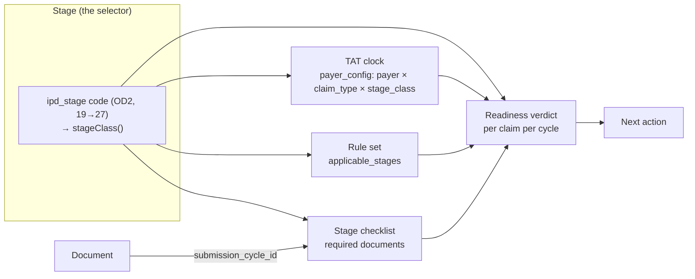
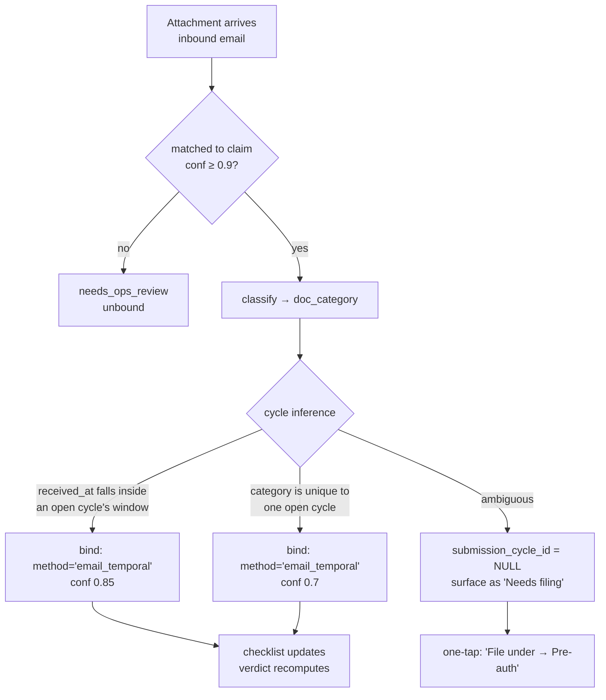

# Pre-Insurance Adjudication — The Product

**Date:** 2026-09-14
**Method:** Product design derived from three research dossiers (world adjudication engines, Indian cashless domain, agentic claims automation) reconciled against the *actual* ClaimOS codebase — schema migrations `024/030/031/032/035/036/037/043/044/067/068/069/072`, `Services/rules/*`, `Services/adjudication/*`, `Services/context/*`, and the live UI surfaces under `webapp/src/pages/hospital/`. Every table, column, stage code and file path named here either exists today or is marked **NEW** with the migration number allocated to it.

**Revision, 14 Sep 2026 (correction pass).** Reconciled against [`NEXT_PHASE_ROADMAP.md`](./NEXT_PHASE_ROADMAP.md) §2 (conflicts C1–C8), §4 (the single migration allocation 076–087) and §8. The substantive changes: the stage vocabulary is now the frozen OD2 one and its existing `StageClass` derivation, not a parallel scheme (§4.1); document binding adopts the companion architecture's **submission-cycle** model rather than a bare `stage_code` enum (§4.3); the existing `stage_transitions` table (mig 030) replaces the proposed `claim_stage_transitions` (§4.1b); evidence is document + section + **page** in V1, with bbox demoted to a named later work item (§3.2, §3.3, §6.1); and §5.3 now names the content owner, the authoring rate and the ramp, because that — not the engine — is the programme's bottleneck.

**Three invariants this document is bound by, shared with all four next-phase docs:**

1. **One stage taxonomy** — the 19 `ipd_stage` codes frozen by [`FROZEN_CONTRACTS.md`](./FROZEN_CONTRACTS.md) OD2, with `StageClass` (`Backend/src/Services/context/types.ts:38`) as the coarse selection axis. This document proposes an *extension of* that vocabulary, under sign-off; it does not propose a second one.
2. **One rules layer** — the adjudication engine's rule selection (`Services/rules/selection.ts` + `stageAwareAdjudicator.service.ts`). The agentic filing system *consumes* the verdicts and findings this document specifies; it does not implement a second rules engine (§6.7).
3. **One migration allocation** — `NEXT_PHASE_ROADMAP.md` §4. Every new table below carries its allocated number.

**North star:** *by the time a claim reaches the insurer, zero deficiencies are discoverable.*

**Companion docs:**
[`E2E_ARCHITECTURE.md`](./E2E_ARCHITECTURE.md) (what exists) ·
[`EXTRACTION_LANDSCAPE_FIX.md`](./EXTRACTION_LANDSCAPE_FIX.md) (the gating quality problem) ·
[`research/ADJUDICATION_ENGINES.md`](./research/ADJUDICATION_ENGINES.md) (how mature engines are built) ·
[`research/INDIAN_CLAIMS_DOMAIN.md`](./research/INDIAN_CLAIMS_DOMAIN.md) (stages, deficiencies, deductions) ·
[`research/AGENTIC_CLAIMS_AUTOMATION.md`](./research/AGENTIC_CLAIMS_AUTOMATION.md) (the filing/follow-up agent that consumes this verdict)

---

## 1. The problem, in outcomes the hospital feels

A hospital TPA desk does not experience "claims adjudication." It experiences five specific pains, in this order of felt severity:

1. **The query.** Two days after a pre-auth goes out, a TPA email lands: *"Provide complete discharge summary (patient name, gender, age, complaints, treatment done, diagnosis, DOA & DOD)."* The patient is still in bed. A bed-day is burning. Someone walks to the ward to chase a consultant's signature.
2. **The 3-hour clock at discharge.** The IRDAI Master Circular (29 May 2024) obliges the insurer to decide final authorisation within 3 hours of *receiving* the request ([`INDIAN_CLAIMS_DOMAIN.md` §4.1](./research/INDIAN_CLAIMS_DOMAIN.md)). That clock does not start until the file is complete. Every missing OT note is a discharge delay the hospital, not the insurer, absorbs.
3. **The short payment.** ₹4,80,000 claimed, ₹3,90,000 settled. A proportionate deduction from a room upgrade nobody flagged at admission, plus ₹18,000 of List II/III consumables that were never billable as separate lines ([`INDIAN_CLAIMS_DOMAIN.md` §8.1, §8.4](./research/INDIAN_CLAIMS_DOMAIN.md)). Discovered 40 days later, when the argument is unwinnable.
4. **The rework.** The same claim file assembled three times: pre-auth, enhancement, final. Each assembly re-collects documents already in the building. Nobody knows which version went out.
5. **The thing that slipped.** A query answered on day 6 of a 5-day window. An enhancement never raised for a ward→ICU shift. A claim folder dispatched on day 9 against a 7-day MOU window.

Every one of these is a **detectable-in-advance** failure. That is the entire product thesis.

### 1.1 The metrics this product moves

[`ADJUDICATION_ENGINES.md` §1.2](./research/ADJUDICATION_ENGINES.md) is unambiguous that **Clean Claim Rate is the vanity metric and First Pass Yield is the real one** — a claim can be structurally perfect and still be denied. We instrument both, and the *gap between them is our blind-spot measure*.

| Metric | Definition | Measured today from | Instrumentation gap |
|---|---|---|---|
| **FPY** (north star) | % of claims settled at full approved amount with **zero** query rounds and zero deduction | `hospital.stage_transitions` (mig `030`, **exists**) — no transition whose `after_stage` is `*_queried` — ∧ `claim_financials.final_approved_amount >= final_claimed_amount` | The append-only log already exists with `before_stage`, `after_stage`, `triggered_by`, `was_reversal` and causal linkage to `submission_events`. The gap is **coverage, not schema**: it is written on some paths and not others, and `ipds.stage` is not yet a projection of its head. See §4.1b. |
| **Query rate** (per stage) | queries received ÷ submissions made, sliced by stage × payer | `emails_inbound` → `email_intelligence_drafts` where `emailClassifier.v1` returns `query`, matched to claim by the 8-strategy ladder | Query *content* is free text. **Need `payer_deficiency_observations`** (**NEW**, mig `081`) normalising each query into `reason_code`s from our closed vocabulary (§3.2). Without this, nothing else in the feedback loop works — **and it has no input stream today**, because both configured hospital Gmail interfaces are disconnected on production (§7, V1 prerequisite). |
| **Deficiency rate (ours)** | % of claims where our gate found ≥1 BLOCKING finding before submission | `claim_rule_evaluations` (status `FAIL`) — **currently empty on prod** | Needs rule content. This is a leading indicator only. |
| **Days-to-settlement** | `settled_at − first_submission_at`, split into *payer-side* and *hospital-side* accumulators | `submission_events.created_at` per `event_type` | PM-JAY computes TAT **excluding time the claim sits with the hospital** ([`INDIAN_CLAIMS_DOMAIN.md` §4.3](./research/INDIAN_CLAIMS_DOMAIN.md)). Our clock must be a payer-side accumulator, not wall-clock age. Requires `stage_transitions` to be written on every path (§4.1b). |
| **Deduction leakage** | `Σ(claimed − approved)` at pre-auth and final, and as % of claimed | `claim_financials` — all four amount columns exist today, with LLM provenance (`*_approved_source_inbound_id`, `*_approved_confidence`) | Leakage is currently an *undifferentiated number*. **Need per-reason attribution**: a settlement letter parsed into `claim_deductions(reason_code, head, amount)` (**NEW**, mig `084`, the deduction-attribution half of the money layer) so we can say "₹62k of room-proportionate, ₹18k of List-II consumables". V2, not V1. |
| **Staff rework** | touches per claim: outbound emails sent, documents re-uploaded, human corrections applied | `emails_outbound` count per claim; `ipd_doc` rows per `(ipd_id, type)` beyond the first; `document_section_corrections` + `extraction_corrections` + `harmonisation_corrections` + `email_intelligence_corrections` row counts | Already measurable. This is our best **day-one baseline** across 18 hospitals / 917 claims. |
| **Bed-day burn at discharge** | `discharge_authorisation_requested_at → discharge_approved_at`, vs the 3-hour IRDAI norm | `submission_events` | Needs the event types to be emitted reliably on the `discharge_submitted` → `discharge_approved` transitions, via `stage_transitions` (030). |

**The one report that defines success:** a per-`(payer × specialty × stage)` calibration table showing *predicted clean* vs *realised FPY*. A cell where we assert "ready" and the TPA queries 30% of the time is a cell where we must **stop asserting readiness** ([`ADJUDICATION_ENGINES.md` §7.6.4](./research/ADJUDICATION_ENGINES.md)). This table is a product surface, not an internal dashboard — it is what earns the desk's trust.

**Baseline first.** Before a single rule is authored, we compute all seven metrics retrospectively over the existing 917 claims. Shipping a rules engine without a measured baseline means we can never prove it worked.

---

## 2. The user and the job

### 2.1 Who

| Role | Typical title | What they own | Our surface |
|---|---|---|---|
| **TPA desk coordinator** | Insurance Executive / TPA Coordinator | The claim from intimation to settlement. 30–80 live claims. Sends the pre-auth, chases the query, assembles the folder. | **Primary user.** Lives in the readiness queue all day. |
| **Billing / final bill** | Billing Executive | The itemised bill, non-payable segregation, patient counter collection | Consumes the financial-exposure findings (§3.4) *before* the bill is finalised |
| **Claims Administrator / Manager** | Insurance Manager, TPA Head | Denials, appeals, deduction disputes, payer relationships, the monthly reconciliation | Owns **overrides**, reads the calibration table, authors hospital-layer rules |
| **Treating consultant** | | Signatures, clinical justification, OT notes | Touched only through a targeted ask ("2 signatures needed, here are the pages") — never given a dashboard |
| **Ops / Finclarity rule author** | | The shared national + payer rule content | The authoring console (§5.3) |

### 2.2 The day we are intervening in

```
08:30  Night admissions list. Which need pre-auth raised today? Which are past the payer's window?
09:00  Inbox. 14 TPA emails. Three are queries. Two are approvals. One is a denial. Nine are noise.
10:00  Chase: ward for a signature, lab for a report, consultant for a justification note.
12:00  Discharge board. Four discharges today. Each needs a final-authorisation request that will not bounce.
15:00  Assemble two claim folders for dispatch. Re-collect documents that already exist somewhere.
17:00  Follow-ups on pre-auths with no response. Portal logins. Helpline calls.
19:00  The thing nobody did today.
```

**The job-to-be-done, in their words:** *"Tell me, for each claim in front of me right now, whether I can send it — and if not, exactly what is missing and who has it."*

Not "score my claim." Not "predict my approval probability." **Can I send it, and if not, what do I fix.**

That framing has a hard consequence: **a readiness percentage is the wrong primitive.** A 78% score is unactionable and, worse, untrustworthy — nobody can falsify it. A list of four named, evidenced, remediable defects is both actionable and falsifiable in five seconds. We will compute a score (the existing `readiness_score` in `rules/engine.ts` remains, for sorting the queue) but **we will never make it the headline.**

---

## 3. The core product concept: a per-stage submission gate

### 3.1 The verdict

For every `(claim, stage)` pair the product produces exactly one **Readiness Verdict**:

| Verdict | Meaning | UI affordance |
|---|---|---|
| `READY` | Every applicable check ran and passed. No BLOCKING or REQUIRED finding open. | The submit action is enabled and prominent. |
| `NOT_READY` | ≥1 BLOCKING or unresolved REQUIRED finding. | Submit is available but **requires an explicit override with a reason** (never hard-disabled — see §6.3). The deficiency list is the page. |
| `UNASSESSED` | We could not evaluate enough of the applicable checks to assert either. | Submit behaves as normal; the banner says plainly *what we could not check and why*. |

`UNASSESSED` is the most important of the three and the one most products omit. It is the honest output when extraction confidence is below threshold, when a document is illegible, or when **we have no rule content for this payer at all** ([`ADJUDICATION_ENGINES.md` §7.6.1–7.6.3](./research/ADJUDICATION_ENGINES.md)). The existing abstention gate in `Services/rules/engine.ts` — which forces `SKIP` below `rule.minConfidence` rather than guessing PASS/FAIL — is exactly the right instinct; `UNASSESSED` is that instinct surfaced to the user instead of buried in a status enum.

Every verdict is accompanied, always and non-optionally, by a **coverage line**:

> **Ready to submit — pre-auth.** 38 of 44 applicable checks passed. 6 not evaluated: implant invoice unreadable (2), no Star Health–specific rules for cardiac packages (4).

That second sentence is the product. It converts "trust me" into "here is precisely the extent of my claim."

### 3.2 The finding — the single most important schema

Everything the user sees is a **Finding**. We adopt the model in [`ADJUDICATION_ENGINES.md` §7.3](./research/ADJUDICATION_ENGINES.md) largely intact, because it is the distilled form of CARC/RARC, PM-JAY's dropdowns and NCCI's modifier-indicator pattern:

```
Finding {
  finding_id
  claim_id, stage
  scenario        DOCUMENTATION | DATA | NOT_COVERED | NOT_SEPARATELY_PAYABLE | TIMELINESS | AUTHENTICITY
  reason_code     closed, versioned vocabulary — DEF_DS_INCOMPLETE, DEF_IMPLANT_STICKER_MISSING, …
  severity        BLOCKING | REQUIRED | ADVISORY
  layer           L0..L7   (§3.5)
  confidence      calibrated; below threshold the finding is ADVISORY or suppressed
  dimensions      {stage, payer_id, claim_type, procedure_group, uin} that selected the rule
  rule_ref        {rule_id, rule_version, ruleset_version, effective_from}
  evidence[]      {field, value, doc_id, section_id, page, extractor_confidence}
                  // V1 grain = document + section + page. bbox is a later field, not a V1 one — see below.
  explanation     one human sentence
  remedy          a concrete action doable in five minutes
  citation        IRDAI clause / policy wording / STG / HBP package id / observed payer query
  bypass          machine-checkable justification that clears it
  status          open | resolved | overridden | expired
}
```

Three parts of that are non-negotiable and are where we win:

- **`reason_code` is a closed vocabulary.** Free-text findings kill aggregation, cross-hospital learning and per-payer analytics ([§7.7 anti-patterns](./research/ADJUDICATION_ENGINES.md)). We seed it directly from [`INDIAN_CLAIMS_DOMAIN.md` §7](./research/INDIAN_CLAIMS_DOMAIN.md) — ~50 `DEF_*` codes across five categories plus 8 `DEN_*` denial grounds. **NEW** table `finding_reason_codes(reason_code, category, scenario, default_severity, stage_detectable[], remediation_template, source_citation, version)`, mig `081`. The `Finding` object itself persists to **NEW** `claim_findings`, mig `081`, whose DDL lives in [`ADJUDICATION_ARCHITECTURE.md`](./ADJUDICATION_ARCHITECTURE.md) §6.1 — findings are a separate ledger from `claim_rule_evaluations` (which stays the per-rule trace, including passes).
- **`evidence[]` carries document + section + page.** This is the piece almost nobody ships. It turns *"the discharge summary is incomplete"* into *"here is the discharge summary, page 2, and here is the section where the consultant's registration number should be."* The pipeline already knows page ranges — `document_sections` is one row per page-range — so **page-level provenance is genuinely free on day one.**

  **Bounding boxes are not free, and this document previously claimed they were.** The shipped `LineItemSchema` (`Backend/src/Services/extractor/lineItems.ts:55`) emits `row_index, particulars, code, date, qty, rate, gross, discount, net, tax_pct, payable, source_page, confidence` — **no coordinates** — and the tiler returns page slices, not row boxes. Row-level localisation is an unbuilt pass, not a by-product of the tiling work. V1 evidence is therefore *document → section → page*, rendered as a page thumbnail with the section's page range called out. Bbox is a named later work item, and nothing in V1 or V2 depends on it.
- **`bypass`.** The NCCI modifier-indicator pattern: a finding that a documented justification clears. "Implant billed above NPPA ceiling" is bypassed by an attached insurer tariff addendum. Without bypass, rules that are right 90% of the time get disabled entirely by frustrated users.

**Deficiencies and denials route to different queues.** [`INDIAN_CLAIMS_DOMAIN.md` §7.6](./research/INDIAN_CLAIMS_DOMAIN.md) is emphatic: categories A–E are *deficiencies* (soft, recoverable by resubmission inside a window); category F are *denials* (coverage decisions, recoverable only by appeal, and post-2024 a repudiation must clear a three-member Claims Review Committee). A TPA coordinator fixes deficiencies. A Claims Manager argues denials. Mixing them in one list is a product error.

### 3.3 What the user actually sees

The surfaces exist in skeleton today — `webapp/src/pages/hospital/AdjudicationView/` already has `BlockingGapItem.tsx`, `WarningItem.tsx`, `PredictedOutcomeCard.tsx`, and `PatientDetail/` has `NextStepsCard.tsx` and `PatientDocumentsPanel.tsx`. We are filling them, not inventing them.

**A. The Readiness Queue** (upgrade of `pages/hospital/Patients`) — the desk's home screen. One row per live claim: patient, payer, stage, verdict chip, the *single most urgent finding*, and the running clock for that stage. Sorted by *time-to-breach*, not by readiness score. This is where "never lets anything slip" is operationalised.

**B. The Claim Readiness surface** (`AdjudicationView`) — three panes:

- **The verdict + coverage line** (§3.1). Never a bare percentage.
- **The deficiency list**, grouped by severity, each row: reason code label → one-sentence explanation → remedy → *evidence pointer* (the actual page, opened at the cited section's page range) → the rule and its citation → resolve / override / bypass. Page-and-section, not a highlighted rectangle — see §3.2.
- **The passes.** Collapsed by default, expandable: *"41 checks passed."* [`ADJUDICATION_ENGINES.md` §7.5](./research/ADJUDICATION_ENGINES.md) is right that a checklist showing 41 passes and 2 fails is credible where a list of 2 red items is not. It is also the only way the user can see what was *not* checked.

**C. One-click remediation.** Every finding carries a typed remedy, and the remedy is a *button*, not prose. The action types already exist in `claim_actions.kind` (`request_doc`, `notify_ops`, `approval_request`, `follow_up_sla`) with an idempotency key, and the Gmail outbound path (`gmailSend.service` + `emailOutbox.queue`, MIME with S3 attachments, VERP reply correlation) already ships. The mapping:

| Finding | Remedy button | Mechanism |
|---|---|---|
| `DEF_DS_NO_SIGNATURE` | "Request signature from Dr. Rao" | `claim_actions{kind:'request_doc', target_kind:'whatsapp_user'}` with the page deep-link |
| `DEF_INVESTIGATION_MISSING` | "Upload CBC report" | Opens stage-bound upload (§4.3), pre-filled with stage + doc category |
| `DEF_NONPAYABLE_BILLED` | "Move 7 lines to patient counter" | Opens the bill with the offending `line_items` pre-selected against the List II/III match |
| `DEF_PREAUTH_AMOUNT_SHORT` | "Raise enhancement for ₹1,20,000" | Drafts the enhancement request (opens an `enhancement` cycle, §4.3) |
| `DEF_QUERY_RESPONSE_LATE` (imminent) | "Reply to query — 4h left" | Drafts the reply with the newly-attached documents |

Every remedy that sends anything outward is **drafted, never auto-sent, in V1** — same discipline as `email_intelligence_drafts` today (`pending_review` → human `applyDraft`). Autonomy is earned per action type, per §6.4.

**D. Override and appeal.** Any finding can be overridden with a reason, by anyone with the claims-manager role. The override is recorded (`rule_overrides` exists), scoped (`this claim` / `this payer+procedure, expiring in 90 days`), and **counted** — a rule overridden >25% of the time is auto-surfaced for retirement (§5.4). Overrides are how the product learns it was wrong, which is why they must be cheap to record and expensive to ignore.

### 3.4 The financial forecast is a first-class finding, not a report

The most valuable finding in the Indian market is not a missing document. It is: *"this claim will be short-paid ₹78,000 and here is the arithmetic."*

The extraction work has just made this feasible. With a full `line_items[]` array per bill (`particulars, code, date, qty, rate, gross, discount, net, tax_pct, payable, source_page`) we can run **per-line** adjudication. The array is persisted at `document_sections.extracted_fields.line_items` with a table-level `line_items_confidence`; `claim_line_items` (**NEW**, mig `083`) is a *projection* of it, not a second extraction.

**One caveat that gates this entire section:** the ~99.5% figure in [`EXTRACTION_LANDSCAPE_FIX.md` §3](./EXTRACTION_LANDSCAPE_FIX.md) is measured on the synthetic harness. It proves the technique works; it does not prove it holds on real production scans. Per-category accuracy on a human-verified sample of *production* `final_bill` and `pharmacy_bill` documents is a hard gate before any money rule enters even shadow mode (§8.1, and `NEXT_PHASE_ROADMAP.md` Phase A exit 2).

- **Room-rent proportionate deduction** — `eligible_ratio = min(1, cap_per_day / actual_per_day)`, applied to the associated heads, with the exempt-head set resolved *per UIN* rather than as a constant ([`INDIAN_CLAIMS_DOMAIN.md` §8.1](./research/INDIAN_CLAIMS_DOMAIN.md)). **Computable at admission**, from the pre-auth form's room rent versus the policy cap — which is when it is still fixable, either by moving the room or by getting a signed patient acknowledgement of the differential.
- **Non-payables** — fuzzy-match each bill line against the IRDAI Annexure-I four lists (68/37/23/18 items) held in `reference_nonpayable` (**NEW**, mig `082`). Crucially, **List II–IV items are billing defects, not patient liabilities** — they are already paid for inside room/procedure/treatment charges, so the remedy is *strip the line*, not *move it to the patient counter*. And the evaluation is `list_membership × policy_rider_state`: a consumables rider or a corporate waiver makes List I payable.
- **Implant caps** — `reference_nppa_cap(device_class, ceiling_ex_gst, effective_from, effective_to, order_ref)` (**NEW**, mig `082`). Dated, never constants: a stent billed at last year's ceiling after a revision is a silent deduction.
- **Sub-limits and co-pay** — cataract per-eye, joint replacement, maternity, ICU per-day, from `benefit_plan` (**NEW**, mig `082`; it exists nowhere in the schema today, despite being referenced across the next-phase docs as though it did).

Presented as a single card on `ClaimFinancialsCard.tsx`: **Claimed ₹4,80,000 → Forecast payable ₹4,02,000**, expandable into the four deduction reasons, each with the bill lines that cause it, each with a remedy. Deliberately hedged as a *forecast with a range* and calibrated against realised `claim_financials` deltas — see §6.2.

### 3.5 The layered gate, and the stop rule that saves the product

We adopt the SNIP-like ladder of [`ADJUDICATION_ENGINES.md` §7.2](./research/ADJUDICATION_ENGINES.md):

| Layer | Checks | ClaimOS source |
|---|---|---|
| **L0** Artifact integrity | readable, right orientation, legible, not duplicate, not a stock image | OCR confidence, the 5-layer dedup, `doc_phase_ledger` |
| **L1** Extraction confidence | did we actually read the fields | `document_sections.extraction_confidence`, tiling agreement across overlapping slices |
| **L2** Internal consistency | DOA ≤ DOD, LOS matches, bill total = Σ break-up, IDs tie across documents | `claim_harmonised_episodes` (medical_episode.v2) |
| **L3** Completeness | required document set present for `(stage, payer, claim_type, procedure_group)` | `insurer_document_requirements`, `stage_requirements` |
| **L4** Clinical coherence | complaints ↔ diagnosis ↔ procedure ↔ investigations ↔ OT notes ↔ package | `LLM_COHERENCE` / `EVIDENCE_CHECK` semantic evaluators (already declared in `rules/types.ts`) |
| **L5** Policy admissibility | coverage, exclusions, waiting periods, SI remaining, empanelment | `benefit_plan` by UIN (**NEW**, `082`) |
| **L6** Financial forecast | §3.4 | `line_items[]` + `reference_nonpayable` / `reference_nppa_cap` (**NEW**, `082`) + `claim_line_items` (**NEW**, `083`) |
| **L7** Payer idiosyncrasies | this TPA's learned quirks | mined from `payer_deficiency_observations` (**NEW**, `081`) |

**The stop rule is the single most important engineering constraint in this document: do not report L4+ findings on a claim that fails L0 or L1.** A garbled extraction produces confident nonsense at the clinical and financial layers. An amount row-shifted onto the wrong line item is an **L1 failure masquerading as an L6 finding** — and the [`EXTRACTION_LANDSCAPE_FIX.md`](./EXTRACTION_LANDSCAPE_FIX.md) proof shows exactly this happening on single-image landscape bills (80–97%, errors concentrated in the money and date columns). On an L0/L1 failure the verdict is `UNASSESSED` with a "this document needs a better scan" finding, and nothing else.

This one rule prevents most of the "the tool cried wolf" failure mode that kills adjudication products in month three.

---

## 4. Stage-awareness as a product primitive

### 4.1 What a stage *is*

Today, `ipds.stage` is a **status stamp** — a mutable column holding one of the **19** curated codes in `master_options(category='ipd_stage')` (mig `024:28–46`): `draft, preauth_submitted, preauth_queried, …, claim_approved`. It records what has happened. (An earlier draft of this document said 20. There are 19, and [`FROZEN_CONTRACTS.md`](./FROZEN_CONTRACTS.md) OD2 lists all 19 by name.)

The product needs something different. **A stage is a gate you submit *into*.** It is a named moment at which a defined set of artefacts, with defined adequacy, must be in hand, against a defined clock. The stage is what selects the checklist, the rules, the TAT, and the verdict.

**There is exactly one stage vocabulary, and it is OD2's.** Two coarser or finer schemes were floated across the next-phase docs — a new 7-value `stage_kind` category and an `S00–S17` workflow taxonomy. Both are refused (`NEXT_PHASE_ROADMAP.md` C1). The 19 codes are the state machine; the coarse axis that rules select on is **`StageClass`**, which already exists in the contract artifact:

```ts
// Backend/src/Services/context/types.ts:38 — OD2's canonical stage classes, already shipped
export type StageClass = 'preauth' | 'enhancement' | 'discharge' | 'claim' | 'other';
// and derived, already shipped, at Services/context/resolver.ts:34
export function stageClass(stage: string | null | undefined): StageClass
```

with a document-mix cross-check `docMixStageClass()` at `resolver.ts:49`. Nothing in this document introduces a parallel vocabulary; where it needs a coarser grain than the 19 codes, it uses `StageClass`, and where it needs a *finer* grain than a stage — enhancement #2 versus enhancement #1 — it uses a **submission cycle** (§4.3), which is a repetition of a stage class, not a new stage.

Two changes follow, and both are amendments *of* OD2 rather than alternatives to it:

**(a) Extend the vocabulary — a `CONTRACT_DRIFT` event requiring sign-off.** The 19 codes cover pre-auth → enhancement → discharge → claim, but miss the front and the back of the lifecycle where the *expensive* failures live. Reconciling with [`INDIAN_CLAIMS_DOMAIN.md` §3.1](./research/INDIAN_CLAIMS_DOMAIN.md):

| Gap in today's vocabulary | Proposed new `ipd_stage` codes | Maps to `StageClass` | Why it matters |
|---|---|---|---|
| No eligibility / intimation stage | `eligibility_check`, `intimation_sent` | `intimation` *(new class)* | `CASHLESS_EVERYWHERE` has a **hard 48-hour elective intimation deadline** that is unrecoverable if missed. Today we cannot even represent the moment at which it is checkable. |
| No denial states | `preauth_denied`, `enhancements_denied` | `preauth`, `enhancement` | Denials route to the appeal queue, not the deficiency queue |
| Nothing after approval | `claim_settled`, `claim_short_paid` | `claim` | **FPY and deduction leakage are unmeasurable without these.** `claim_approved` today conflates "insurer said yes" with "money arrived in full". |
| No appeal / write-off tail | `appeal_filed`, `written_off` | `appeal` *(new class)* | A disputed deduction has a life after settlement, and today it has no state to live in. |

That is **19 → 27 codes** and **`StageClass` 5 → 7** (`intimation` and `appeal` added; `query_response` is deliberately *not* a class — a query round is a cycle, §4.3).

**This is a `CONTRACT_DRIFT` event under OD2 and it does not proceed without sign-off** (`NEXT_PHASE_ROADMAP.md` decision **D2**), because it changes the TypeScript contract artifact `IPD_STAGE_CODES` (`Services/context/types.ts:13`) and every consumer of it:

- `ipds.stage` · `claim_context.stage` (067) · `document_sections.stage` (067) · `stage_transitions.before_stage/after_stage` (030)
- `stage_requirements.target_stage` (035) · `insurer_rule_sets.applicable_stages` and `insurance_rules.applicable_stages` (044/068)
- `stageClass()` and `docMixStageClass()` in `resolver.ts`, plus every selection weight in `Services/rules/selection.ts:45`

Two implementation notes that are easy to get wrong: the new codes must be seeded into `master_options` in the *same* migration that extends the TS constant (076), and `enhancements_denied` is spelled with the plural stem deliberately — `stageClass()` matches `startsWith('enhancements')`, so a singular `enhancement_denied` would silently classify as `other`.

Also: `discharge_submitted` is the 3-hour final-authorisation request, and the enhancement loop needs to be enterable *repeatedly* — the codes already allow it, the UI does not, and §4.3's cycle model is what makes the repetition addressable.

**(b) The transition log already exists — populate it, do not re-create it.** An earlier draft proposed a new `claim_stage_transitions` table. **`hospital.stage_transitions` already exists** (mig `030_event_schema_extensions.sql:142`) and is a strictly better version of it:

| What we wanted | What 030 already has |
|---|---|
| `from_stage` / `to_stage` | `before_stage` (NULL on first) / `after_stage` |
| `occurred_at` | `created_at` |
| `actor` | `actor_user_id` |
| `trigger_source` | `triggered_by` (`human \| ai_suggestion \| inbound_email \| submission_sent \| timeout`) |
| `evidence_ref` | `triggering_event_id → submission_events(id)`, plus `context_doc_section_ids[]` and `unresolved_query_ids[]` |
| — | `was_reversal`, `reasoning`, and three indexes |

So the work is **not a migration**. It is three things: (i) write a `stage_transitions` row on *every* path that mutates `ipds.stage`, not only the ones that do today — that gap is why §1.1's clock metrics are not computable; (ii) make `ipds.stage` a projection of the log's head rather than an independently-mutated column; (iii) use it as the cycle-opening trigger (§4.3). Without (i) and (ii), TAT cannot be split into payer-side and hospital-side accumulators, and "re-running a claim produces a new decision record, never an overwrite" ([`ADJUDICATION_ENGINES.md` §4.5](./research/ADJUDICATION_ENGINES.md)) is unenforceable. If the log turns out to be missing a column we need, we **add the column to 030's table**; we do not start a second log.

### 4.2 What it means that everything is stage-bound



- **Documents** bind to a *submission cycle*, which carries the stage. The final bill uploaded for the discharge cycle is a different artefact, evaluated differently, from the interim bill uploaded for enhancement #2.
- **Rules** declare their stages. `insurance_rules.applicable_stages TEXT[]` already exists (migration `068`) alongside `applicable_schemes`, `applicable_routes`, `applicable_case_types`, and `Services/rules/selection.ts:45` already weights stage 4 / insurer 4 / scheme 3 / case_type 2 / route 1. **The selector is built; it has no content** — which is §5.3's problem, not a schema one.
- **Verdicts** are per-stage. `claim_hypothesis` (migration `069`) is already keyed `(claim_id, stage)` with a 4-layer hypothesis. `claim_dossiers.doc_sufficiency_per_stage` (031) already exists as a JSONB projection. The spine is in place.
- **Clocks** are per-stage-class and per-payer, and they live in `payer_config` (**NEW**, mig `080`) — a table all four next-phase docs referenced and none defined. It carries per-`(payer × claim_type × stage_class)` TATs, submission and query windows, and is seeded from *published* clocks first (IRDAI 1h/3h/30d; PM-JAY 48h/24h/45d; Cashless Everywhere 48h intimation), with MOU windows arriving later as a separate content stream. A pre-auth query has a 24-hour response window under PM-JAY private EHCP (auto-reject at 72h); a post-submission claim query typically has 30–60 days under a private MOU.

### 4.3 The UX of stage-aware upload

**This is the product change users will feel most, and it is currently absent.** `ipd_doc.type` is an upload-time free-ish category; `document_sections.category` is AI-derived; **neither is bound to a stage.**

**The change:** uploading is reframed from "add a document to this patient" to **"complete this stage's checklist."**

The upload surface (`PatientDocumentsPanel.tsx`) becomes stage-first:

```
Pre-auth · Star Health · Cardiac – PTCA                      NOT READY
────────────────────────────────────────────────────────────────────
✓ Pre-auth form              complete
✓ Photo ID                   Aadhaar · name matches policy
✓ TPA card                   
✓ Prescription               
⚠ Investigation reports      CAG images present · Trop-I missing      [Upload]
✗ CAG diagram                required for PTCA, not found             [Upload]
○ Implant invoice            not required until the discharge cycle
────────────────────────────────────────────────────────────────────
                                            [ Drop files for this stage ]
```

- The checklist is **resolved live** from `insurer_document_requirements` × `stage_requirements` for this `(stage, payer, claim_type, procedure_group)` — not a static list.
- Dropping a file onto a checklist row binds it to the **open cycle**: `ipd_doc.submission_cycle_id = <the open preauth cycle>`, `doc_category = 'cag_report'`, `stage_assignment_method = 'human'`. **User intent is the strongest signal we will ever get about a document** and today we throw it away.
- Dropping a file into the general area lets the classifier decide the category, and the *currently open cycle* supplies the binding, with `stage_assignment_method = 'upload_current'` at confidence 0.95.
- Items shown with `○` — required at a *later* stage — are the quiet feature. A coordinator who sees "implant invoice needed at discharge" while the patient is still in OT collects it at the right moment instead of chasing the vendor three weeks later.

**Schema: the submission cycle, not a bare enum.** An earlier draft of this document proposed `ipd_doc.stage_code / stage_binding_source / stage_binding_confidence`. That is wrong in a way that matters: **stages repeat.** A bare enum cannot distinguish the document set of enhancement #2 from enhancement #1, nor a third query round from the first — and those are exactly the cases where the desk loses track. We adopt the companion architecture's cycle model in full ([`ADJUDICATION_ARCHITECTURE.md`](./ADJUDICATION_ARCHITECTURE.md) §5.2, `NEXT_PHASE_ROADMAP.md` C4), with `stage_class` in place of that doc's proposed `stage_kind` per C1:

```
-- 076_submission_cycles_and_stage_binding.sql        [NEW]
hospital.claim_submission_cycles(
  id, claim_id, stage_class, cycle_no, parent_cycle_id,       -- a query round is a CHILD cycle
  opened_at, opened_by_transition_id → stage_transitions(id), -- 030's log is the trigger
  submitted_at, closed_at, outcome, due_at, ipd_stage_at_open)

ALTER TABLE hospital.ipd_doc ADD
  submission_cycle_id, stage_class, stage_assignment_method, stage_assignment_confidence;
  -- method ∈ human | upload_current | email_temporal | backfill_inferred

-- document_sections.stage (nullable since 067, carrying the comment "M2 will populate it")
-- becomes a DERIVED projection of the parent document's cycle. A bundle PDF can legitimately
-- span stages — pre-auth letter + final bill in one scan — so the section, not the file,
-- stays the true grain of evaluation.
```

`077_stage_backfill.sql` + `Backend/src/scripts/backfillSubmissionCycles.ts` (**NEW**) back-fill the existing corpus in three passes — transition-derived (0.9), correspondence-derived (0.75), `docMixStageClass()` synthetic (0.5). Expect roughly half the historical corpus at 0.5. **That is the correct answer and it must be reported as coverage, not hidden**, exactly as §5.4 requires of everything else.

Extending `StageClass` to seven values and `IPD_STAGE_CODES` to 27 happens in this same migration, and is the `CONTRACT_DRIFT` sign-off of §4.1a.

### 4.4 Out-of-band arrivals — the case that breaks naive designs

Most documents will *not* arrive through the checklist. They arrive as an attachment on a TPA email, matched to a claim by the 8-strategy ladder in `emailMatching.service` and auto-saved to `ipd_doc` when confidence ≥0.9. They have no stage, and the stage they belong to is genuinely ambiguous.

The rule: **infer, never assert.**



Three product commitments here:

1. **An unbound document is visible, not lost.** A "Needs filing (3)" chip on the claim. One tap files it. This is a 5-second task the desk will happily do, *if* we ask; it is a catastrophe if we silently guess wrong.
2. **A wrongly-inferred binding is cheap to fix and is recorded.** Every correction writes to `stage_binding_corrections` (**NEW**, mig `076`), which trains the inference — the same pattern already used by `document_section_corrections` (032) and `extraction_corrections` (064). A human re-file is `stage_assignment_method='human'` at confidence 1.0 and always wins.
3. **An out-of-band document *re-opens* the verdict.** If the final bill arrives by email after the discharge cycle was marked READY, the verdict recomputes and the desk is told. Readiness is a live property, not a stamp.

**The three wiring points that decide whether any of this is real.** Stage-awareness is not a column; it is three call sites, and if any one of them is skipped the primitive stays inert:

| # | Call site | What it must do |
|---|---|---|
| 1 | `Controllers/v2/uploads.controller.ts` | Stamp the claim's open cycle on upload (`upload_current`, 0.95); most-recently-opened leaf when several are open |
| 2 | `Services/gmailInbound.service.ts` | Bind attachments by `emails_inbound.received_at` falling inside `[opened_at, closed_at)`; a query email opens a *child* cycle and its attachments bind to the **parent** |
| 3 | the projection | `document_sections.stage := ipd_doc.stage_class` of the parent document |

### 4.5 The checklist drives completion

The checklist is the completion engine, and it is what makes "never lets anything slip" mechanical rather than heroic:

- **Percent-complete per stage** is shown, but as *"6 of 9 required documents"* — a count, not a score.
- **A missing checklist item auto-generates a `claim_actions` row** with an idempotency key derived from `(claim_id, stage, doc_code)`, routed to whoever holds that document — ward, lab, consultant, billing. That routing table is a per-hospital configuration, not a guess.
- **Checklist items carry the clock.** "CAG diagram — required for submission, pre-auth window closes in 19h."
- **Completing the checklist is what flips the verdict**, and flipping the verdict is what enables the submit action. The loop is tight enough that the user learns the rules by using the product.

---

## 5. Rule dimensionality: stage × payer × disease × claim type

### 5.1 The honest dimensionality

The brief names four axes. [`ADJUDICATION_ENGINES.md` §7.1](./research/ADJUDICATION_ENGINES.md) argues the minimal honest set is **seven**: stage, payer, claim type, clinical, patient, financial, temporal. Both are right — four is what the *user* authors against; seven is what the *engine* must key on.

And the resolution key is not the insurer. It is the **UIN** (policy product identifier, e.g. `ADIHLIP21062V022021`) where available, falling back to `insurer × product_family` ([`INDIAN_CLAIMS_DOMAIN.md` §2](./research/INDIAN_CLAIMS_DOMAIN.md)) — two policies from the same insurer routinely carry different room-rent caps and different non-payable annexures. For corporate group policies the key is the group benefit table, not the insurer's retail product; corporate GMC frequently removes precisely the clauses (room cap, PED wait, co-pay) that generate retail deductions.

**The anti-pattern to refuse outright: one giant N-dimensional rule table.** Instead, many small **rule families**, each with one conclusion, each declaring only the axes it actually uses:

```
required_documents(stage, claim_type, procedure_group, payer)   → document_set
document_adequate(doc_category, extracted_fields)               → adequacy + reasons
timeliness(stage, event_timestamps, payer_tat_config)           → verdict + deadline
coverage_admissible(uin, diagnosis, doa, ped_status, waits)     → verdict
financial_exposure(room_category, caps, line_items, nonpayables) → forecast + per-line attribution
package_admissible(package, diagnosis, procedure, age, sex)     → verdict   [scheme claims]
```

A top-level COLLECT node aggregates the findings. Each family has its own hit policy, its own completeness declaration, and its own owner.

**Resolution order — most specific wins, union for documents, max-severity for deficiencies** ([`INDIAN_CLAIMS_DOMAIN.md` §11](./research/INDIAN_CLAIMS_DOMAIN.md)):

```
(payer, claim_type, procedure_group, uin)
  → (payer, claim_type, procedure_group)
  → (payer, claim_type)
  → (claim_type)
  → (*)
```

The existing selector in `Services/rules/selection.ts` + `stageAwareAdjudicator.service.ts:265` resolves `{scheme, route, insurer, stage, case_type}` today, with specificity weights already in place (`selection.ts:45`). It needs two axes added — **`procedure_group`** and **`uin`/`benefit_plan_id`**, as new `TEXT[]` columns on `insurer_rule_sets` / `insurance_rules` (**NEW**, mig `081`) — and the tables need content.

**This selector is the one rules layer.** It resolves rule sets for readiness verdicts *and* for the agentic system's next-action derivation; there is no second resolver and no parallel follow-up-ladder engine (§6.7).

### 5.2 Claim type changes more than the payer does

`claim_type` is a first-class key because it changes the document set, the clocks *and* the deduction model:

| Claim type | The delta that matters |
|---|---|
| `EMPANELLED_CASHLESS` | Baseline. Tariff = negotiated hospital rate card. |
| `CASHLESS_EVERYWHERE` | **48h elective / 48h emergency intimation, hard and unrecoverable.** Two extra artefacts: hospital consent letter, ad-hoc rate agreement. Higher insurer discretion to refuse. The intimation check must fire on the day surgery is *scheduled*, not the day of admission. |
| `GOVT_SCHEME_PMJAY` | **Package (HBP) rates, not itemised.** Package-code correctness is a top rejection reason. Mandatory STG documents, clinical photographs, biometrics in some states. TAT is auto-enforced: 48h pre-auth initiation → auto-reject; 24h query response → auto-reject at 72h; claim submission >45 days inadmissible outright. |
| `CORPORATE_GROUP` | Benefit table is per-corporate, not per-UIN. Usually removes room cap / PED wait / co-pay, adds disease-wise sub-limits. **The most under-modelled axis.** |
| `TOP_UP_SUPER_TOPUP` | The primary insurer's settlement letter becomes a mandatory document. |
| `REIMBURSEMENT` | Originals, patient signatures, KYC, NEFT mandate; hospital is not the payee. |

ClaimOS already carries `ipds.claim_filing_route` (migration `017`) and `is_empanelled` (`020`), and the adjudicator resolves `{scheme, route, case_type}`. The vocabulary needs widening to the ten types above and the mapping made explicit rather than inferred.

### 5.3 How rules get authored — and who owns them

**Non-engineers author.** This is the headline capability of every mature platform (Sapiens, FINEOS, Duck Creek, Guidewire Olos, Waystar Rule Manager) and the thing that decides whether a rule base stays alive. A senior TPA coordinator must be able to encode *"Star Health now wants the anaesthetist's notes for all GA cases"* without a deploy.

**Layered content, never forks** — the Optum CES model:

| Layer | Owner | Editable? | Examples |
|---|---|---|---|
| **Base / regulatory** | Finclarity ops | Read-only to hospitals | IRDAI Annexure-I Lists I–IV, NPPA ceilings, IRDAI TAT norms, standard form field sets |
| **Scheme** | Finclarity ops | Read-only | PM-JAY HBP packages, STG document sets, NHA query/rejection vocabulary |
| **Payer** | Finclarity ops + hospital proposal | Parameterise & enable/disable | "Vidal: claim folder within 7 days", "Insurer X: anaesthesia notes for GA" |
| **Hospital** | Hospital claims manager | Full | "Our cardiology unit always attaches the cath-lab note" |

Lower layers **enable, disable and parameterise** upper layers. They never edit base content in place.

**Four governance rules, adopted verbatim from [`ADJUDICATION_ENGINES.md` §7.4](./research/ADJUDICATION_ENGINES.md):**

1. **A rule without a citation cannot be published.** IRDAI clause, policy wording, STG reference, MOU page, or a specific observed payer query email. Strongest single governance constraint available, costs nothing to enforce. It is a NOT NULL column.
2. **Every rule carries provenance** — author, source document, effective dates, reviewer, next review date.
3. **Draft → simulate → shadow → champion/challenger → publish.** Simulation runs the candidate against the 917 historical claims and reports what changes. Shadow runs it silently on live traffic. Neither is optional.
4. **Deprecation is a workflow.** Rules that never fire, or that fire and are always overridden, surface automatically for retirement. Rule bases die from accumulation, not from bad individual rules.

**Effective dating is not negotiable.** A claim for a March admission is adjudicated against **March's** rules even when re-run in September. Every rule row carries `effective_from` / `effective_to` (`stage_requirements` and `insurer_rule_sets` already do — `044`, currently unused); every stored verdict carries `ruleset_version`; re-running produces a *new* decision record. This dovetails with the codebase's existing `re-run = from scratch` principle — with one sharpening: a re-run wipes AI-derived *interpretation*, but **finalised verdicts are never retroactively re-adjudicated**, they are superseded.

### 5.3a The content project — owner, rate, sources, ramp

**This is the bottleneck of the entire programme, and it is the part of the plan most likely to be left unowned.** Every phase after the engine lands is a content-acquisition problem wearing an engineering costume. The engine is ~70% built and 0% populated; a perfect engine with eleven rules is worth nothing. So, concretely: who authors, at what rate, from what, and what the ramp actually looks like.

**What "today's rule base" actually is.** Production's rule tables are **empty**, so the adjudicator abstains on every claim. But the *ledger* is not contentless: migration `044` seeds **three rule sets** — `ICICI_LOMBARD_CARDIAC_V1`, `STAR_HEALTH_ORTHOPEDIC_V1`, `SADBHAWANA_PMJAY_THR_V1` (`044_insurer_rule_sets.sql:221,335,447`) — whose `insurance_rules` rows predate the `kind` column added in `068`. If `044` were applied to production as-is, those sets would **match, win selection, and evaluate to nothing** (`no_kinded_rules`), which is worse than an empty table because it looks like coverage. **First content task, before any new authoring: kind-ify these three or retire them.** Leaving them is not an option.

**Who authors.** A named, full-time **TPA-desk domain owner** — a senior claims professional, not an engineer, and not a coordinator doing this between desk shifts. This is founder decision **D5** in `NEXT_PHASE_ROADMAP.md` and the plan does not work without it. Around that one person:

| Role | Commitment | What they do |
|---|---|---|
| **Rule content owner** (the hire) | 1.0 FTE | Authors, cites, simulates, shadows, publishes. Owns the reason-code vocabulary and the payer packs. Owns the publish rate. |
| **Supporting engineer** | ~0.3 FTE | The authoring loop: seed-script schema, the simulate-over-917 harness, the shadow diff report, the promotion dashboard. Not a rule author. |
| **Clinical reviewer** (consultant or senior billing manager) | ~2 h/week | Governance rule 2's `reviewer` field on anything clinical-adjacent. A rule without a reviewer is not publishable. |
| **Founder / CS** | episodic | MOU acquisition (**D3**) and payer relationships. The long pole, and not delegable. |

**The authoring rate, honestly.** A *published* rule is not a line of YAML. It is: a condition over a declared input contract, a `reason_code` from the closed vocabulary, a citation, `evidence_requirements`, a `min_confidence`, a `requires_extraction_grade` flag where it reads extracted money, test fixtures, a simulation run over the 917 historical claims, and a shadow period. Separate the two things that get conflated:

- **Reference-data rows** (a non-payable list item, an NPPA ceiling, a TAT figure) are transcription-and-verify. Fast: **~150–200 rows/day** sustained. IRDAI Annexure-I's four lists (68/37/23/18 = 146 items) are about a day's work, not a sprint's.
- **Rules** are slow. Realistic sustained throughput for one trained author with the loop working: **8–12 published rules per week**, ≈40/month. During bootstrap — before the vocabulary and the simulate harness exist — expect **~4/week**.

The arithmetic this forces is uncomfortable and should be faced now: **V2's gate of ≥300 published rules is ~8 months of one author**, or ~4 with two. It is not a quarter's work. Either the gate moves, or the headcount does.

**Sources, in yield order, each with its owner and its lead time:**

| # | Source | Owner | Lead time | Yield |
|---|---|---|---|---|
| 1 | **Published regulatory** — IRDAI Master Circular 29-05-2024, Annexure-I Lists I–IV, NPPA ceiling orders | content owner | days | Insurer-agnostic, so `n` = the whole corpus. Highest statistical value per rule; the only place thin-cell problems do not bite. |
| 2 | **Published scheme** — NHA Claims Adjudication Manual 2.0, HBP master, state operational orders | content owner | days–weeks | Seeds `finding_reason_codes` directly. Caveat §9 item 5: confirm current TAT figures before enforcing auto-reject clocks. |
| 3 | **Hospital empanelment MOUs** — submission windows, query windows, tariffs, package terms | founder / CS (**D3**) | **weeks–months per hospital** | Highest-value private content. Also the long pole: payer-layer rules and `payer_config` are thin without it. A *sales* activity. |
| 4 | **UIN policy wordings**, top 10 payers by volume | content owner | weeks | Required before the financial forecast asserts anything (§9 item 2). Proportionate-exempt head sets live here. |
| 5 | **Observed payer behaviour** — inbound queries and deductions normalised into `payer_deficiency_observations` (**NEW**, `081`), mined into `rule_proposals` (**NEW**, `081`) | the system | compounding | The only way to learn unpublished TPA rulebooks, and it compounds across 18 hospitals. **Yields exactly zero until Gmail is reconnected** — both configured hospital interfaces are disconnected on production today. |

**The realistic ramp**, one author, assuming the D5 hire lands at week 0 and the authoring loop is built in parallel:

| Weeks | Deliverable | Published rules (cum.) | Gates it clears |
|---|---|---|---|
| 1–2 | **Bootstrap.** `044`'s three seeds kind-ified or retired. Reason-code vocabulary authored (~50 `DEF_*` + 8 `DEN_*`). Authoring loop working end to end: seed script → simulate over 917 → shadow → diff report. | 0 | nothing yet — and that is correct |
| 3–6 | **Regulatory base pack.** 146 non-payable rows, ~40 NPPA ceilings, IRDAI/PM-JAY TAT rows into `payer_config`. ~6 rule families, L0–L3. | ~25 | Applies corpus-wide, so shadow precision is measurable immediately |
| 7–10 | **Scheme pack.** PM-JAY HBP packages, STG document sets, NHA query/rejection vocabulary. | ~55 | `GOVT_SCHEME_PMJAY` claims fully covered at L0–L3 |
| 11–18 | **Payer pack.** Top 3 payers × top 5 procedure groups × 2 stage classes = 30 cells, L0–L3 only. ~10/week. | ~135 | **V1 scope complete around week 14–16** |
| 19–35 | Depth: L5 admissibility, L6 money (gated on §8.1), remaining payers | ~300 | V2's rule-count gate, at one author |

**Two things falsify this ramp, and both are visible early.** If week 8 arrives with no published pack for any of the top three payers, the content function is not working and the problem is staffing or tooling, not domain difficulty (`NEXT_PHASE_ROADMAP.md` risk **R5**). And if the Phase C label harvest yields fewer than 200 labelled claims, the measured-precision promotion ladder cannot run at all, and the honest fallback is rules at advisory permanently with human judgment as the gate — a materially weaker product that we should choose deliberately rather than drift into (**R2**).

**The metric the content function is managed by** is **publish rate (rules/week)** and its queue depth (`rule_proposals` awaiting review), reported weekly alongside the engineering burndown. Not "rules written." Published means cited, simulated and shadowed.

### 5.4 When no rule matches: abstain, never guess

The honest outputs, distinguished:

| Situation | Verdict | What the user is told |
|---|---|---|
| Rules ran, all passed | `READY` | "38 of 38 applicable checks passed." |
| Rules ran, some failed | `NOT_READY` | the deficiency list |
| Rules exist but inputs were unreadable | `UNASSESSED` | "4 checks could not run: implant invoice unreadable." |
| **No rule content for this payer** | `UNASSESSED` | **"We have no Star Health–specific rules for cardiac packages. Only generic checks ran (22 of them)."** |
| Rule confidence below threshold | finding downgraded to `ADVISORY` | shown, hedged, not blocking |

The fourth row is the one that matters. On day one of a new payer we will have *no* content, and we must say so rather than let an absence of findings read as an assertion of cleanliness. **Per-payer content coverage is a UI element**, not an internal metric: every claim readiness surface shows which layers of rule content were available for its payer.

Three-valued logic throughout: every rule returns `PASS / FAIL / UNKNOWN`, never a silent PASS on missing input. `Services/rules/engine.ts` already implements this (`PASS | FAIL | SKIP | ERROR` with the `minConfidence` abstention gate). The product job is to make `SKIP` *visible* rather than to let it vanish into a score.

---

## 6. Trust: how the product earns the right to be believed

A TPA desk that has been burned once by a wrong "ready" will never trust the verdict again. Trust is the actual constraint on this product, not accuracy.

### 6.1 Explainability is the surface, not the log

Cotiviti productised explanation for the *counterparty*. Our counterparty is the biller and, transitively, the TPA. Concretely, per finding: the document, the section, and the page it sits on (not a highlighted rectangle — §3.2); the rule text and its citation; the remedy phrased as a five-minute action; and a reproducible decision record — ruleset version, inputs, every rule evaluated including the passes — retrievable months later ([`ADJUDICATION_ENGINES.md` §4.7, §7.5](./research/ADJUDICATION_ENGINES.md)).

The **evidence pointer is the differentiator.** It makes every finding falsifiable in five seconds. A user who can instantly check us and find us right three times will believe the fourth.

### 6.2 Calibration, published

Track predicted-clean against realised FPY, sliced by payer × specialty × package × stage, and **show the hospital their own slice**. Where a cell's precision is poor, we stop asserting in that cell and say so. The deduction forecast (§3.4) likewise carries a calibrated range, not a point estimate, until enough realised `claim_financials` deltas exist to tighten it.

This is also the mechanism by which the product tells us where to author rules next: the gap between our CCR and realised FPY *is* the blind-spot map.

### 6.3 Human override, always available

Never hard-block a submission. The desk knows things we do not — a phone call to the TPA, a relationship, an emergency. Overriding is one click plus a reason; the reason is structured where possible (`payer_confirmed_verbally`, `patient_liability_accepted`, `rule_wrong`, `clinically_justified`, `urgent_discharge`) and free-text otherwise. `rule_overrides` exists. What must be added is the **feedback consequence**: `rule_wrong` at >25% frequency on a rule auto-flags it for review; `payer_confirmed_verbally` at high frequency is a signal the payer's actual behaviour differs from our content.

### 6.4 Autonomy is earned, per action type

From [`AGENTIC_CLAIMS_AUTOMATION.md`](./research/AGENTIC_CLAIMS_AUTOMATION.md) and mirrored in the existing `email_intelligence_drafts` → human-apply pattern. Each action type climbs a ladder independently, gated on measured precision:

```
observe  →  draft (human applies)  →  auto-act with undo window  →  auto-act
```

A `request_doc` WhatsApp to the ward can reach full autonomy quickly; a pre-auth submission to an insurer should sit at "draft" for a long time; a claim-denial appeal should probably never leave it. **This document specifies the verdict and the action; the autonomy ladder that executes them is the agentic filing/follow-up system's concern.**

### 6.7 One rules layer — what the agentic system may and may not do

There is a live risk that the filing/follow-up system grows its own rules engine: a standalone follow-up ladder table with its own payer × claim-type × stage resolver, and its own notion of what a claim needs next. That produces two rule bases that disagree, two authoring surfaces, and two sets of content to keep current — and the content function (§5.3a) cannot staff one, let alone two.

The boundary:

| The adjudication layer owns | The agentic layer owns |
|---|---|
| Rule storage, versioning, effective dating, citation, publish governance | Scheduling, channel selection, retries, verification, kill switches |
| **Rule selection** — `Services/rules/selection.ts` specificity scoring over `{scheme, route, insurer, stage, case_type, procedure_group, uin}` | Executing the action the selected rules imply |
| The verdict, the findings, the coverage statement | The durable per-claim row, its `next_wakeup_at`, and the orphan alarm |
| Follow-up ladders, as **child rows of `insurer_rule_sets`** — a ladder is rule content and is authored, cited and versioned like any other | Walking a ladder's rungs on the clock |

So: **the agentic system's next-action derivation reads `claim_findings` and calls the existing `selectRuleSet`. It does not re-implement selection, and it does not hold rule content of its own.** One exception, and it is not a rules engine: the deadline calendar. A countdown derived from a published IRDAI or PM-JAY TAT in `payer_config` reads no `insurance_rules` row and needs no rule content to be correct — which is precisely why the calendar can ship in parallel with the content ramp rather than behind it.

### 6.5 The audit trail is a compliance asset

Full decision trace per claim, per stage, per run — inputs, artifact versions, intermediate values, thresholds, outcome ([`ADJUDICATION_ENGINES.md` §4.7](./research/ADJUDICATION_ENGINES.md)). `claim_rule_evaluations`, `claim_hypothesis`, `adjudication_reports` and `doc_phase_ledger` already carry most of this. What is missing is the **user-facing reproducibility**: "show me exactly why this claim was marked ready on 12 August," answerable in the UI, months later, against the ruleset version in force then.

### 6.6 The line an LLM may not cross

**An LLM may extract, may explain, may propose a rule, may draft a message. It may never assert the clean/not-clean verdict.** The verdict comes from the deterministic layer only. The existing architecture already respects this — `rules/engine.ts` is a pure, IO-free, deterministic evaluator, and the semantic kinds (`LLM_COHERENCE`, `EVIDENCE_CHECK`) are separated out and subject to the same abstention gate. Preserve that boundary absolutely; it is what makes the audit trail meaningful and the product defensible.

---

## 7. Scope

### V1 — "Tell me what's missing, per stage" *(the trust-building release)*

**Prerequisites — none of them engineering, all of them blocking:**

1. **The D5 hire.** A named full-time rule content owner (§5.3a). V1's rule content is ~14 author-weeks; without the owner it is nobody's job and will not happen.
2. **Gmail reconnected on ≥2 hospitals, and staying connected.** Both configured hospital interfaces are disconnected on production today. `payer_deficiency_observations` is a V1 must-ship and it has **no input stream** until this is fixed; so does the label harvest that every later precision claim depends on. The interface-health gauge already exists in `emailIntelligenceReconciler.cron.ts` — it must page, not log.
3. **The migration path trustworthy.** Prod's schema diverges from its `pgmigrations` ledger; `076` must apply cleanly on a prod clone first ([`DEPLOYMENT_HARDENING.md`](./DEPLOYMENT_HARDENING.md)).
4. **`044`'s three seeded rule sets kind-ified or retired** (§5.3a). They will otherwise match, win selection and evaluate to nothing.
5. **D2 sign-off** on the OD2 `CONTRACT_DRIFT` (§4.1a), before `076` is written.

**Ships:**
- Stage vocabulary extended to 27 codes / 7 `StageClass` values under D2 sign-off (§4.1a); `stage_transitions` (030) written on every path and `ipds.stage` projected from it (§4.1b) — **no new transition table**
- Stage-bound documents via `claim_submission_cycles` + `ipd_doc.submission_cycle_id` (mig `076`, §4.3), the three wiring call sites (§4.4), the `077` backfill; stage-first upload UX; "Needs filing" tray for out-of-band arrivals
- Rule content for **L0–L3 only**: artifact integrity, extraction confidence, internal consistency, document completeness — for the **top 3 payers by volume** × the **top 5 procedure groups**, at **two stage classes** (`preauth`, `discharge`), chosen from the 917-claim history rather than intuition
- `finding_reason_codes` vocabulary seeded from [`INDIAN_CLAIMS_DOMAIN.md` §7](./research/INDIAN_CLAIMS_DOMAIN.md); `claim_findings` + rule lifecycle columns incl. `insurance_rules.requires_extraction_grade` (mig `081`, all **NEW**)
- `payer_config` (mig `080`, **NEW**) seeded from **published** clocks only — IRDAI, PM-JAY, Cashless Everywhere. MOU windows (D3) arrive later and improve it; the countdown is correct without them
- The readiness verdict + coverage line + deficiency list with document/section/page evidence, in `AdjudicationView`
- One-click remediation for `request_doc` (drafted, human-sent), wired to existing `claim_actions` (037) + Gmail outbound
- Override with structured reason
- Retrospective baseline of all seven §1.1 metrics over the 917 existing claims
- `payer_deficiency_observations` (mig `081`, **NEW**) — normalising inbound queries into reason codes (**the feedback loop must ship in V1, not later**)

**Deliberately excluded:** financial forecasting; deduction prediction; clinical coherence (L4); policy admissibility (L5); any autonomous outbound action; portal automation; per-line bill adjudication; **bounding-box evidence** (§3.2); rule authoring UI for hospitals (ops authors via seed scripts and `Backend/src/scripts/seedAdjudicationRules.ts`).

**Gate to V2 — all four must hold:**
1. Extraction accuracy ≥99% on real landscape/dense bills for `final_bill` and `pharmacy_bill`, verified on a labelled sample of **production** documents, ≥30 per category per orientation (§8.1). The harness figure does not satisfy this gate.
2. Shadow-mode precision ≥90% on BLOCKING findings — measured as: of claims we marked NOT_READY, what fraction actually drew a query on that reason code. **Stated denominator: corpus-wide first.** At 917 claims most `(payer × procedure_group × stage_class)` cells have n<10, and a per-cell precision figure over n=4 is noise wearing a decimal point. Per-cell precision is reported **only where n ≥ 10**, with confidence intervals; thin cells are published as *refused*, never silently averaged into the corpus number. Requires ≥200 labelled claims from the harvest — below that, this gate cannot be evaluated at all and the V1→V2 decision becomes a judgment call that should be made explicitly (§5.3a, R2).
3. ≥60% of stage-bound documents bound at upload time rather than inferred, sustained over 4 weeks (i.e. the desk is actually using the checklist). **Below 40%, stop and fix the UX** rather than building stage-scoped rules on top of a primitive users are routing around.
4. Measured reduction in query rate at the `preauth` stage class versus the retrospective baseline, on the covered payer × procedure cells

### V2 — "Tell me what it will cost" *(the value release)*

**Ships:**
- **L6 financial forecast** (§3.4): per-line non-payable matching against IRDAI Lists I–IV, room-rent proportionate computation, NPPA implant caps, sub-limits and co-pay — on `claim_line_items` (mig `083`, **NEW**), projected from `document_sections.extracted_fields.line_items` and carrying `source_page`, `row_index`, and a `line_confidence` that falls back to the table-level `line_items_confidence` when the per-row value is absent (it is optional in the shipped schema), recording which was used
- `reference_nonpayable`, `reference_nppa_cap`, `charge_head_catalog`, `benefit_plan` (mig `082`, all **NEW**), all effective-dated with `order_ref`
- **Approvals parsed as constraint objects, not amounts.** [`INDIAN_CLAIMS_DOMAIN.md` §3.2](./research/INDIAN_CLAIMS_DOMAIN.md): an approval letter carries room cap, co-pay %, named diagnosis, named procedure, validity window and pre-excluded heads. *Almost every deduction is a violation of something written in the approval letter that nobody parsed.* Extend the email-intelligence approval extractor to emit the whole constraint object into `policy_constraints` (mig `084`, **NEW**), with `claim_deductions` alongside it for realised per-reason attribution. (Named `policy_constraints`, not `claim_approval_constraints` — one name across all four docs.)
- **Divergence detection during the stay** — actual episode vs the approval constraint object → enhancement trigger. Ward→ICU, 3 days→7 days, lap→open, second procedure. Un-enhanced divergence is the highest-value denial in the taxonomy.
- **L5 policy admissibility**: waiting periods, PED, exclusions, SI remaining
- **TAT clocks with payer-side/hospital-side accumulators**, driving the Readiness Queue sort order
- Hospital-layer rule authoring UI (enable/disable/parameterise, propose)
- Published calibration table per hospital

**Deliberately excluded:** clinical coherence judgements (L4); autonomous submission; appeal drafting; cross-hospital rule sharing without consent.

**Gate to V3:**
1. Deduction forecast within ±10% of realised on ≥70% of claims, measured against `claim_financials` and parsed settlement letters. Zero money findings on claims that failed L0/L1, and per-line abstention reported in coverage on every claim.
2. ≥1 payer × procedure cell where realised FPY improved by ≥15 points against baseline
3. Rule base ≥300 published rules with citations, ≤10% override rate. **This gate is a headcount decision, not an engineering one:** at §5.3a's sustained rate of 8–12 published rules/week, 300 is ~8 months of one author (~4 of two), and V1 itself consumes the first ~14 weeks. Either the number moves or the staffing does — but the number should not be quietly carried forward as though a quarter would clear it.

### V3 — "Tell me it's handled" *(the compounding release)*

**Ships:**
- **L4 clinical coherence** via the semantic evaluators — complaints ↔ diagnosis ↔ procedure ↔ investigations ↔ OT notes ↔ package — always ADVISORY at first, never BLOCKING without measured precision
- **L7 payer-idiosyncrasy rules mined from `payer_deficiency_observations`**, surfaced as `rule_proposals` (**NEW**, `081`) with precision estimates, approved by ops
- Cross-hospital learning: a query pattern learned at hospital A proposed as content for hospital B (with explicit consent, aggregated, never PHI)
- Full autonomy ladder for low-risk actions
- Appeal/dispute support: deduction disputed with the arithmetic and the citations pre-assembled
- NHCX readiness — `Communication` / `CommunicationRequest` carry the deficiency query in the FHIR R4 profile, which is *structurally the finding model*; our closed reason-code vocabulary should map to it

**Deliberately excluded (permanently, as anti-goals):** insurer-side adjudication; automatic modification of clinical content; any auto-submission of a claim carrying an open BLOCKING finding.

### 7.1 Schema ledger — what this document adds, and when

Every table and column this document names is either in the left column (exists today, verified in `Backend/src/schema/migrations/`) or in the right (new, with its number from the **single** allocation in [`NEXT_PHASE_ROADMAP.md`](./NEXT_PHASE_ROADMAP.md) §4). Nothing here may claim a number allocated to another document.

| Exists — build on it, do not re-create | Mig |
|---|---|
| `hospital.stage_transitions` — per-claim stage history | `030` |
| `claim_dossiers` (+ `doc_sufficiency_per_stage`, `current_panel_id`) | `031` |
| `document_sections` (+ `.stage`, nullable, unpopulated) | `032` / `067` |
| `stage_requirements` · `insurer_document_requirements` | `035` / `044` / `074` |
| `claim_actions` (kinds, targets, idempotency key) | `037` |
| `insurer_rule_sets` · `insurance_rules` · `claim_rule_evaluations` · `rule_overrides` | `044` |
| `insurance_rules.kind` / `min_confidence`; rule-selection dimensions | `068` |
| `claim_hypothesis`, per-stage evaluation key | `069` / `070` |
| `claim_financials` (four amounts + LLM provenance) | `072` |

| **NEW** — this document's additions | Mig | Ships in |
|---|---|---|
| `claim_submission_cycles`; `ipd_doc.submission_cycle_id / stage_class / stage_assignment_method / stage_assignment_confidence`; `stage_binding_corrections`; the 27-code / 7-class OD2 extension | `076` | V1 |
| stage/cycle backfill over the existing corpus | `077` | V1 |
| `payer_config` — per-`(payer × claim_type × stage_class)` TATs and windows | `080` | V1 |
| `finding_reason_codes` · `claim_findings` · `payer_deficiency_observations` · `rule_proposals` · rule-lifecycle columns incl. `requires_extraction_grade`, `procedure_group`, `uin` | `081` | V1 |
| `reference_nonpayable` · `reference_nppa_cap` · `charge_head_catalog` · `benefit_plan` | `082` | V2 |
| `claim_line_items` (projection of `document_sections.extracted_fields.line_items`) | `083` | V2 |
| `policy_constraints` · `claim_deductions` | `084` | V2 |

`078` / `079` (workflow spine, worklist) and `085`–`087` (channels, workflow definition, agent governance) belong to the agentic filing docs. This document allocates none of them.

---

## 8. Risks and anti-goals

### 8.1 The one that matters most: adjudicating on bad extraction

**Adjudicating on inaccurate extraction produces confident wrong recommendations, which is strictly worse than no product at all.**

The evidence is in this repo, not in theory. [`EXTRACTION_LANDSCAPE_FIX.md` §3](./EXTRACTION_LANDSCAPE_FIX.md) shows single-image vision on a realistically-degraded landscape bill scoring 80–97% across trials, with errors **concentrated in the payable and date columns** — amounts row-shifted onto the wrong line item, `2026` read as `2028`. An adjudicator fed that will say, with full confidence and a citation, *"line 14 exceeds tariff by ₹8,400"* about a line that does not exist. The user will check it, find us wrong, and stop reading our findings forever. One such incident per hospital is enough.

**The mitigation is structural, not procedural:**

1. **Extraction accuracy gates rule enablement, per category.** A rule family that reads `line_items[]` cannot be enabled for a document category until that category has demonstrated ≥99% field accuracy on a labelled production sample. This is a **hard flag in the rule metadata** that the engine checks, not a team norm: `insurance_rules.requires_extraction_grade` (**NEW** column, mig `081`; it does not exist today).
2. **The L0/L1 stop rule** (§3.5) — no L4+ findings on a claim whose artifacts or extraction failed.
3. **Extraction confidence is an input to finding confidence.** A finding derived from a field extracted at 0.62 confidence is ADVISORY at most, and says so.
4. **Tiling agreement as a cross-check.** Overlapping tiles independently read the overlap region; disagreement is a first-class L1 signal, effectively free.
5. **Sequencing is fixed:** tiling + deskew + vision-first for `final_bill`/`pharmacy_bill` → prove ~99.5% on real documents → full `line_items` contract → *then* enable financial rules. This ordering is already stated in [`EXTRACTION_LANDSCAPE_FIX.md` §5](./EXTRACTION_LANDSCAPE_FIX.md). It is the sequencing commitment of this product too.

### 8.2 The other risks

| Risk | Why it kills the product | Mitigation |
|---|---|---|
| **Alert fatigue / abrasion** | 14 advisories per claim and the desk stops reading. Payers learned this the hard way with misfired edits. | Hard cap on ADVISORY findings surfaced per claim; precision threshold to graduate ADVISORY → REQUIRED; per-rule override rate monitored; an advisory nobody ever acts on is auto-retired. |
| **Empty rule base shipped as a product** | Literally today's production state: the rule tables are empty on prod and the engine abstains on every claim. Worse than empty is *stale-but-matching* — `044`'s three seeded sets predate the `kind` column and would win selection while evaluating to nothing. "The content is the product." | V1 ships narrow-and-deep (3 payers × 5 procedure groups × 2 stage classes) rather than broad-and-empty. `044`'s seeds kind-ified or retired before anything else (§5.3a). Coverage displayed honestly (§5.4). A named owner and a published rate (§5.3a, **D5**). |
| **Stale reference data** | An NPPA ceiling revised in April makes every implant check silently wrong from April. | All reference tables effective-dated with `order_ref`; a staleness monitor alerts when any reference set is >12 months past its last update; expired reference data forces `UNASSESSED`, not a guess. |
| **Rule-base rot** | Rule bases die from accumulation. | Mandatory `next_review_date`; never-fires and always-overridden reports; deprecation as a workflow (§5.3). |
| **The stage becomes bureaucracy** | If binding a document to a stage is friction, users route around it and the whole primitive collapses. | Binding must be *zero extra clicks* in the checklist flow, and inference must be good enough that the "Needs filing" tray is short. Measured: gate-to-V2 criterion #3. |
| **Optimising CCR instead of FPY** | The industry's own named mistake — we congratulate ourselves on a clean scrubber while claims still get denied. | FPY is the north star in every review; CCR is explicitly labelled a leading indicator. |
| **PHI and consent** | Cross-hospital learning on claim content is a privacy question before it is a product question. | Learning operates on normalised reason codes and rule proposals, never on PHI; per-hospital consent; aggregation thresholds. |
| **Schema drift on prod** | Prod's DB diverges from the migration ledger (dump-created). New rule/finding tables will land badly. | Everything here ships through the hardened migration path in [`DEPLOYMENT_HARDENING.md`](./DEPLOYMENT_HARDENING.md). |

### 8.3 Named anti-goals

- **We do not adjudicate for the insurer.** We predict what the insurer will find. Those are different products with different liabilities.
- **We do not auto-correct clinical content.** Structural repairs only — a date format, a whitespace-mangled policy number. "Correcting" a diagnosis code is fabrication and a compliance risk ([`ADJUDICATION_ENGINES.md` §1.1](./research/ADJUDICATION_ENGINES.md)).
- **We do not show a readiness score as the primary verdict.**
- **We do not emit free-text findings.** Closed vocabulary or nothing.
- **We do not silently pass on missing data.** The direct cause of false confidence.
- **We do not re-adjudicate finalised claims against today's rules.**
- **We do not let an LLM assert a verdict.**
- **We do not block a human from submitting.** We make sure they know what they are submitting.

---

## 9. What must be resolved before building

Carried forward from [`INDIAN_CLAIMS_DOMAIN.md` §12](./research/INDIAN_CLAIMS_DOMAIN.md), narrowed to what blocks *product* decisions:

1. **The MOUs.** Per-payer submission windows, query windows, tariffs and package terms are contractual and unpublished. They are in the client hospitals' finance offices. Obtaining them is the highest-leverage content activity available, it is not an engineering task, and it has a weeks-to-months lead time per hospital (`NEXT_PHASE_ROADMAP.md` **D3**). `payer_config` ships without them, seeded from published clocks, and improves as they arrive.
2. **Proportionate-deduction exempt heads** vary by policy wording and are actively disputed. Read the actual UIN wordings for the top 10 payers by volume across the 18 hospitals before the financial forecast asserts anything.
3. **What the HIS can actually emit.** Claim Form Part B demands ICD-10-PCS procedure codes; most Indian HIS installations do not produce them. Verify before making `DEF_PCS_MISSING` blocking.
4. **Which payer × procedure cells carry the volume.** V1's narrow scope must be chosen from the 917-claim history, not from intuition.
5. **Current PM-JAY TAT figures.** Ours come from Claims Adjudication Manual 2.0 (Oct 2020) via a state mirror; NHA has issued later operational orders. Confirm before enforcing auto-reject clocks.
6. **Who, at each hospital, owns an override.** The role model in §2.1 is a hypothesis. If overrides are ungoverned the audit trail is worthless; if they are too governed the desk routes around the product. (`NEXT_PHASE_ROADMAP.md` **D8**, due before the advisory release.)
7. **Whether the D5 content hire is made, and when.** §5.3a's ramp assumes one full-time author from week 0. Every date in this document moves with that decision, and no engineering choice compensates for it.
