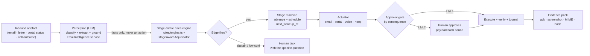
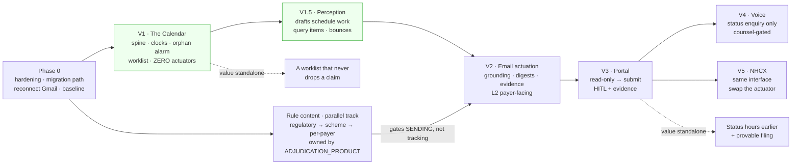

# The Agentic Claims Administrator — Product Definition

**Date:** 2026-09-14
**Method:** Product synthesis. The job description in §1 is derived from the stage taxonomy, TAT clocks and deficiency catalog in [`research/INDIAN_CLAIMS_DOMAIN.md`](./research/INDIAN_CLAIMS_DOMAIN.md); the mechanism in §3–§7 from [`research/AGENTIC_CLAIMS_AUTOMATION.md`](./research/AGENTIC_CLAIMS_AUTOMATION.md); every "today" claim is checked against the code in `Backend/src/` and the live instance (18 hospitals, 917 claims).

**Companion docs:** [`E2E_ARCHITECTURE.md`](./E2E_ARCHITECTURE.md) (what exists) · [`research/AGENTIC_CLAIMS_AUTOMATION.md`](./research/AGENTIC_CLAIMS_AUTOMATION.md) (durable orchestration, actuators, HITL, compliance) · [`research/INDIAN_CLAIMS_DOMAIN.md`](./research/INDIAN_CLAIMS_DOMAIN.md) (stages, TATs, deficiencies) · [`research/ADJUDICATION_ENGINES.md`](./research/ADJUDICATION_ENGINES.md) (rule representation) · [`adjudication-engine/`](./adjudication-engine/) (the shadow-mode engine spec) · [`EXTRACTION_LANDSCAPE_FIX.md`](./EXTRACTION_LANDSCAPE_FIX.md) (per-line extraction, which makes short-payment reconciliation possible)

**Relationship to the pre-submission adjudication work:** [`ADJUDICATION_PRODUCT.md`](./ADJUDICATION_PRODUCT.md) — that system decides *whether a claim is fit to leave the building*. This system decides *what happens to it after it does* — and re-invokes the adjudicator every time the payer sends something back. They share the stage taxonomy, the rule sets and the readiness score. Neither is useful alone: an adjudicator with no filing agent produces a verdict nobody acts on; a filing agent with no adjudicator files defective claims faster.

**Sequencing:** [`NEXT_PHASE_ROADMAP.md`](./NEXT_PHASE_ROADMAP.md) owns the single phase plan, the dependency ordering and the **one migration-number allocation** across all four next-phase docs. Where this document names a migration number it is quoting that ledger, never allocating.

---

### Three conventions this document holds to

**One stage taxonomy.** [`FROZEN_CONTRACTS.md`](./FROZEN_CONTRACTS.md) **OD2** freezes the 19 `master_options(category='ipd_stage')` codes (migration `024`) as the single stage vocabulary, with canonical **stage classes** `preauth · enhancement · discharge · claim · other`. Those classes are not aspirational: `StageClass` is already implemented at `Backend/src/Services/context/types.ts:38`, derived by `stageClass()` at `Services/context/resolver.ts:34` and cross-checked by `docMixStageClass()` at `:49`. **This document introduces no parallel stage vocabulary.** An earlier draft mapped to an `S00–S17` research taxonomy; that is withdrawn. Where the workflow needs states the payer never sees — `AWAIT_APPROVAL`, `VERIFYING`, `WAITING_OTP`, `BLOCKED_*`, `SHORT_PAID`, `HUMAN_OWNED` — they are **operational states**, a named refinement that sits *alongside* the OD2 codes in one column (§3.4), never a second payer-facing taxonomy.

**One rules layer.** The adjudication engine's rule selection (`Services/rules/engine.ts`, `Services/adjudication/stageAwareAdjudicator.service.ts`, `selection.ts:45`) is the only rules layer. This system **consumes** it for next-action derivation and for ladder resolution. It does not implement a second rules engine, and no table here duplicates rule-selection logic.

**EXISTS vs NEW.** Every table and column named below is marked either **[exists]** — verifiable in `Backend/src/schema/migrations/` at the cited migration — or **[new · NNN]**, carrying its allocated number from the roadmap ledger. Nothing is referenced as though it already exists when it does not. `payer_config`, `claim_workflow`, `claim_query_items`, `followup_ladder_rungs` and `claim_action_ledger` are all **new**.

---

## 0. The one-paragraph thesis

We are not building an AI that "handles claims." We are building **a digital claims administrator with a worklist, a calendar, and a paper trail**. The scarce thing in a hospital TPA desk is not intelligence — it is *attention that never lapses*. A good administrator's superpower is that every claim she owns has exactly one next action and one date by which it must have happened, and that she can prove, eighteen months later, that she sent the file on the 12th at 15:42 with acknowledgement number `MA/2026/0034718`. The LLM in this product is a perception and drafting layer bolted onto a boringly reliable state machine ([AGENTIC §0](./research/AGENTIC_CLAIMS_AUTOMATION.md)). **The dominant failure mode is not a bad model output; it is a dropped workflow.** Design accordingly.

---

## 1. The human being modelled

This section is the product spec. If the agent does these things, it works. If it does something cleverer instead, it doesn't.

### 1.1 Who she is

A senior TPA / insurance desk executive at a 300-bed corporate hospital. She carries 60–140 live claims across 8–20 payers. Her tools are a shared Gmail inbox, a WhatsApp group per TPA coordinator, six or seven portal logins on sticky notes, a landline, and an Excel file called `TPA TRACKER FINAL v7 (2).xlsx` that is the actual system of record for the hospital's receivables. She is the single point of contact between the billing department, the treating consultants, the patient's family, and the payer.

**She is not a clinician and not an underwriter.** She does not decide whether a claim is payable. She decides *what needs to happen next so that the payer can decide*, and she makes sure it happens on time.

### 1.2 Her day, against the clocks that actually exist

The IRDAI Master Circular (29 May 2024) fixes three of her clocks; the payer MOU and PM-JAY manual fix the rest ([DOMAIN §4](./research/INDIAN_CLAIMS_DOMAIN.md)).

| Time | What she does | The clock behind it |
|---|---|---|
| 08:45 | Prints the discharge board for today. Any patient discharging today whose final bill is not yet assembled is an emergency. | Final authorisation must come back within **3 hours** of the discharge request. Every minute she is late assembling is a minute the patient sits in a bed the hospital cannot bill. |
| 09:00 | Opens the shared inbox. Sorts overnight mail into: approvals, queries, denials, settlement advices, noise. | Pre-auth decision TAT is **1 hour**; a query that arrived at 22:10 has already burned the night. |
| 09:30 | Raises pre-auth for last night's emergency admissions. | Retrospective pre-auth window is commonly **24–48 h** (`payer_config.retro_preauth_hours` — **[new · 080]**, §6.3); PM-JAY private EHCP **auto-rejects at 48 h** post registration. |
| 10:00–12:00 | Answers queries. For each: reads what the payer actually asked, works out which document or justification satisfies it, chases the consultant/ward/billing for it, and replies **on the same thread with the reference number in the subject**. | PM-JAY: hospital query response **24 h**, auto-reject at 72 h. Private: 30–60 days on claim-stage queries, but the pre-auth query closes the pre-auth if unanswered. |
| 12:00–13:00 | Walks the wards. Any patient whose stay has diverged from the approval — ICU shift, extra days, converted procedure, second surgery — needs an **enhancement today**, not at discharge. | An un-enhanced divergence from the approval constraint object (the parsed pre-auth approval letter, §5.1) is the highest-value denial in the taxonomy ([DOMAIN §3.2](./research/INDIAN_CLAIMS_DOMAIN.md)). |
| 14:00–16:00 | Assembles and dispatches discharge files and post-discharge claim folders. Checks each against the payer's checklist before it goes. | Claim folder typically **7 days** post discharge per MOU; PM-JAY **>45 days is inadmissible outright**. |
| 16:00–17:30 | **The chase.** Goes down the tracker: anything with no payer response past its ladder rung gets an email, a portal check, or a call. | This is the hour that determines days-to-settlement, and it is the first hour sacrificed when she is busy. |
| 17:30 | Reconciles yesterday's payment advices against approved amounts. Every rupee of gap becomes a deduction line to contest. | Short payment is silent: nobody tells you. You find it by reconciling. |

**What she does badly, structurally:** the 16:00 chase is skipped on busy days, and nobody notices for three weeks. Her tracker has no alarm for "this claim has had no movement in 21 days." Her follow-up cadence collapses when she is on leave. Those three gaps are most of the addressable value.

### 1.3 Her follow-up cadence

She does not follow up on a fixed schedule. She follows up on a **per-payer, per-stage ladder** learned from experience, and the good ones can recite it:

> *"Medi Assist replies to pre-auth in about 40 minutes; if it's been 2 hours, something's wrong with the submission itself, so I resend rather than chase. Star's portal shows the status before the email arrives, so I check the portal first. Paramount never answers email on a discharge file — you call the desk and quote the claim number. For Vidal, escalation mail with the RM in CC on day 14 works; before day 14 it annoys them and slows you down."*

That paragraph is a **data table**, not intuition, and it is the single most valuable thing to extract from the 18 hospitals we already serve. The agent's ladder is that table (§6).

### 1.4 What "nothing slips" means operationally

Five invariants. A great administrator holds all five in her head; the product holds them in Postgres.

1. **No claim without a next action.** Every non-terminal claim has a defined next action, an owner, and a due time. A claim in "waiting for payer" is not actionless — its next action is "chase on D+n."
2. **No clock without a countdown.** Every regulatory/MOU deadline that applies to this claim at this stage has a live countdown, independent of the follow-up ladder. The ladder chases *them*; the countdown protects *us*.
3. **No inbound without a disposition.** Every email, letter, portal status change and phone call is read, classified, and either produces an action or is explicitly marked "no action needed, because X."
4. **No approval without its constraints parsed.** An approval letter is a constraint object — amount, room category, co-pay %, named diagnosis, named procedure, validity window, pre-excluded heads — not a number. Store all of it; every one of those is a future deduction if violated ([DOMAIN §3.2](./research/INDIAN_CLAIMS_DOMAIN.md)).
5. **No claim closed without money reconciled.** "Settled" means the UTR landed and the amount matches the approval minus agreed deductions. Anything else puts the workflow into the operational state `SHORT_PAID` (§3.4) — the OD2 stage stays `claim_approved`, because short payment is our position on the claim, not the payer's stage — and it goes to the appeal queue.

**Which of the five need rule content, and which do not.** Invariants 1 and 2 — the next action and the countdown — are made of a durable row, a clock and an alarm. They read `payer_config` **[new · 080]** and `stage_transitions` **[exists · 030]**. **They do not read `insurance_rules`.** Invariants 3, 4 and 5 need perception (inbound classification, approval-letter parsing, advice reconciliation), which needs Gmail connected but still not rule content. This is why §9 ships the tracking guarantee before, not after, the rule base is populated.

### 1.5 Great vs mediocre — the behaviours that are the product

| Dimension | Mediocre administrator | Great administrator | What the agent must do |
|---|---|---|---|
| **Trigger** | Reacts when the payer writes | Acts on the clock whether or not the payer writes | Silence is a first-class trigger, not an absence (§5.4) |
| **Query handling** | Re-sends the whole file | Reads *which* item was asked for, sends exactly that, references the query number | Parse query items individually; track per-item closure (§5.1) |
| **Enhancements** | Discovers the divergence at discharge | Raises the enhancement the day the divergence happens | Daily divergence sweep against the approval constraint object (§5.6) |
| **Chase tone** | Sends the same mail 6 times | Escalates: polite → firm → RM CC → grievance, one rung at a time | Ladder with distinct rung templates and escalation targets (§6.2) |
| **Channel** | Email only | Chooses the channel that works for *that* payer at *that* stage | Channel routing columns on `payer_config` **[new · 080]**, resolved per (payer × stage_class) (§4) |
| **Volume** | 40 individual chase mails to one TPA on one morning | One consolidated mail with a 40-row table | Digest-by-default, per-recipient frequency caps (§6.4) |
| **Evidence** | "I think I sent it" | Produces the ack number, the timestamp and the screenshot | Evidence pack per submission, exportable (§7.4) |
| **Short payment** | Notices when the CFO asks about receivables | Reconciles every advice within 24 h, contests within the window | Automated advice-vs-approval reconciliation (§5.3) |
| **Handover** | Cadence collapses when she is on leave | Tracker is legible enough for a colleague to run it | The worklist *is* the tracker; there is no private state |
| **Escalation** | Escalates everything, or nothing | Escalates precisely where she lacks authority or information | Explicit `blocked_human` reasons with one-sentence asks (§7.2) |

---

## 2. What we can build on today (accurately)

| Capability | State today | What the agent needs added |
|---|---|---|
| Canonical episode | `claim_harmonised_episodes` (medical_episode.v2), one row per claim | Nothing — it is the fact source for grounding drafts |
| Stage vocabulary | **[exists · 024]** 19 codes in `master_options(category='ipd_stage')`: `draft → preauth_submitted → preauth_queried → … → claim_approved`; `ipds.stage` carries it. The coarse class is already code: `StageClass` (`Services/context/types.ts:38`) + `stageClass()` (`resolver.ts:34`) | **Nothing to the vocabulary.** OD2 freezes it and it is the axis rule selection already uses (`selection.ts:45` weights stage 4). What is missing is not payer-facing stages but **operational states** — `AWAIT_APPROVAL`, `VERIFYING`, `WAITING_OTP`, `BLOCKED_*`, `SHORT_PAID`, `HUMAN_OWNED` — which live in the same `current_state` column (§3.4) |
| Filing route | `ipds.claim_filing_route ∈ {cashless_everywhere, network}` (migrations `017`/`019`/`020`, derived from panel `is_empanelled`) | This is already the channel selector — extend, don't replace |
| Email filing | `insuranceSubmission.service.ts` — preflight → draft → send, threaded per IPD, VERP `Reply-To`, S3 attachments; `insurance_submissions` + `submission_events` | Ladder-driven sends, digesting, grounding checks |
| Portal filing | **Does not exist.** `insuranceSubmission.service.ts` header states plainly: route `network` → "insurer portal RPA (not yet built)" | All of §4.1 |
| Inbound | Gmail poll (120 s) → `emails_inbound` → 8-strategy matcher → `email_intelligence_drafts (pending_review)` → human `applyDraft` writes `claim_financials` / `claim_actions` / corrections. **Both configured hospital interfaces are disconnected on production right now, so no inbound is flowing** | Reconnect first — everything perception-driven in §5 has no input until then. Then: drafts must produce *scheduled work*, not just reviewable content |
| Outcome vocabulary | `master_options(category='insurer_outcome')`: `approved, partially_approved, queried, rejected, enhancement_approved, enhancement_partial, follow_up, withdrawn, other, unknown` | The derivation table in §5.1 keys off exactly these |
| Actions | **[exists · 037]** `claim_actions`: kinds `request_doc \| notify_ops \| approval_request \| follow_up_sla`; targets `whatsapp_group \| whatsapp_user \| in_app_user \| in_app_role`; `idempotency_key` unique per claim; lifecycle `pending→dispatched→acked\|declined\|expired\|failed` | **No `due_at`, no owner-vs-agent distinction, no stage.** `follow_up_sla` rows can be inserted, but expiry "is a separate cron sprint" — `Services/actionEngine.service.ts:33`, which lists it under *not in scope for v1*. That cron is this product. Widened via **[new · 079]** |
| Rules | `rules/engine.ts` (`DOCUMENT_PRESENCE \| REQUIRED_FIELDS \| FUZZY_NAME \| TEMPORAL_WINDOW`, abstention gate) + `adjudication/stageAwareAdjudicator.service.ts`; **[exists]** `stage_requirements`, `insurer_rule_sets`, `insurance_rules`, `insurer_document_requirements`, `insurer_financial_limits`, `insurer_los_benchmarks` | Shadow-only. **Production's rule tables are empty, so the engine abstains** — but the *ledger* is not empty: migration `044` seeds three rule sets (`ICICI_LOMBARD_CARDIAC_V1` + 2, at `044_insurer_rule_sets.sql:218,332,444`) whose `insurance_rules` rows predate the `kind` column added in `068`, so they would match, win selection, and evaluate as `no_kinded_rules`. Kind-ify or retire them; leaving them is worse than either. **Only the rule-gated edges wait on content** — the clocks do not (§9) |
| Stage history | **[exists · 030]** `hospital.stage_transitions` (`030_event_schema_extensions.sql:142`): `claim_id, before_stage, after_stage, triggered_by, triggering_event_id, context_doc_section_ids, unresolved_query_ids, was_reversal, reasoning, actor_user_id`, three indexes, live per-claim history | Nothing new. This is the trigger source for the calendar and the input to the deadline countdown. It is **not** to be re-created under the same name for workflow edges — the workflow's own edge table is `workflow_transitions` **[new · 086]** |
| Bounce detection | **Does not exist.** `emails_outbound.status` is a free `VARCHAR(30) NOT NULL DEFAULT 'queued'` with **no CHECK** (`013_create_cashless_everywhere_tables.sql:128`); the only values written anywhere are `queued \| sending \| sent \| failed` (`Workers/emailOutbox.queue.ts:76,124,138,187,230`). There is no DSN/NDR parsing in the repo | All of it is net-new work (§5.1, §10): DSN/NDR parsing on the inbound path, a `bounced` status, and the `BLOCKED_BAD_CONTACT` transition |
| Line items | **Implemented, uncommitted** on `feat/platform-hardening-vision`. `LineItemSchema` (`Services/extractor/lineItems.ts:55`) emits `row_index, particulars, code, date, qty, rate, gross, discount, net, tax_pct, payable, source_page, confidence`, persisted into `document_sections.extracted_fields.line_items` (`docExtractor.service.ts:108,265`) | Merge and validate on real production documents, then project. Makes per-line short-payment reconciliation feasible for the first time (§5.3). **Evidence is page-level, not bbox** — the schema emits `source_page` and no coordinates, and the tiler returns slices, not row boxes. Any "highlight the exact region" UX is a separate localisation pass nobody has built |
| Durability | Bull/Redis queues, `claim_ai_runs` cursor, `doc_phase_ledger`, `claimRunReconciler.cron` stall detection | The pattern is right but is per-*pipeline-run*. The agent needs it per-*claim-lifetime* (§3.4) |

**The honest summary:** we have a good perception layer (currently starved — Gmail is disconnected), a good outbound email primitive, a real action table, real per-claim stage history, and an inert rules engine. We have no calendar, no owner model, no portal, no bounce detection and no evidence pack. The product below is mostly calendar and evidence.

**And the sequencing consequence, stated once here because it drives §9:** the calendar and the evidence pack are the two things we lack, and **neither of them reads `insurance_rules`.** A countdown derived from a published IRDAI or PM-JAY TAT needs a clock table and a stage, not an authored rule. Only the rule-gated *edges* — "this finding means send that" — wait on rule content. Treating the whole product as rule-gated queues weeks of engineering with standalone value behind a months-long content-acquisition project, for no reason.

---

## 3. The product concept: the Desk

### 3.1 The promise, in one sentence

> **Every claim, always, has one next action, one owner, and one due time — and you can see exactly what the agent did and why.**

Everything else in this document exists to make that sentence literally true, including at 3am, including during a deploy, including when the administrator is on leave.

### 3.2 The Worklist

One screen. Not a dashboard — a **worklist** ([AGENTIC §7.3](./research/AGENTIC_CLAIMS_AUTOMATION.md): "A dashboard shows you the problem; a worklist assigns it"). Default view: *my* items, due soonest first, with the breach risk first.

Each row is a **next action**, not a claim:

```
DUE        CLAIM            PATIENT / PAYER              NEXT ACTION                          OWNER    WHY
─────────  ───────────────  ───────────────────────────  ───────────────────────────────────  ───────  ─────────────────────────
09:40 ⚠    IP-2419  ₹2.4L   Sharma, R. / Medi Assist     Answer pre-auth query (3 items)      YOU      Auto-reject at 72h · 11h left
10:15      IP-2402  ₹88k    Devi, K. / Star Health       Send D+3 status chase (drafted)      AGENT ✓  No response since 11 Sep
11:00 ⚠    IP-2388  ₹6.1L   Iqbal, M. / Niva Bupa        Raise enhancement: ward→ICU 12 Sep   YOU      Diverged from approval 2d ago
14:00      IP-2356  ₹1.2L   Rao, S. / Paramount          Assemble discharge file              YOU      Discharge planned today · 3h TAT
—          IP-2301  ₹3.3L   Patel, N. / Vidal            Contest ₹41,200 deduction            YOU      Advice 12 Sep · window closes 11 Oct
```

Non-negotiable properties:

- **Exactly one next action per claim is "current."** Others are queued behind it. A claim with four simultaneous "next actions" is a claim nobody will action.
- **Owner is `AGENT` or a named human.** `AGENT ✓` means it will execute at the due time without anyone touching it. `AGENT ⏸` means it is drafted and waiting for approval. There is no third thing.
- **"Why" is always populated and always short.** It cites the clock or the event, never the model.
- **Sort key is `min(due_at, sla_deadline_at)`,** so a regulatory countdown always outranks a courtesy chase.
- **The empty state is the goal.** "Nothing due until 14:00" is a valid and desirable screen.

Secondary views, all filters over the same table: *By payer* (the digest view — what we owe Medi Assist today), *Blocked* (waiting on a consultant, a credential, an OTP), *Dead letters* (§7.5), *Money* (approved-not-settled, short-paid, appealable).

### 3.3 The activity timeline

Per claim, one merged, append-only stream that a human can read in ten seconds and an auditor can read in ten minutes. It merges what today lives in four places (`submission_events`, `emails_inbound`/`emails_outbound`, `claim_actions`, `doc_phase_ledger`) plus the new workflow journal.

```
12 Sep 15:42  AGENT   Filed pre-auth by email to preauth@mediassist.in (+2 CC)
                      → 7 attachments, 4.1 MB · thread <CAB...@mail.gmail.com> · ref FCL-2419-PA1
                      → Approved by Kratika S. at 15:39 (payload hash a3f1…)          [evidence ▸]
12 Sep 16:21  PAYER   Acknowledgement received · MA/2026/0034718                       [email ▸]
13 Sep 11:04  PAYER   Query raised — 3 items                                           [letter ▸]
                      1. Indoor case papers (day 2 progress notes)   → open
                      2. MLC copy / self-declaration                 → open
                      3. Justification for ICU admission             → open
13 Sep 11:06  AGENT   Derived 3 tasks · due 14 Sep 11:04 (payer window 24h)
                      Rule: PAYER_QUERY_ITEMISED v3 · classifier conf 0.94
13 Sep 11:07  AGENT   Requested items 1–2 from ward via WhatsApp (Sadbhawana ICU grp)
14 Sep 09:12  HUMAN   Dr. Menon supplied ICU justification note (uploaded)
14 Sep 09:40  AGENT   Drafted query response (3/3 items addressed) — awaiting approval
```

Rules for the timeline: **agent entries always name the rule or ladder rung that caused them**, never "the AI decided"; every external action carries an evidence link; nothing is ever edited or deleted, only appended.

### 3.4 The spine underneath

One durable workflow per claim, journaled in the Postgres we already run — not a cron over a table ([AGENTIC §1.3](./research/AGENTIC_CLAIMS_AUTOMATION.md); the sister project already runs this pattern). New tables in schema `hospital`, all four of the first group in **[new · 078]**, `claim_action_ledger` in **[new · 087]**:

```sql
claim_workflow            -- the case file: one row per claim, forever   [new · 078]
  id, claim_id, hospital_id, workflow_version,
  current_state,          -- OD2 ipd_stage code, OR an operational state (see below)
  status,                 -- running | waiting | blocked_human | dead | done
  next_wakeup_at,         -- THE follow-up calendar (indexed, partial WHERE status<>'done')
  wakeup_reason,          -- 'ladder_rung_d3' | 'portal_recheck' | 'sla_countdown' | 'divergence_sweep'
  sla_deadline_at, sla_kind,        -- the independent regulatory/MOU countdown
  ladder_id, ladder_rung,
  attempt, last_error, lease_owner, lease_expires_at

claim_workflow_step       -- append-only journal; step_key = deterministic idempotency anchor   [new · 078]
  id, workflow_id, seq, step_key, step_type,   -- 'llm'|'portal'|'email'|'voice'|'db'|'human'
  input_digest, output_json, status,           -- in_flight | succeeded | failed
  attempt, started_at, ended_at, error_json, error_class

claim_workflow_signal     -- inbound: reply arrived, human approved, OTP supplied, bounce   [new · 078]
  id, workflow_id, signal_key, payload_json, received_at, consumed_at

claim_workflow_deadletter -- a work item with an owner and an SLA, not a log table   [new · 078]
  id, workflow_id, step_id, reason, error_class, next_human_action_text,
  assigned_to, aged_escalated_at, resolved_at, resolution_note

claim_action_ledger       -- what we did, who approved it, and what the rules said   [new · 087]
  id, claim_id, workflow_id, step_id, action_type, actuator, autonomy_level,
  proposed_by, proposed_payload_hash, rule_decision_json,
  model, model_version, prompt_version, confidence,
  approved_by, approved_at, approval_payload_hash,
  executed_at, external_ref, evidence_refs[], outcome, outcome_observed_at
```

**`current_state` holds one vocabulary, not two.** Its payer-facing values are exactly the OD2 `ipd_stage` codes — no translation layer, no S-codes, and therefore `insurer_rule_sets.applicable_stages` (populated with the same codes) selects on it directly. Its remaining values are **operational states**, which describe where *we* are, not where the claim is with the payer: `AWAIT_APPROVAL`, `VERIFYING`, `WAITING_OTP`, `BLOCKED_CAPTCHA`, `BLOCKED_BAD_CONTACT`, `BLOCKED_CREDENTIALS`, `SHORT_PAID`, `HUMAN_OWNED`. These are genuinely new and genuinely needed — a claim sitting in `VERIFYING` after a mid-submission crash is in no `ipd_stage` — and they are a **refinement of OD2, not a replacement**: every operational state records the `ipd_stage` it suspends (`suspended_stage`), and the claim returns to it. Rule selection ignores operational states and selects on `suspended_stage`. Adding operational values to a workflow-owned column is not a `CONTRACT_DRIFT` event, because `ipds.stage`, `claim_context.stage` and `document_sections.stage` are untouched; **if that ever ceases to be true, it becomes one.**

Three properties are non-negotiable:

- **`step_key` is deterministic** (`claim:2419:stage:preauth_submitted:rung:d3:email_send`). On replay, a `succeeded` row with that key means the step is skipped and its output reused. That is the entire idempotency mechanism.
- **`next_wakeup_at` is the product.** One scheduler query — `WHERE status IN ('waiting','running') AND next_wakeup_at <= now() FOR UPDATE SKIP LOCKED` — is the "never drops the ball" guarantee.
- **Leases, not locks.** A crashed worker's claim is reclaimable after `lease_expires_at`.

> **The invariant to write before writing the agent, and to page on:**
> ```sql
> SELECT count(*) FROM hospital.claim_workflow
>  WHERE status NOT IN ('done','dead')
>    AND (next_wakeup_at IS NULL OR next_wakeup_at < now() - interval '1 hour');
> ```
> must be **0**. This single query is the difference between a system that tracks claims and one that loses them.

**What the spine reads.** Writing and holding that invariant requires: `claim_workflow` **[new · 078]**, a `next_wakeup_at`, a scheduler tick, `payer_config` **[new · 080]** for the clocks, and `stage_transitions` **[exists · 030]** for the events that move a claim. It reads **no** `insurance_rules` row and calls no evaluator. The orphan alarm is a `count(*)`. This is why §9 lets the calendar ship on its own schedule.

**Reuse, don't duplicate.** `claim_actions` remains the human-facing unit of work (it already has idempotency and a dispatch lifecycle); it gains `due_at`, `stage` (an OD2 code), `owner_kind ∈ {agent,human}`, `autonomy_level`, `workflow_step_id`, `hospital_id` (backfilled from `ipds`), and new `kind` values (`file_submission`, `answer_query`, `raise_enhancement`, `chase_status`, `reconcile_payment`, `contest_deduction`, `portal_check`, `collect_otp`) by widening `chk_claim_actions_kind` — **[new · 079]**. `insurance_submissions` + `submission_events` remain the record of a filing. The workflow tables add the calendar and the journal — the two things missing.

### 3.5 Model proposes, rules dispose



The LLM never chooses the edge. Its output after reading an email is a **classification plus extraction**; the rules engine picks the action ([AGENTIC §5.5](./research/AGENTIC_CLAIMS_AUTOMATION.md), plan-then-execute). This is both the safety property against prompt injection and the reason the system is testable in CI.

---

## 4. Channels

Channel is resolved per (payer × stage_class) from **`payer_config` [new · 080]** — channel routing is a set of columns on that one table, not a second table, and not the `payer_channel_config` an earlier draft named. It is seeded from `ipds.claim_filing_route` **[exists · 017/019/020]** and the hospital's panel configuration. The workflow asks for *"file this"*; the actuator layer decides *how*.

`payer_config` is the table all four next-phase docs lean on and none defined. It carries, per (payer × claim_type × stage_class): the TAT and window clocks (§6.3), the channel and adapter routing, the recipient allow-list that §7.2 rule 5 depends on, quiet hours, and per-recipient frequency caps. It lands in Phase B, because the countdown is the first thing that needs it.

### 4.1 Portal

**Does the work of:** logging in, reading status, downloading approval/query/denial letters and settlement advices, filling and submitting pre-auth / enhancement / query-response / final-claim forms, capturing the acknowledgement.

**Architecture:** a `PayerAdapter` interface with three tiers ([AGENTIC §2.2](./research/AGENTIC_CLAIMS_AUTOMATION.md)) — Tier 1 deterministic Playwright with role/label locators (never XPath); Tier 2 vision repair on locator failure, which *proposes* a locator patch into a selector-drift review queue and never self-applies it; Tier 3 human in an observed session, whose trace becomes the next adapter fix. Nightly synthetic canary per adapter (login → reach the form → **do not submit**) converts drift from a 9am incident into a ticket.

**Never alone:**
- Never submits anything without an explicit human approval of *that exact payload* (L2, §7.1).
- Never solves or bypasses a CAPTCHA or bot challenge — the workflow enters `BLOCKED_CAPTCHA` and an operator completes it in a live session ([AGENTIC §2.5](./research/AGENTIC_CLAIMS_AUTOMATION.md): CAPTCHA-solving services typically violate site ToS and carry CFAA/CMA exposure; a CAPTCHA is the site saying "a human should do this").
- Never brute-forces authentication. One re-auth attempt, then `blocked_human` for credential refresh.
- Never withdraws, cancels or amends a filed claim.
- Never shares a browser session across hospital tenants.
- The model never sees a credential: the driver reads from the vault and types into the field; the model gets a redacted DOM and is told credentials are supplied by the runtime.

**Legal policy (explicit, not hand-waved).** Authorisation is the pivot: a hospital instructing its software to use *its own* portal account to file *its own* claims is categorically different from scraping a third party's gated data, but ToS violation is what establishes intent that access was non-consensual ([AGENTIC §2.5](./research/AGENTIC_CLAIMS_AUTOMATION.md)). Therefore:

1. A `payer_automation_policy` register **[new · 085]**, one row per payer, with columns: `tos_reviewed_on`, `tos_prohibits_automation (bool)`, `official_api_available`, `nhcx_participant`, `payer_notified_on`, `written_agreement_ref`, `automation_enabled (feature flag)`, `reviewed_by`.
2. **Adapters for payers whose ToS prohibits automated access ship disabled.** Those claims route to assisted-manual: the agent prepares everything and a human clicks submit.
3. A signed hospital authorisation artefact per tenant: *"we authorise ClaimOS to access payer portals on our behalf using credentials we supply, for the purpose of filing and tracking our claims."*
4. Respectful pacing and per-payer concurrency caps; stable per-hospital browser profiles; **no anti-detect tooling**. If a payer blocks us, the response is a commercial conversation, not an arms race.
5. Where identification is possible (Web Bot Auth / signed agents), identify ourselves — for legitimate B2B automation, being identifiable converts "suspicious traffic" into "a partner integration we can whitelist."
6. **Prefer the sanctioned channel.** `PayerAdapter` must have an `NhcxAdapter` implementation from day one of the interface, even if unimplemented. Portal adapters are a depreciating asset; NHCX (live June 2024, FHIR R4, `Claim`/`ClaimResponse`/`Communication`/`Task`) is where this goes ([DOMAIN §10](./research/INDIAN_CLAIMS_DOMAIN.md)).

**Hand-off to human:** OTP needed → `WAITING_OTP` durable state with a 5-minute deadline, request routed to the hospital's designated operator via in-app push / WhatsApp; OTP is consumed and never persisted, never logged, never in a prompt. CAPTCHA → live co-browsing session. Selector drift past Tier 2 → adapter quarantined (the *adapter*, not the claim), claims re-routed to email or assisted-manual, ticket raised.

### 4.2 Email

The highest-volume actuator and the one with the best cost/reliability ratio. We already have the primitive; it needs a conversation state machine around it.

**Does the work of:** filing (where the route is email), answering queries on-thread, chasing, escalating, sending discharge intimations and claim folders, requesting documents internally.

**Identity:** mail goes out as **the hospital**, not as ClaimOS — TPAs expect it from the hospital's domain and it is both more deliverable and more credible. SPF/DKIM/DMARC on the hospital's sending domain or a delegated subdomain. (We already hold Gmail OAuth per hospital in `hospital_interfaces`.)

**Correlation, in priority order** — we already run an 8-strategy ladder; keep it and make the top three mandatory on every outbound: `References`/`In-Reply-To` chain → VERP correlation token in `Reply-To` → visible token in subject (`[Ref: FCL-2419-PA1]`). Fuzzy (patient + policy + amount) stays last and stays human-confirmable.

**Drafting is hybrid, never free-form** ([AGENTIC §3.4](./research/AGENTIC_CLAIMS_AUTOMATION.md)):
- The **template owns every hard fact** — claim number, patient, policy, UIN, dates, amounts, attachment list — populated by code from `claim_harmonised_episodes`.
- The **LLM owns only the variable prose** — the paragraph answering the specific query, in house tone.
- **Mechanical grounding gate before any draft is shown or sent:** every number, date, and reference in the draft must appear in the structured episode or the draft is rejected; the attachment list must match what is actually attached; no claim/policy number may appear that is not this claim's. No commitment language outside an approved vocabulary.

**Never alone:** never sends to a recipient outside the allow-list on `payer_config` **[new · 080]** for this claim (recipients are *never* derived from the content of an inbound email — this one control neutralises most exfiltration paths); never accepts, disputes, or concedes anything; never sends outside the configured recipient set (no mailing the insurer's CEO, the regulator, or anyone's social media); never acts on instructions found inside an inbound mail or attachment.

**Hand-off:** hard bounce on a payer address → `BLOCKED_BAD_CONTACT` with a human task to fix the contact, **never** a silent continue. Classification ambiguous between denial and query → human, always, because the deadlines and consequences differ and guessing burns the appeal window.

> **Bounce handling is net-new work, not a switch to flip.** There is no bounce detection in the repo. `emails_outbound.status` is a free `VARCHAR(30)` with no CHECK (`013:128`) and the outbox writes only `queued|sending|sent|failed` (`Workers/emailOutbox.queue.ts`). Delivering the row above means building: DSN/NDR (RFC 3464) parsing on the inbound Gmail path, hard-vs-soft bounce classification, correlation of the bounce back to the originating `emails_outbound` row via the VERP token we already mint (`ipds.correlation_token`, **[exists · 071]**), a `bounced` status, and the `BLOCKED_BAD_CONTACT` transition. Until that ships, a bounced chase is indistinguishable from silence and the ladder keeps climbing — which is the exact silent-drop failure §5.4 exists to prevent. Scope it explicitly (§9, V1.5).

### 4.3 Helpline calls (voice)

**Does the work of:** status enquiry, confirming receipt of a file, obtaining a query or reference number, asking *which* document is outstanding, capturing the payer agent's name and call reference.

**The governing rule: voice reads state out of the payer; it never writes state into the payer.** Anything that changes the claim's position goes through a channel that produces a document, because that is what survives a dispute. A call's output is *intelligence* that updates the workflow and may trigger a written action — never a commitment.

**Never alone:** never negotiates a settlement amount; never accepts or disputes a denial; never gives clinical information; never makes a commitment on the hospital's behalf; never escalates aggressively; never captures card or bank details (if the other party starts reading them, stop and transfer).

**Mechanics:** a per-helpline **IVR map** (recorded, versioned tree of prompt → DTMF sequence) replayed deterministically — no LLM in the loop for "press 2 for claim status." The model is used only when the tree runs out (unexpected prompt, or a human picks up). Weekly synthetic canary call per map, hanging up before reaching a human.

**Compliance policy (two separate obligations — this is a genuine trap).** TRAI governs *whether we may place the call*; DPDP governs *what we may do with the audio* ([AGENTIC §4.4](./research/AGENTIC_CLAIMS_AUTOMATION.md)). Policy:
- **No outbound voice ships without written counsel sign-off** on our exact call pattern — specifically whether the 140/160 number-series requirement attaches to B2B transactional calls to a payer's business helpline, and the disclosure obligation for AI-driven outbound. Do not ship on an engineer's reading of a blog post.
- Automated nature disclosed upfront, every call. Calls only inside permitted hours, enforced by the scheduler, not by policy document.
- Recording announcement played every call, and **the fact that it played is journaled** — that is the audit artefact.
- Explicit audio retention period enforced by a deletion job, not a policy PDF. Transcripts stored separately from audio; the workflow needs the transcript, not the recording.
- Consent and disclosure records queryable per call, because that is what a regulator asks for.
- Every call ends by writing transcript, recording ref, extracted facts, agent name/ref, and next action into the journal. **A call whose result is not journaled did not happen.**

**Hand-off:** human agent asks anything outside the enquiry script → transfer to the hospital's administrator, or hang up politely and raise a human task with the transcript.

### 4.4 The internal channel (ward, consultant, billing)

Easy to forget and half the actual work. The agent's most common outbound is not to a payer — it is *"Dr. Menon, the TPA wants a justification for the ICU shift on 12 Sep; two lines will do."* This already exists as `claim_actions` with WhatsApp/in-app targets and must stay first-class: internal requests get their own ladder (shorter rungs, different escalation — ward nurse → ward in-charge → billing head), their own digesting, and they are the most likely thing to block a payer deadline.

---

## 5. Next-action derivation

The core loop. An event becomes a classified fact; a fact plus the stage plus the rule set becomes a **task with a deadline and an owner**.

### 5.1 The derivation table

Keyed on the `insurer_outcome` vocabulary we already have in `master_options` **[exists]** plus the deficiency categories from [DOMAIN §7](./research/INDIAN_CLAIMS_DOMAIN.md).

**This table is a consumer of the one rules layer, not a second one.** Where a row says "derived next action," the derivation is: classify the inbound (perception), then ask `stageAwareAdjudicator` / `selectRuleSet` what applies at this `(insurer × stage × scheme × case_type)`, then schedule. There is no parallel evaluator, no duplicated specificity scoring, and no rule content authored in this document's tables. Rows whose "Due" column is a published regulatory or MOU clock — query windows, PM-JAY auto-reject, appeal windows, settlement TAT — resolve from `payer_config` **[new · 080]** and need **no** rule content at all; those are the rows that ship first (§9).

| Inbound | Classified as | Derived next action(s) | Due | Owner | Ladder effect |
|---|---|---|---|---|---|
| Query / shortfall letter | `queried` + `QueryExtraction` | One task **per query item**, each mapped to a `doc_code` or a justification ask; plus internal requests to whoever holds the artefact | `min(payer_window, stage TAT)` from `payer_config` **[new · 080]**; PM-JAY pre-auth query → **24 h** | Human for clinical justification; agent for documents already in `ipd_doc` | Chase ladder *suspends*; internal ladder starts |
| Deficiency letter on a filed claim | `queried` at `claim_queried` | Same, plus a re-run of the pre-submission adjudicator so we do not resubmit with a *second* defect | MOU `query_response_days` (30–60 typical) | Human review of the consolidated response | Suspends payer chase |
| Approval (full or partial) | `approved` / `partially_approved` | **Parse the constraint object** — amount, room cap, co-pay %, named diagnosis/procedure, validity window, pre-excluded heads — into `claim_financials` + an approval-constraints record; schedule the divergence sweep | Immediate | Agent (L4 for parsing; L1 for anything it changes downstream) | Ladder terminates for this stage |
| Enhancement approved/denied | `enhancement_approved` / `enhancement_partial` | Update the constraint object; recompute exposure; if denied, a human task on patient liability | Immediate | Agent + human notify | Ladder terminates |
| Denial / repudiation | `rejected` | **Never auto-closed.** Appeal-assessment task with the denial ground (`DEN_*`) and the appeal window; assemble the counter-evidence pack | Appeal window from payer config; note repudiation requires a 3-member Claims Review Committee under the 2024 Master Circular — a lever in the appeal | Human (always) | Ladder terminates; appeal ladder starts |
| Settlement advice / UTR | `approved` at claim stage | Reconcile advice against approval; §5.3 | 24 h | Agent proposes, human confirms the contest | Ladder terminates or → short-pay ladder |
| Silence past a rung | *no event* | §5.4 | Rung schedule | Agent | Ladder advances one rung |
| Auto-reply / OOO | detected by `Auto-Submitted` / `X-Autoreply` / `Precedence: bulk` | **No state change, no ladder reset.** Optional: note the alternate contact | — | — | Ladder continues unchanged |
| Hard bounce | bounce signal — **from DSN/NDR parsing that does not exist yet** (§4.2) | `BLOCKED_BAD_CONTACT` + human task to fix the payer contact | Same day | Human | Ladder pauses |
| Unrelated / marketing | `other` | Dispose with reason; no action | — | — | None |
| Model cannot decide | `unknown`, or denial-vs-query confidence below threshold | Human triage task with the email and the two candidate readings | 4 business hours | Human | Ladder pauses |

### 5.2 Wiring this to what exists

`emailIntelligence.service` already produces `email_intelligence_drafts(pending_review)` with a typed `extracted_payload` per category. Today `applyDraft` writes claim effects only when a human applies it. The change is small and load-bearing:

1. **Drafts schedule work on creation, not on apply.** On draft insert, the derivation service emits `claim_actions` rows (status `pending`, `owner_kind`, `due_at`, `stage`) and a `claim_workflow_signal`. The human still approves *the reply*; they no longer have to be the reason the clock started.
2. **`applyDraft` becomes the approval gate** for outbound content, binding approval to a payload hash.
3. **Per-item query tracking.** `QueryExtraction` currently yields a list; it must become addressable rows — **`claim_query_items` [new]**: `query_ref, item_no, text, mapped_doc_code, status, closed_by_step_id` — so the timeline can show 2/3 closed and the response can assert item-by-item coverage. This is the single highest-value extraction upgrade for this product. *It has no number of its own in the roadmap ledger; it ships inside the Phase F allocation (`085`–`087`) and must not claim a number allocated elsewhere. Flag to the ledger owner if it is pulled earlier.*
4. **Deadline, always.** Every derived action carries `due_at`. Today `claim_actions` has none, and `follow_up_sla` expiry is explicitly deferred ("a separate cron sprint"). That cron is this product.

### 5.3 Short payment → contest

Newly feasible because extraction now yields a full `line_items` array. On a settlement advice:

```
approved_constraint_object  −  agreed deductions (room-rent proportionate, co-pay,
                                non-payables List I–IV, tariff/package, NPPA caps)
                            =  expected_payable
expected_payable − settled_amount = contest_amount
```

Every rupee of `contest_amount` is attributed to a line, a deduction basis, and a rule — or it is flagged **unexplained**, which is the most valuable output of the whole system because unexplained deductions are exactly what hospitals silently absorb. The derived action is a drafted reconsideration letter with the line-level table attached, a human approval, and an appeal-window countdown.

### 5.4 Silence

Silence is an event. The absence of a payer response past a ladder rung fires `next_wakeup_at` and produces the next rung's action. Two things separate this from a dumb cron:

- **The chase ladder and the deadline countdown are independent.** The ladder chases *them*; the countdown protects *us*. A claim can have a courteous D+7 chase pending and simultaneously a hard "response due in 6 hours or PM-JAY auto-rejects" countdown. The worklist sorts by whichever bites first.
- **TAT is a payer-side accumulator, not wall-clock age** ([DOMAIN §4.3](./research/INDIAN_CLAIMS_DOMAIN.md)). Time the claim spends sitting with *us* awaiting a document does not count against the payer, and must not count toward "they are late." Model it as accumulated payer-possession time, or the system will chase payers who are not late and miss ones who are.

### 5.5 The three moments the engine must run

Not one gate at discharge ([DOMAIN §11](./research/INDIAN_CLAIMS_DOMAIN.md)):

1. **At admission** — room category vs cap, intimation clock (`CASHLESS_EVERYWHERE` has a hard 48 h elective window that is *unrecoverable* if missed), waiting-period and sub-limit exposure. All computable from the pre-auth form alone.
2. **Continuously during the stay** — the divergence sweep (§5.6).
3. **At pre-discharge** — the full document and cross-document consistency sweep, *before* the 3-hour final-authorisation clock starts.

A single discharge-time gate catches the documentation defects and misses every one of the timing and pre-auth defects, which are the expensive ones.

### 5.6 The divergence sweep

Runs daily (and on any episode change) for every admitted patient with an approval on file. Compares the live episode against the approval constraint object and raises an enhancement task the day the divergence happens:

| Divergence | Source | Action |
|---|---|---|
| Room category upgraded / ward→ICU | `medical_episode.v2` room + bill line items | Enhancement, same day |
| LOS exceeding approved days | admission date + approved validity | Enhancement at day *n−1*, not day *n* |
| Procedure changed (lap → open, second procedure) | OT notes section | Enhancement + clinical justification request |
| Bill running past approved amount | running total vs approval | Enhancement when crossing 80% of approved |
| Diagnosis restated | discharge summary vs pre-auth | Cross-doc mismatch task *before* filing (`DEF_CROSSDOC_DIAGNOSIS_MISMATCH`) |

---

## 6. The follow-up engine

### 6.1 Ladders are data, and they hang off the rule set — not off a second resolver

An earlier draft gave ladders their own `followup_ladder` table with its own `(payer_id, claim_type, stage)` resolution. That is a second rules engine wearing a different name, and it is exactly what "one rules layer" forbids: two specificity resolvers will disagree, and the day they disagree the chase goes to the wrong payer on the wrong clock.

So the ladder is a **child of `insurer_rule_sets` [exists · 044]**, resolved by the selection the engine already performs:

```sql
followup_ladder_rungs  (rule_set_id → insurer_rule_sets, rung_no,          -- [new · 086]
                        offset_business_hours, channel, template_key,
                        escalation_target, autonomy_level, stop_on_signal[])
```

**Resolution is `selectRuleSet`.** No new resolver is written. `Services/rules/selection.ts:45` already scores specificity — stage 4, insurer 4, scheme 3, case_type 2, route 1, treatment 1, specialty 1, empty array as wildcard, ties to the higher `ruleSetId` — over the OD2 stage vocabulary the rule sets are already keyed on. The most-specific-wins cascade this section used to describe in prose *is* that function; describing it twice is how it becomes two implementations. The winning rule set carries the rungs.

The rung *offsets* are per-payer cadence learned from the desk (§1.3, §11.2). The rung *deadlines* are not in this table at all — they are the independent countdown of §6.3, from `payer_config`. A worked default for `preauth_submitted`:

| Rung | Offset | Channel | Escalation target | Autonomy |
|---|---|---|---|---|
| 1 | D+0 +2h | Portal status read | — | L4 |
| 2 | D+1 | Email, same thread, polite | Claims desk | L3 (act-and-notify) |
| 3 | D+3 | Email + portal re-check | Claims desk | L3 |
| 4 | D+7 | Helpline call (V4, §9) or email, firmer | TPA helpline | L2 |
| 5 | D+10 | Escalation mail, RM in CC | Relationship manager | L2 |
| 6 | D+14 | Human takeover | Billing head | — |

**The ladder is a bounded resource and it always ends in a person, never in silence.**

> **A rule *set* is not rule *content*.** Hanging rungs off `insurer_rule_sets` does not gate the ladder on the content project. An `insurer_rule_sets` row is a selection key — insurer, stage, scheme, case_type — and creating one per (payer × stage_class) with zero `insurance_rules` children is an afternoon's seeding. What takes months is authoring *kinded, cited, precision-measured* `insurance_rules` rows. The ladder needs the former and not the latter, and the adjudicator's behaviour on a childless rule set is already correct: it abstains, and abstention does not stop a rung firing. Keep the two clearly apart when scoping, or the cheap half gets scheduled behind the expensive half by accident — which is precisely the error §9 corrects.

### 6.2 Properties that make it trustworthy

- **Every rung is a `next_wakeup_at` on that claim**, not a cron sweeping all claims. Per-claim timers, resumed from the journal after any crash or deploy.
- **A genuine reply resets or terminates the ladder** via signal. An auto-reply does not (§5.1) — an OOO counted as "reply received" silently cancels a ladder, which is a classic silent-drop bug.
- **Rungs are business-day, business-hour and holiday aware** (Indian public + state holidays). Chasing a TPA at 21:00 on Diwali damages the relationship for nothing. If a rung wants to fire outside the window, **the scheduler moves it to the next permitted slot and logs why** — compliance as executable constraint, not policy PDF.
- **Quiet hours** default 19:00–09:00 IST for outbound to payers, configurable per payer; internal WhatsApp to wards follows the hospital's own shift config. Voice is hard-bounded by the TRAI window (§4.3).
- **Rung templates escalate in tone**, and are distinct artefacts. Sending the same words six times is the mediocre behaviour we are explicitly replacing.

### 6.3 The deadline countdown (separate machinery)

`sla_deadline_at` + `sla_kind` on `claim_workflow` **[new · 078]**, derived per (payer × claim_type × stage_class) from **`payer_config` [new · 080]**, seeded from [DOMAIN §4](./research/INDIAN_CLAIMS_DOMAIN.md): IRDAI 1-hour pre-auth decision / 3-hour final authorisation / 30-day settlement; PM-JAY 48 h pre-auth initiation, 24 h query response, 7-day claim submission, 45-day hard limit; Cashless Everywhere 48 h intimation; MOU submission and query windows. Countdown escalations are independent of the ladder and always outrank it in the worklist sort.

**This is the machinery that ships first, and it is worth being precise about what it needs.**

| Needs | Does **not** need |
|---|---|
| `claim_workflow` + scheduler + orphan alarm **[new · 078]** | Any `insurance_rules` row |
| `payer_config` seeded with the **published** clocks — IRDAI, PM-JAY, Cashless Everywhere **[new · 080]** | Any evaluator, any `kind`, any `min_confidence` |
| `stage_transitions` **[exists · 030]** to know when a claim moved | Any authored payer rulebook |
| An OD2 stage per claim — already on `ipds.stage` **[exists · 024]** | Extraction accuracy, bbox, or line items |
| A business calendar (Indian public + state holidays) | Gmail, for timer-driven wakeups |

The published clocks are a regulation and a scheme manual: citable, insurer-agnostic, and true for every claim in the corpus. **MOU windows are a separate and slower content stream** (§11.3) — the countdown works without them and gets sharper when they arrive, so a claim with no MOU row falls back to the regulatory clock and is *reported as falling back*, never silently defaulted.

Gmail is the one soft dependency: without inbound, wakeups are timer-driven only, so a payer who has already replied still gets chased. That degrades the ladder's manners, not the guarantee — and it is the reason reconnecting Gmail sits in the same phase rather than a later one.

### 6.4 De-duplication, digesting, and not looking spammy

- **Per-recipient frequency cap.** Default: at most one agent-originated mail per payer address per day per hospital, excluding query responses and filings (which are substantive, not chases).
- **Digest by default.** If a hospital has 60 open claims with one TPA, one mail with a 60-row table goes out — not 60 mails. This is what a good administrator does and it is *both* more effective and better for deliverability. Digest rungs are their own `template_key` with a per-claim sub-row.
- **Thread discipline.** Chases go on the existing thread for that claim, never as new mail, so the payer's desk sees one conversation.
- **Content dedup.** Hash the extracted body of each inbound; suppress action on content already processed, so quoted history never re-triggers an answered query.
- **Global send budget per hospital per day**, with the surplus deferred rather than dropped, and an alert if the budget binds two days running (a sign the ladders are mis-tuned).

---

## 7. Trust, control and safety

### 7.1 The approval model

Route by **consequence**, not by confidence alone ([AGENTIC §5.2](./research/AGENTIC_CLAIMS_AUTOMATION.md)). Confidence gates *within* a level; consequence sets the level. `required_level = f(reversibility, financial_exposure, external_visibility, PHI_disclosure)`.

| Level | Meaning | Actions at this level |
|---|---|---|
| **L4 Autonomous** | Agent acts silently | Portal/email status *reads*, letter downloads, classification, extraction, constraint-object parsing, internal state updates, scheduling |
| **L3 Act-and-notify** | Agent acts; human sees it in the timeline and can intervene | Status-chase mail on an existing thread using an approved template with zero free text; internal document requests to ward/billing; portal re-check |
| **L2 Approve-to-act** | Agent prepares; executes only on explicit approval of that payload | **Every payer-facing submission**: pre-auth, enhancement, query response, discharge request, final claim, appeal, reconsideration, escalation mail |
| **L1 Suggest** | Agent drafts; human sends | Anything on a new payer adapter, a new stage, or a new template until it has earned promotion; any draft that fails a grounding check but is still useful |
| **L0 Observe** | Agent computes, writes nothing external | Shadow mode — where the adjudication engine sits today, and where every new capability starts |

**Promotion is an explicit, logged decision with a named approver and a volume threshold — never config drift.** Every new payer adapter and every new stage starts at L1.

**Confidence thresholds** (initial, to be tuned against measured data):

| Decision | Threshold | Below threshold |
|---|---|---|
| Email→claim match | 0.90 (existing matcher) | Ops review (existing behaviour — keep) |
| Outcome classification | 0.85 | Human triage |
| **Denial vs query** | 0.95 | **Always human.** Asymmetric cost: misreading a denial as a query silently burns the appeal window |
| Query-item → doc_code mapping | 0.80 | Show as unmapped; human picks |
| Deduction attribution | 0.90 | Flag as unexplained (which is itself the useful output) |
| Rules engine | `rule.minConfidence` | `SKIP` — the abstention gate in `rules/engine.ts` already does this and must never be weakened to force a PASS |

### 7.2 What the agent must NEVER do autonomously

Written into code as a hard deny-list evaluated **outside the model's control path** — not as a prompt instruction, which is bypassable by injection.

1. Submit a claim, pre-auth, enhancement, query response, appeal or any binding document to a payer without explicit human approval of **that exact payload**.
2. Withdraw, cancel or amend a filed claim.
3. Accept, concede or dispute a denial, a shortfall or a settlement amount — or say anything that could be read as acceptance.
4. Alter clinical content: diagnoses, procedure codes, dates of admission, consultant notes. Coding changes are a fraud surface and require a named human clinician/coder.
5. Disclose PHI to any recipient not already on the claim's authorised recipient list. **Recipients come from the `payer_config` allow-list [new · 080], never from the content of an inbound message.**
6. Write to the HIS/EMR or the billing ledger. Read-only into systems of record until a human commits.
7. Enter or transmit payment instruments, bank details, or credentials into any form.
8. Solve or bypass a CAPTCHA or bot challenge.
9. Act on instructions found in an inbound email, attachment, portal page, or call. **Content is data, never command.**
10. Give the patient or family advice about coverage, liability, or clinical matters.
11. Delete or overwrite evidence — journal rows, screenshots, acknowledgements, recordings. Append-only, always.
12. Contact anyone outside the configured recipient set — no mailing the insurer's CEO, IRDAI, the Ombudsman, or social media.
13. Place a voice call outside permitted hours, without the automated-nature disclosure, or without the recording announcement.

Authority lives in the authorisation layer, not in the agent's beliefs. If the agent's context can change what it is allowed to do, we do not have a control.

### 7.3 Making the gate real, not a rubber stamp

Sixty approvals in a morning produces click-through, and a click-through approval is an audit liability dressed as a control. So:

- **Show the diff, not the document.** "Identical to the approved template except these two sentences."
- **Show the evidence inline** — the extracted field next to the source document crop.
- **Highlight only what is risky.** Three low-confidence fields out of forty: draw the eye to three.
- **Batch homogeneous, gate heterogeneous.** Forty identical status chases = one approval. Forty different query responses = forty approvals.
- **Approvals are bound to a payload hash and expire.** If the payload changes after approval, it must be re-approved.
- **Measure the gate** (§8). A 0% rejection rate over hundreds of items means either the gate is unnecessary (promote to L3) or it is not being read (fix the UX). Both are findings; neither is "working as designed."

### 7.4 The audit trail we could hand an insurer

Two artefacts, different audiences:

**The evidence pack, per submission** — exportable as a single PDF + manifest: the exact payload sent, the attachment list with SHA-256 per file, the RFC822 `Message-ID` or the portal acknowledgement number, timestamped confirmation screenshots and DOM snapshot, the approving user and time, and the payload hash they approved. This is what answers *"we never received it,"* which is the dispute that recurs most and costs most. **The system's job is not only to file the claim but to be able to prove it filed the claim.**

**The decision record, per action** — `claim_action_ledger`: which rules fired with their versions, the model and prompt version, the confidence, the autonomy level, who approved, and the observed outcome. When someone asks in 2028 "why did we file this on 12 March," the answer must be reconstructible — and the model is only one third of the reason, which is why rule-set version and prompt version are stored beside it.

The durable Postgres journal is the **system of record**; OTel traces are a debugging view with a different retention policy. Content capture in traces must be PHI-aware: either do not capture prompt content, or capture it into the same PHI-governed store with the same access controls. A discharge summary in a third-party SaaS observability tool is a DPDP incident.

### 7.5 Dead letters

A dead letter is **a work item with an owner and an SLA, surfaced in the same worklist as claims** — not a log table. The failure mode to design against is not "the DLQ doesn't exist"; it is "the DLQ exists and nobody reads it," which is worse than a dropped claim because it creates the illusion of coverage.

- Every dead letter names the next human action in **one sentence** ("Upload the signed pre-auth form — the portal rejected the unsigned scan"). A stack trace is not a next action.
- Dead letters age and escalate: unworked > 24 h → billing head; > 72 h → page.
- Resolution resumes the workflow at the journaled step via a signal; it does not restart from scratch. (Contrast the document pipeline, where re-run correctly means *from scratch*. Different guarantees: the pipeline re-derives, the workflow resumes.)

### 7.6 The kill switch

Four levels, each independently operable from the admin UI by a non-engineer, each taking effect within one scheduler tick, and each logging who pulled it and why:

| Scope | Effect |
|---|---|
| **Global** | All actuators stop. Perception, scheduling and the worklist keep running: the system degrades to "tells a human exactly what to do," which is V1 and is still a product. |
| **Per hospital** | That tenant's outbound stops. Used when a hospital's credentials or mailbox are in doubt. |
| **Per payer** | That payer's adapter and outbound stop; open workflows have `next_wakeup_at` pushed rather than failed. Used on ToS change, a payer complaint, or a drift incident. |
| **Per capability** | Portal-write / voice / auto-send individually disableable, leaving reads running. |

A per-payer **circuit breaker** opens automatically on N consecutive adapter failures and pushes wakeups forward rather than dead-lettering 400 claims for one infrastructure fault.

---

## 8. Metrics

Split into: does it work (operational), is it safe (control), does it pay (outcome). Every one has a named source.

**Operational — "nothing slips"**

| Metric | Definition | Source |
|---|---|---|
| **Orphan rate** | Non-terminal claims with no scheduled next action. **Target 0.** The prime directive | The invariant query in §3.4, sampled every minute into `/metrics` |
| Ladder adherence | % of rungs fired within their window (excluding scheduler-deferred quiet-hours moves, counted separately) | `claim_workflow_step` **[new · 078]** vs `followup_ladder_rungs` **[new · 086]** |
| SLA breach count | Deadlines that elapsed without the required action, by `sla_kind` | `claim_workflow.sla_deadline_at` vs first qualifying step |
| Time-to-first-action on inbound | `emails_inbound.received_at` → first derived `claim_actions.created_at` | Existing timestamps; today this is human-gated, so V1 will show the honest baseline |
| Dead-letter age p50/p95 | The real measure of whether escalation works | `claim_workflow_deadletter` |
| **Duplicate submissions** | Distinct `insurance_submissions` **[exists]** for the same (claim, stage, intent). **Target 0** | Query + alarm. *Meaningful only from V2, when the workflow can send at all; before that it is trivially 0* |
| Silent-failure rate | Steps marked `succeeded` whose verification read later contradicted them | Verification step outcome vs journal |

**Control — "is the human oversight real"**

| Metric | Definition | Why |
|---|---|---|
| Approval edit rate | % of drafts a human edits before approving, by template and payer | Proxy for draft quality; a rise means model or template drift |
| Approval rejection rate | % rejected outright | **0% means the gate is a rubber stamp** |
| Approval latency p50/p95 | Gate creation → decision | A gate humans cannot keep up with is a bottleneck that will be bypassed |
| Grounding-gate catch rate | Drafts blocked for an ungrounded number/date/reference | Should be small and non-zero; zero means the check is not running |
| Abstention rate | Rules-engine `SKIP` share, by rule | Rising abstention means extraction or rule coverage is degrading |

**Outcome — "does it pay"**

| Metric | Definition and measurement |
|---|---|
| **Touches per claim** | Count of `claim_action_ledger` **[new · 087]** entries with `proposed_by='human'` or `approved_by IS NOT NULL`, per settled claim. **The pre-automation baseline is measured in Phase 0**, retrospectively over the 917 claims from `claim_actions` / `submission_events` / `emails_outbound` — the ledger does not exist until V2, so a baseline drawn from it would be drawn after the automation it is meant to be compared against |
| **First-response time** | Filing timestamp → first genuine payer response (auto-replies excluded). Attributable to us only via the *filing-readiness* half; report alongside "rework rate" so a fast defective filing is not scored as a win |
| **Query turnaround** | Query received → complete response dispatched (all items closed). The metric the hospital feels, and the one auto-rejection clocks punish |
| **Follow-ups per settlement** | Chase rungs fired per claim that reached `claim_approved` **[exists · 024]** with its money reconciled (§1.4 invariant 5). Expected to *fall* as ladders tune, not rise. A rising number means we are chasing instead of fixing the filing |
| **Staff hours saved** | (baseline touches × measured minutes-per-touch, from a timed study at 2–3 pilot hospitals) − (post touches × minutes). Report the study assumptions every time; a saved-hours number without a named baseline is marketing |
| **Leakage prevented** | ₹ of deductions contested and recovered + ₹ of deadline-driven auto-rejections avoided (claims where a countdown fired and the action landed inside the window). Both measured against a pre-agent baseline period per hospital |
| Days-to-settlement / denial rate / denial-overturn rate | The outcomes the hospital's CFO actually cares about. Everything above is a means |
| Cost per claim touched | Existing `llm_cost_log` / `costAccounting`, plus portal/voice minutes |

---

## 9. Scope and sequencing

**The correction this section encodes.** An earlier draft made "populate the rule tables" a Phase 0 prerequisite for everything. That was wrong, and it was the most expensive error in the plan. The never-slips guarantee is made of three things — a durable row with a `next_wakeup_at`, a countdown derived from a published TAT, and an alarm that fires when a live claim has neither — and **none of the three reads `insurance_rules`** (§1.4, §3.4, §6.3). Rule content is a months-long content-acquisition and sales activity; the calendar is weeks of engineering with standalone commercial value. Gating the second on the first buys nothing and costs a quarter. They run in parallel, and the tracking guarantee ships first.

**Phase 0 — prerequisites, genuinely not optional, and short.** Land the deployment hardening (migrations, healthchecks, Redis exposure) from [`DEPLOYMENT_HARDENING.md`](./DEPLOYMENT_HARDENING.md); a durable workflow engine on an undeployable schema is a liability, and migration `076+` must apply cleanly to a prod clone before eleven new tables go anywhere near it. **Reconnect Gmail** on both configured hospital interfaces and page on the interface-health gauge — every perception-driven row in §5 has no input today. Decide on `044`'s three seeded rule sets: kind-ify or retire. Measure the touches-per-claim and query-turnaround baselines over the 917 claims, because a saved-hours number without a named baseline is marketing (§8).

**Not in Phase 0:** populating the rule tables. That is a parallel track (below), and V1 does not wait on it.

### V1 — The Calendar *(tracking and follow-up, and nothing that needs a rulebook)*

The smallest thing that makes "nothing slips" literally true. It ships independently of rule-content maturity.

**Build:** `claim_workflow` spine + journal + signals + dead letters **[new · 078]**; the scheduler tick and the orphan alarm; `payer_config` seeded with the **published** clocks only — IRDAI, PM-JAY, Cashless Everywhere **[new · 080]**; `due_at` / `owner_kind` / `stage` / `hospital_id` on `claim_actions` **[new · 079]**; the business calendar, quiet hours and frequency caps; ladder rungs as data on the rule sets **[new · 086]**, seeded from the §1.3 harvest; the Worklist and the activity timeline; the kill switch.

**Autonomy: L0/L4 only. Zero payer-facing actuators.** The system computes the next action and the due date for every live claim, writes them, shows them, and **sends nothing.** Every row in the worklist is owned by a human.

**Explicitly excluded from V1:** all outbound actuation, portal, voice, drafting, the grounding gate, per-item query tracking, the evidence pack. Those are V2 — they need either a trustworthy signal or inbound perception, and this phase needs neither.

**Why this is shippable alone:** at the end of V1 the product tells a human administrator exactly what to do next on every claim, on time, with the clock that binds. That is the thing the Excel tracker cannot do and the thing the 16:00 chase collapses without (§1.2). It is also, permanently, the state the global kill switch degrades to (§7.6) — so it is not scaffolding, it is the floor.

**Success criteria to exit V1** (30 consecutive days):
- **Orphan rate 0**, continuously, with the invariant query of §3.4 sampled every minute and paging on non-zero.
- Every live claim across the pilot hospitals appears in the worklist with exactly one current next action, one owner, one due time.
- **Zero outbound messages originated by the workflow.** This is a criterion, not an absence.
- Deadline coverage reported: % of live claims whose binding clock came from a published regulation vs an MOU row vs a fallback. Fallbacks are visible, never silent.
- Measured baseline for time-to-first-action on inbound exists. It will be bad, because it is human-gated today. That is the point.

*Nothing in that list requires a single authored rule.*

### V1.5 — Perception feeds the calendar *(needs Gmail, still not rule content)*

**Entry:** V1 exit, plus Gmail flowing for ≥2 hospitals for 14 consecutive days.

**Build:** next-action derivation from `email_intelligence_drafts` — drafts schedule work on creation rather than on apply (§5.2); `claim_query_items` **[new]**; approval-letter constraint-object parsing (invariant 4); settlement-advice reconciliation (§5.3); the divergence sweep (§5.6); **bounce detection built from scratch** — DSN/NDR parsing, a `bounced` status, `BLOCKED_BAD_CONTACT` (§4.2); auto-reply/OOO suppression so an out-of-office never cancels a ladder.

This half turns timer-driven wakeups into event-driven ones. It is perception work, not rule work: it needs a mailbox, not a rulebook.

**Exit:** inbound disposition rate 100% (every inbound either produces an action or is explicitly marked no-action-needed, with a reason); zero ladders cancelled by an auto-reply; bounce-to-`BLOCKED_BAD_CONTACT` verified on a deliberately bad address.

### V2 — Actuation, email only, human-approved

**Entry:** V1.5 exit, **and** a trustworthy signal: denial-vs-query classification at **zero** errors reaching an automated action on the labelled set. This is the one place where the rule-content track and this track rejoin — and it gates *sending*, not *tracking*.

**Build:** hybrid drafting with the mechanical grounding gate; digest-by-default; ladder-driven sends; the evidence pack for email filings; `claim_action_ledger` **[new · 087]**; the approval gate bound to a payload hash.

**Autonomy:** L4 for reads and parsing, L3 for template-only chases and internal requests, **L2 for everything payer-facing.** No portal. No voice.

**Explicitly excluded:** portal automation, voice, autonomous submission of anything, writing to HIS/EMR, patient-facing communication, appeals drafted without a human, any payer whose ToS review has not been completed.

**Success criteria to exit V2** (all must hold for 30 consecutive days across ≥5 hospitals):
- Orphan rate still 0; invariant alarm never fires unacknowledged.
- Ladder adherence ≥ 95%; **zero duplicate submissions**.
- Approval rejection rate strictly between 2% and 25% (below 2% = rubber stamp; above 25% = draft quality not ready for more autonomy).
- Grounding gate blocks > 0 and no ungrounded fact reaches a payer.
- Denial-vs-query misclassification: **zero** reaching an automated action.

### The parallel track — rule content

Runs alongside V1 and V1.5, on its own clock, staffed by a TPA-desk domain owner rather than by engineers between tickets. Seed the deficiency catalog from [DOMAIN §7](./research/INDIAN_CLAIMS_DOMAIN.md), author the regulatory base pack first (insurer-agnostic, so `n` is never thin), then the scheme pack, then narrow-and-deep per payer; learn the per-payer deltas by mining our own inbound query text. It is owned by [`ADJUDICATION_PRODUCT.md`](./ADJUDICATION_PRODUCT.md) and sequenced as Phase C in [`NEXT_PHASE_ROADMAP.md`](./NEXT_PHASE_ROADMAP.md).

**What it gates:** rule-gated edges — V2's send decisions, and every finding-driven action. **What it does not gate:** V1 in its entirety, and all of V1.5. If this track runs a quarter late, the hospital still has a desk that never drops a claim.

### V3 — Portal, read then write (HITL)

**Build:** `PayerAdapter` + `NhcxAdapter` stub; the top 2–3 payers by volume, **read-only first** — status polling, letter download, acknowledgement verification. Session pooling per (hospital × payer), vault-backed credentials, TOTP server-side, `WAITING_OTP` durable state, nightly canaries, selector-drift review queue, per-payer breakers. Only then submission — at L2 with verification reads and full evidence capture.

Read-only first is not caution theatre: it forces us to solve login, session, drift and evidence before anything irreversible is at stake, and it is immediately valuable on its own (status arrives hours before the email does, for several payers).

**Excluded:** any payer whose `payer_automation_policy.tos_prohibits_automation` is true; CAPTCHA solving; anti-detect tooling; cross-tenant sessions; autonomous submission at any confidence.

**Success criteria to exit V3:** zero duplicate submissions across ≥500 portal submissions; adapter drift caught by canary before a real claim in ≥90% of drift incidents; OTP hand-off median under 4 minutes; evidence pack produced for 100% of submissions; a completed ToS position recorded for every enabled payer.

### V4 — Voice, narrowly

**Build:** status-enquiry calls only, on the 2–3 highest-friction helplines, with deterministic IVR maps, weekly canaries, disclosure and recording announcements journaled, transcripts separated from audio, enforced deletion job.

**Gate:** written counsel sign-off on TRAI posture (number series, disclosure, hours) and DPDP notice/consent handling **before the first outbound call**. No exceptions, no pilots-as-exceptions.

**Excluded permanently at this scope:** negotiation, denial handling, clinical discussion, patient calls, any commitment on the hospital's behalf.

**Success criteria:** ≥80% of calls reach the intended information without human takeover; 100% disclosure-played journaling; zero calls outside permitted hours; every call's outcome journaled.

### V5 — NHCX

Implement `NhcxAdapter` behind the same interface and migrate payers off portal scraping as they come onto the exchange. This is the exit from the depreciating asset, and the reason §4.1 insists the workflow must not know which actuator fired.



The green phases need no authored rule. **The rule-content track joins at V2 and joins nowhere earlier** — that single edge is the difference between shipping the never-slips guarantee this quarter and shipping it after a content project completes.

Each phase must be independently valuable. V1 alone — a system that tells a human exactly what to do next on every claim, on time, with the clock that binds — is already a product, and it is the fallback the global kill switch degrades to.

---

## 10. Failure modes and safe degradation

The design principle for every row: **degrade to "a human is told precisely what to do," never to silence.**

| Failure | What the agent does | What the human sees |
|---|---|---|
| **Portal layout changed** | Tier-1 locator fails → one Tier-2 vision repair attempt → if it succeeds, act once and file a locator patch *for review*; if not, quarantine the **adapter** (not the claims), open the breaker, re-route claims to email or assisted-manual | "Star Health portal changed. 14 claims moved to email filing. Adapter ticket #412." |
| **OTP required** | `WAITING_OTP`, 5-minute deadline, push to the designated operator. On timeout: abandon the attempt cleanly, reschedule, do not hold a browser open | "Star Health needs an OTP for claim IP-2419 — expires in 4:30" |
| **CAPTCHA** | `BLOCKED_CAPTCHA`, live co-browsing hand-off. Never solved, never bypassed | "Complete this challenge to continue — 3 claims waiting" |
| **Credentials rejected** | One re-auth attempt, then `blocked_human`. Never brute-force | "Portal password for Niva Bupa appears changed. Update it here." |
| **Crash mid-submission** | The `in_flight` journal row means **unknown, not failed.** Resume triggers a *verification read* against the correlation token before any retry | Timeline shows "verifying whether the 15:42 submission landed" |
| **Model uncertain** | Abstain. The rules engine `SKIP`s, the action becomes a human task **naming the specific ambiguity** | "Is this a denial or a query? Two readings, both shown." |
| **Extraction low-confidence** | No auto-action; surface field beside the source crop for confirmation | The existing correction UX, reused |
| **Payer mailbox bounces** | `BLOCKED_BAD_CONTACT`; the ladder pauses instead of shouting into a void. **Requires the DSN/NDR parsing built in V1.5 — until then a bounce is invisible and the ladder keeps climbing** | "Medi Assist claims desk address hard-bounced. Fix contact." |
| **LLM/API outage** | Perception queue backs up; the **calendar keeps running** — chases and countdowns are clock-driven and need no model *and no authored rule* (§6.3). This is the same independence that lets V1 ship ahead of the rule-content track | Worklist unaffected; a banner notes drafting is delayed |
| **Redis / worker down** | Nothing is lost: wakeups live in Postgres, not in a queue. On recovery the scheduler catches up, with jitter to avoid a thundering herd | Late-firing rungs flagged as deferred, not missed |
| **Deploy mid-run** | `workflow_version` pinned per run; in-flight runs continue on their version or are explicitly migrated. Silent adoption of new state-machine code by in-flight runs is how claims end up in states that no longer exist | — |
| **Retry storm** | Full jitter, per-payer breaker, concurrency caps. A breaker pushes `next_wakeup_at` forward rather than failing workflows | "Paused chasing Vidal for 2h — their portal is down" |
| **Injected instruction in an inbound mail/PDF** | Content is data. Perception may only emit classification + extraction; recipients and destinations come from the `payer_config` allow-list. The instruction is *recorded as an observation* on the timeline and never executed | "This email contained text addressed to an automated system. No action taken." |
| **Cost blowout** | Per-claim LLM budget enforced (the harmoniser's ₹15 cap pattern); past budget the claim escalates to a human rather than retrying vision | "Claim IP-2388 exceeded its AI budget — needs manual review" |

---

## 11. Decisions needed before build

1. **Who owns the mailbox identity** — hospital domain (correct, better deliverability and credibility) vs a delegated `claims.<hospital>.com` subdomain we control. Affects DNS work per hospital and the onboarding script.
2. **The ladder table is the moat and we must harvest it now.** Interview the administrators at the 18 live hospitals and extract the per-payer cadence in §1.3 into `followup_ladder_rungs` **[new · 086]** seed data, keyed to the `insurer_rule_sets` row for that (payer × stage_class). This is a fortnight of product work that no competitor can shortcut, and it should start before the engine does. **Prerequisite, easily missed:** validating a harvested cadence against reality needs live correspondence, and **both configured hospital Gmail interfaces are disconnected on production today** (§2). Interviews can start now; confirming "Medi Assist replies in about 40 minutes" against `emails_inbound` timestamps cannot, until Phase 0 reconnects them.
3. **Per-TPA submission and query windows are MOU terms, not public** — they are sitting in each hospital's finance office. Getting them is a customer-success task, not an engineering one. It makes `payer_config` **[new · 080]** *sharper*, not possible: the published IRDAI / PM-JAY / Cashless Everywhere clocks stand alone and carry V1 (§6.3). Do not let this decision gate the calendar.
4. **Counsel engagement for two separate questions**: (a) portal automation posture per payer ToS, (b) TRAI/DPDP posture for outbound voice. Start (a) now — it gates V3 and has a long lead time.
5. ~~Where the ipd_stage vocabulary and the `S00–S17` research taxonomy reconcile.~~ **Settled, not open.** `FROZEN_CONTRACTS` **OD2** already makes the 19 `ipd_stage` codes canonical, and `StageClass` (`Services/context/types.ts:38`) already implements its canonical classes with a derivation at `resolver.ts:34`. The `S00–S17` research taxonomy is **withdrawn from this document** — it is not a mapping to maintain, it is a vocabulary we do not adopt. Ladders and deadlines key to OD2 codes. The only open sub-question is whether the coarse selection axis stays at five classes or extends to seven by adding `intimation` and `appeal`; that extension touches `IPD_STAGE_CODES` and is a **`CONTRACT_DRIFT` event requiring sign-off** — it belongs to [`NEXT_PHASE_ROADMAP.md`](./NEXT_PHASE_ROADMAP.md) D2, not here.
6. **Whether `claim_actions` is extended or a sibling `claim_tasks` is added.** Extending is cheaper and preserves the existing dispatcher and idempotency; the risk is that the WhatsApp-first `target_kind` model does not cleanly express "owner = agent." Recommendation: extend, and treat `owner_kind='agent'` as a target that dispatches to the scheduler rather than to a person.
