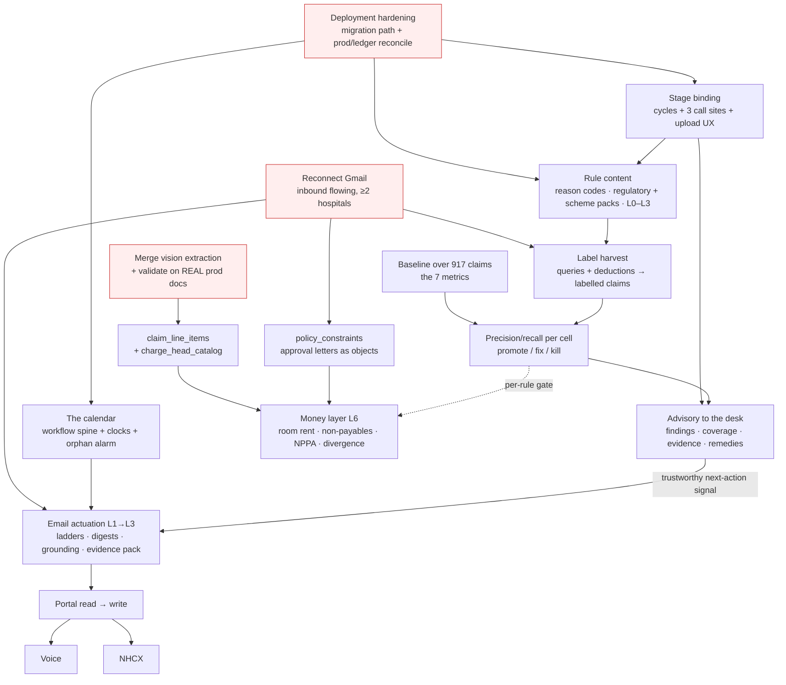

# ClaimOS Next Phase — Combined Roadmap: Pre-Insurance Adjudication + Agentic Filing

**Date:** 2026-09-14
**Revision — 14 Sep 2026, confirmation pass.** The four companion docs have been corrected against §2 (C1–C8), §4 (the single migration allocation) and §8 (the per-file list). **§9 below records what is resolved and what is still open**, re-verified against the repo rather than against the correction reports. Three claims in *this* document were themselves wrong and are corrected in place: `document_sections.stage` **is** populated (§1.5), `044`'s seeds are at `:217,331,443` (§1.2), and migration `013` does carry a `'bounced'` comment even though nothing writes it (§1.5). One allocation moved: `086` splits across Phase B2 and Phase F (§4).

**Method:** Read the four new design docs end-to-end, then verified every load-bearing claim about the current system against the repo — `Backend/src/schema/migrations/000–075`, `Services/rules/*`, `Services/adjudication/*`, `Services/context/*`, `Services/extractor/*`, `Services/email*`, `Workers/*`, and `webapp/src/pages/hospital/*`. Findings marked **[verified]** were confirmed by reading the file; **[not grounded]** means the repo contradicts the doc.

**Companion docs — the four this sequences:**
[`ADJUDICATION_PRODUCT.md`](./ADJUDICATION_PRODUCT.md) ·
[`ADJUDICATION_ARCHITECTURE.md`](./ADJUDICATION_ARCHITECTURE.md) ·
[`AGENTIC_FILING_PRODUCT.md`](./AGENTIC_FILING_PRODUCT.md) ·
[`AGENTIC_FILING_ARCHITECTURE.md`](./AGENTIC_FILING_ARCHITECTURE.md)

**And the ground they stand on:**
[`E2E_ARCHITECTURE.md`](./E2E_ARCHITECTURE.md) ·
[`EXTRACTION_LANDSCAPE_FIX.md`](./EXTRACTION_LANDSCAPE_FIX.md) ·
[`FROZEN_CONTRACTS.md`](./FROZEN_CONTRACTS.md) ·
[`DEPLOYMENT_HARDENING.md`](./DEPLOYMENT_HARDENING.md)

**This document owns:** the single sequenced plan, the dependency ordering, the entry/exit criteria, the founder decision points, and (§8) the corrections the four docs need — which I cannot make, because I do not own those files.

---

## 1. Where we actually are, on 14 September 2026

The four docs are, on the whole, unusually well-grounded — file paths, migration numbers, line references and column names check out at a rate I did not expect. But they are written as if from a standing start, and four facts about *today* change the plan materially. Three of them are better than the docs assume; one is worse.

### 1.1 The extraction work is built, not pending design **[verified]**

Both architecture docs treat tiled vision extraction and the `line_items` contract as future work ("P0", "per `EXTRACTION_LANDSCAPE_FIX.md`"). It is **implemented and sitting uncommitted on `feat/platform-hardening-vision`**:

| File | State |
|---|---|
| `Backend/src/Services/extractor/imageTiler.ts` | untracked; `TILER_VERSION='v2'`, `ANTHROPIC_MAX_EDGE_PX=1568`, `planTiles`, `tilePdfPage`, `toLlmAttachments` |
| `Backend/src/Services/extractor/deskew.ts` | untracked |
| `Backend/src/Services/extractor/lineItems.ts` | untracked; `LineItemSchema`, `LINE_ITEMS_SCHEMA_FRAGMENT`, `dedupeLineItems`, `checkLineItemTotals`, `buildLineItemsPromptBlock` |
| `Backend/src/Services/extractor/visionRead.ts`, `harness/` | untracked |
| `docExtractor.service.ts`, `ocr.service.ts`, `llm/prompts/*`, `providers/claudeClient.ts` | modified |

So P0 is **merge, migrate, validate on real production documents** — not build. That shortens the critical path by weeks and moves the risk from "can we hit 99.5%?" to "does 99.5% hold on real scans, and does the branch land cleanly?"

Two consequences the docs get wrong:

- **The persisted contract is `document_sections.extracted_fields.line_items`** (`docExtractor.service.ts:108,265`), a Zod-validated array whose row shape is `{row_index, particulars, code, date, qty, rate, gross, discount, net, tax_pct, payable, source_page, confidence}`, plus a table-level `line_items_confidence`. `ADJUDICATION_ARCHITECTURE` §4.3's `claim_line_items` is a **projection** of that, and should say so.
- **There is no bounding box.** `LineItemSchema` (`lineItems.ts:55`) emits `source_page`, not coordinates. Both adjudication docs promise bbox evidence and say it "comes free from the tiled extraction work" — **[not grounded]**. Page-level evidence *is* free (`document_sections` is already one row per page range). Bbox is a separate localisation pass that nobody has built. Plan for page + section crop in V1; treat bbox as a later enhancement, not a freebie.

### 1.2 The rules engine is ~70% built and 0% populated **[verified]**

- `Services/rules/engine.ts` is pure, dispatches by kind, and the abstention gate is real (`engine.ts:52`: below `minConfidence` → `SKIP`, never `PASS`/`FAIL`). `RuleStatus = 'PASS'|'FAIL'|'SKIP'|'ERROR'` (`types.ts:10`).
- Four evaluators exist (`evaluators.ts`): `evaluateDocumentPresence`, `evaluateRequiredFields`, `evaluateFuzzyName`, `evaluateTemporalWindow`. Two semantic kinds in `semantic.ts`.
- `selection.ts:45` weights **stage 4, insurer 4, scheme 3, case_type 2, route 1, treatment 1, specialty 1**, empty array = wildcard, ties break to higher `ruleSetId`.
- `stageAwareAdjudicator.service.ts` resolves context, selects one rule set (`:265`), builds `RuleContext` (`:125`), merges deterministic and semantic results on equal footing (`:312-313`), persists the 4-layer hypothesis (`:206`).
- All rule tables are **empty on production**, so the engine abstains on every claim.

One nuance neither adjudication doc states: **migration `044` ships three seeded rule sets** — `ICICI_LOMBARD_CARDIAC_V1`, `STAR_HEALTH_ORTHOPEDIC_V1` and `SADBHAWANA_PMJAY_THR_V1` (`044_insurer_rule_sets.sql`: the three `INSERT INTO hospital.insurer_rule_sets` at `:217,331,443`, the `rule_set_id` literals at `:221,335,447`). Their `insurance_rules` rows predate the `kind` column (added in `068`), so even if `044` were applied to prod, the adjudicator would classify them `no_kinded_rules` and skip them. "The rule base is empty" is true of prod; "the ledger has no content" is not. Decide explicitly whether to kind-ify those three or retire them — leaving them is worse than either, because they will match, win selection, and evaluate to nothing.

### 1.3 Gmail is integrated and currently disconnected **[the fact that hurts]**

The inbound half is genuinely good code — 8-strategy matching ladder with the exact confidences the docs quote (`emailMatching.service.ts:58-110`), SPF/DKIM/DMARC gating, VERP correlation via `ipds.correlation_token` (`071`), `email_intelligence_drafts` with human `applyDraft` (`emailIntelligence.service.ts:511`), an outbox with atomic status claim and stranded-row rescue (`emailOutbox.queue.ts`), a reconciler cron.

But **both configured hospital interfaces are disconnected on production right now.** No inbound mail is flowing. That is not an incident footnote — it is a structural blocker for four separate things the docs treat as available:

1. `payer_deficiency_observations` (ADJUDICATION_PRODUCT §1.1, §5.3) has no input stream.
2. The **label harvest** that gates rule promotion (ADJUDICATION_ARCHITECTURE §9.2, P4→P5) has no source of truth for "did the insurer actually query this?"
3. `mineRuleCandidates.ts` — the only realistic way to obtain private TPA rulebooks — has nothing to mine.
4. The whole next-action derivation table (AGENTIC_FILING_PRODUCT §5.1) is keyed on inbound events that do not arrive.

**Reconnecting Gmail, and keeping it connected, is the single highest-leverage non-engineering task in this plan.** It is also the cheapest. It goes in Phase A and it is a hard gate on Phase C.

### 1.4 Two vocabularies, four allocators, one collision **[verified]**

`FROZEN_CONTRACTS.md` **OD2** freezes: *"The 19 `master_options(category='ipd_stage')` codes (mig 024) are the single stage vocabulary used by `ipds.stage`, `document_sections.stage`, `claim_context.stage`, rule-set selection, and per-stage evaluation history."* Migration `024` seeds exactly 19 codes. `Services/context/types.ts:13` holds `IPD_STAGE_CODES` as the TypeScript source of truth, and OD2 names a change to it a `CONTRACT_DRIFT` event.

Against that:

- `ADJUDICATION_ARCHITECTURE` §5.1 adds a **second** vocabulary, `stage_kind` (7 values, new `master_options` category), as the rule-selection axis.
- `AGENTIC_FILING_ARCHITECTURE` §2.4 adds a **third**, `S00_ELIGIBILITY…S17_WRITE_OFF`, as `claim_workflow.current_state`, and asserts that "`claim_context.stage` and `claim_workflow.current_state` are the same vocabulary, so the rules engine selects on it without translation." That is false: `claim_context.stage` is `ipd_stage` codes (`067`), `insurer_rule_sets.applicable_stages` is populated with the same, and selection on S-codes would match nothing.
- `ADJUDICATION_PRODUCT` §4.1a adds eight **new `ipd_stage` codes** without flagging OD2.

And neither architecture doc noticed that **`StageClass` already exists** — `Services/context/types.ts:38` defines `'preauth' | 'enhancement' | 'discharge' | 'claim' | 'other'`, which is verbatim OD2's canonical stage classes, with a derivation function `stageClass(ipdStage)` at `resolver.ts:34` and a document-mix cross-check `docMixStageClass` at `:49`. The coarse rule-selection axis both docs want is half-built, contract-sanctioned, and in use.

Separately: **both architecture docs allocate migrations 076–082 for entirely different tables.** `ADJUDICATION_ARCHITECTURE` uses 076=cycles, 077=rule lifecycle, 078=line items, 079=reference data, 080=findings, 082=backfill. `AGENTIC_FILING_ARCHITECTURE` uses 076=workflow, 077=worklist, 078=workflow definition, 079=payer channels, 080=portal, 081=governance, 082=voice. FROZEN_CONTRACTS mandates a single allocator and "no ad-hoc numbers." (That ledger is itself stale — it assigns 071=autonomy, 072=audit; the repo has 071=correlation_token, 072=claim_financials.)

Worse than the collision: `AGENTIC_FILING_ARCHITECTURE` §6.3 issues `CREATE TABLE hospital.stage_transitions (...)` for the workflow edge table. **`hospital.stage_transitions` already exists** — migration `030_event_schema_extensions.sql:142`, with `claim_id, before_stage, after_stage, triggered_by, triggering_event_id, context_doc_section_ids, unresolved_query_ids, was_reversal, reasoning, actor_user_id`, three indexes, and live per-claim stage history. The companion doc `ADJUDICATION_ARCHITECTURE` §1 correctly lists it as existing and uses it as the cycle-opening trigger. One CREATE with no `IF NOT EXISTS` fails the migration; with `IF NOT EXISTS` it silently no-ops and the workflow has no edges.

### 1.5 Everything else the docs claim about today checks out

Sampled and verified: `claim_actions` (037) kinds/targets/statuses and `(claim_id, idempotency_key)` partial unique; `insurer_rule_sets.effective_from/effective_till` (044, unused); `insurance_rules.kind`/`min_confidence` (068); `claim_rule_evaluations.deduction_estimate` (044:176); `document_sections.stage` added nullable in 067; `uq_insurer_doc_req_set_type_stage` pinned by 074; `claim_financials` four amounts + LLM provenance (072); `hospital_interfaces.kind CHECK IN ('email','portal')` (023:38); `emails_outbound.idempotency_key VARCHAR(255) NOT NULL UNIQUE` (013:138); `claim_dossiers.current_panel_id` + `doc_sufficiency_per_stage` (031:47,58); `fetchInsurerCode` joining `panels.code` (`stageAwareAdjudicator.service.ts:66`); every named webapp component (`AdjudicationView/{BlockingGapItem,WarningItem,PredictedOutcomeCard}.tsx`, `PatientDetail/{NextStepsCard,PatientDocumentsPanel,ClaimFinancialsCard}.tsx`); every named service file. Migration head is `075_seed_ledger.sql`.

Two small ones that do not: `emails_outbound.status` has **no enforced `'bounced'` value** — it is a free `VARCHAR(30) DEFAULT 'queued'` with no CHECK, and the code writes only `queued|sending|sent|failed` (`emailOutbox.queue.ts:76,124,138,187,230`). There is no bounce detection anywhere in the repo. *(Where the claim came from, for the record: `013_create_cashless_everywhere_tables.sql:129` carries the inline comment `-- 'queued' | 'sending' | 'sent' | 'bounced' | 'failed'`. A comment in a migration is a wish, not a column constraint and not a writer. All four docs now state the ground truth; none of them cite the comment, which is fine — but nobody should re-derive the original error from it.)* And `payer_config`, `payer_channel`, `benefit_plan` do not exist in any form, though all four docs reference `payer_config` as if it were a known table.

**One correction to this document's own §1.5, found on the confirmation pass:** `document_sections.stage` is **not** unpopulated. Both classification paths already stamp it — `docBundleClassifier.service.ts:1504` and `docSegmenter.service.ts:594`, each calling `fetchClaimStage()` (`Services/context/loader.ts:28`) and writing the result inside the persistence transaction, best-effort, NULL on failure. The defect is subtler and worse than "never populated": what gets stamped is **the claim's stage at the moment of classification**, which drifts on every re-classification and is meaningless for a document backfilled months later. A plausible-but-wrong stage makes a stage-scoped rule evaluate *confidently against the wrong document set* instead of abstaining. So B1's third call site is a **deletion as much as an addition** — remove the live-stage fallback, write NULL when the document is unbound, and project from the cycle when it is.

---

## 2. What the four docs got right, and where they disagree with each other

**Right, and worth protecting from later cost-cutting:**

- The **L0/L1 stop rule** (both adjudication docs). Do not emit clinical or financial findings on a claim whose extraction failed. This is the single constraint that prevents the month-three "the tool cried wolf" death, and it is directly evidenced by the repo's own landscape proof.
- **`UNASSESSED` as a first-class verdict** and coverage as a required UI element. "No rule exists for this payer" and "rules ran and passed" must never render the same.
- **Findings separate from evaluations** — one ledger for the trace including passes, one for the deduplicated actionable object.
- **Model proposes, rules dispose**, with the deny-list evaluated outside the model's control path.
- **`verify()` mandatory on every channel adapter**, and the insistence that "unknown" is not "failed." That is the difference between a duplicate pre-auth and a clean recovery.
- **Durable workflow in Postgres, not Temporal**, with `next_wakeup_at` as the calendar and an orphan alarm as the prime directive. The repo already contains the pattern twice (`emailOutbox.queue.ts`, `claimRunReconciler.cron.ts`).
- **Citation as a NOT NULL publish constraint.** Cheapest governance available.

**Where they disagree with each other** — these must be settled before anyone writes a migration:

| # | Conflict | Docs | Resolution I recommend |
|---|---|---|---|
| C1 | Stage vocabulary: `stage_kind` (7, new) vs `S00–S17` vs the frozen 19 `ipd_stage` codes | ADJ_ARCH §5.1 vs AGENTIC_ARCH §2.4 vs OD2 | Keep the 19 as the state machine. Extend the **existing** `StageClass` (`context/types.ts:38`) from 5 to 7 by adding `intimation` and `appeal`; that *is* the coarse selection axis, it is OD2-sanctioned, and `stageClass()` already derives it. `query_response` is **not** a class — it is a cycle, which is what `claim_submission_cycles` models. No new `master_options` category; no S-codes. |
| C2 | `hospital.stage_transitions` proposed as new (workflow edges) while it exists as claim stage history | AGENTIC_ARCH §6.3 vs ADJ_ARCH §1 / mig 030 | Rename the workflow edge table `workflow_transitions`. Keep 030's table as the history log, and use it as the cycle-opening trigger exactly as ADJ_ARCH §5.3 proposes. |
| C3 | Migration numbers 076–082 double-allocated | both architectures | One ledger, in `FROZEN_CONTRACTS.md`, updated in the same PR as any migration. Sequencing below assigns them. |
| C4 | Document-to-stage binding columns: `ipd_doc.stage_code/stage_binding_source/stage_binding_confidence` vs `ipd_doc.submission_cycle_id/stage_kind/stage_assignment_method/stage_assignment_confidence` | ADJ_PRODUCT §4.3 vs ADJ_ARCH §5.2 | The architecture's cycle model wins. Stages repeat; enhancement #2 has a different document set from #1. The product doc should adopt the cycle vocabulary. |
| C5 | Stage transition log: new `claim_stage_transitions` vs existing `stage_transitions` (030) | ADJ_PRODUCT §4.1b vs mig 030 | Use 030's table. It already has `before_stage`, `after_stage`, `triggered_by`, `was_reversal` and causal linkage to `submission_events`. If it is missing something, add columns. |
| C6 | Follow-up ladders: standalone `followup_ladder(payer_id, claim_type, stage)` vs child of `insurer_rule_sets` | AGENTIC_PRODUCT §3.4 vs AGENTIC_ARCH §6.3 | Child of `insurer_rule_sets`. The architecture's D6 ("no second rules engine") is correct and the existing `selectRuleSet` specificity scoring is exactly the resolver the product doc describes in prose. |
| C7 | `claim_workflow.current_stage` (ipd_stage) vs `current_state` (S-codes) | AGENTIC_PRODUCT §3.4 vs AGENTIC_ARCH §2.3 | `current_state`, holding `ipd_stage` codes plus the operational states (`AWAIT_APPROVAL`, `VERIFYING`, `WAITING_OTP`, `BLOCKED_*`, `HUMAN_OWNED`). Operational states are genuinely new and genuinely needed; payer-facing states are not. |
| C8 | `payer_channel_config` vs `payer_channel`; `payer_config` referenced by all four, defined by none | all four | One table, `payer_config`, with DDL, in the phase that first needs it (Phase B — it carries the TAT clocks). Channel routing is columns on it, not a second table. |

**What the brief asked for and the docs under-deliver:**

- **Item 3, stage-aware upload.** `ADJUDICATION_PRODUCT` §4.3 has the right UX (checklist-first, drop-to-bind, `○` for later-stage items, "Needs filing" tray) and `ADJUDICATION_ARCHITECTURE` §5.2–5.3 has the right data model. What neither has is the **wiring inventory**: exactly three call sites decide whether stage-awareness is real or stays a column — `Controllers/v2/uploads.controller.ts` (stamp the open cycle on upload), `emailMatching.service.ts:454` → `savePatientDocsFromInbound` (bind by `emails_inbound.received_at` against the open cycle), and the projection of `document_sections.stage` from the parent document's cycle, replacing today's live-stage stamp. ADJ_ARCH §11.5 names this as the smallest, highest-leverage change and then does not schedule it. It is scheduled below, in Phase B, as its own deliverable with its own exit criterion.
- **Item 4, "never lets anything slip."** The docs give the guarantee (the orphan invariant query) but both gate it behind rule-table population — `AGENTIC_FILING_PRODUCT` §9 Phase 0 and `AGENTIC_FILING_ARCHITECTURE` §10 Phase 0 both say "populate the rule tables" *before* the spine. **This is over-gated and it is the most consequential sequencing error in the set.** The never-slips guarantee is made of three things: a durable per-claim row with a `next_wakeup_at`, a deadline countdown derived from published IRDAI/PM-JAY TATs plus MOU windows, and an alarm that fires when a live claim has no scheduled wakeup. **None of those reads `insurance_rules`.** The calendar can ship in parallel with the content-acquisition project rather than behind it — which matters enormously, because content acquisition is a months-long sales activity and the calendar is weeks of engineering with standalone value.

**Decidability.** ADJ_ARCH and AGENTIC_ARCH are both buildable as written — DDL, file paths, interfaces, error taxonomies, exit gates. AGENTIC_ARCH is the strongest of the four; its `ChannelAdapter` contract and `runtime.step()` sketch could be handed to an engineer today. ADJ_PRODUCT is the weakest on decidability: §3.2's `Finding` shape and §3.5's layer ladder are crisp, but §5.3's authoring layers and §7's V1 scope describe a content project without naming who does it, in what tool, at what rate. That is the actual bottleneck, and §11.1's own line is the honest one: *"every phase after P1 is a content-acquisition problem wearing an engineering costume."*

---

## 3. The dependency graph

**The four hard gates, stated as rules rather than arrows:**

1. **No schema change lands before the migration path is trustworthy.** Prod's DB diverges from the `pgmigrations` ledger (dump-created). Eleven new tables and ~40 new columns across the two designs will land badly otherwise.
2. **No money rule enters even shadow mode before per-category extraction accuracy is demonstrated on real production documents.** Not on the synthetic harness — that is already at 99.5% and proves only that the technique works. The gate is a labelled sample of real prod landscape and dense-portrait bills, per `doc_category`, human-verified. `insurance_rules.requires_extraction_grade` should be a real column that the engine checks, not a team norm.
3. **No rule promotes past shadow before its precision is measured**, and precision cannot be measured without labels, and labels come from insurer correspondence, which requires Gmail connected. The chain is: Gmail → drafts → labelled claims → precision → promotion. Break any link and every rule stays in shadow forever.
4. **No agentic actuator fires on a signal that has not been measured.** The "trustworthy next-action signal" gate is specific: denial-vs-query classification at **zero** errors reaching an automated action on the labelled set, and the edge's guard rules in `enforcing` mode. The calendar half is exempt — a deadline countdown derived from a published regulation needs no model.

**What is genuinely parallel:** stage binding and the calendar (different tables, different people); rule content acquisition and the calendar; the money layer and email actuation, once both their gates clear.

---

## 4. Phases

Each phase names its entry gate, the rough shape of the work, and an exit criterion that is checkable rather than aspirational. Migration numbers are allocated here, once, resolving C3.

### Phase A — Foundations *(unblock everything)*

**Entry:** none. This starts now.

**Work:**
- Land `DEPLOYMENT_HARDENING.md` in full: genesis-schema application, `pgmigrations` ledger reconciliation against live prod, compose healthchecks, Redis host exposure. Publish a diff of prod schema vs ledger and close it.
- Merge `feat/platform-hardening-vision`. It carries tiling, deskew, `line_items`, the harness and prompt changes. Put the harness in CI as a blocking gate (`EXTRACTION_LANDSCAPE_FIX.md` §4.6 already specifies it).
- Validate on **real** production documents: query `ipd_doc` for wide images/PDFs, extract with tiling, human-verify a labelled sample per category, starting `final_bill` then `pharmacy_bill`. Roll `extraction_mode='vision'` per category on `master_options`, watching `extraction_confidence` and correction rates.
- Reconnect Gmail on both configured hospitals; add the interface-health gauge to the existing reconciler alerting (`emailIntelligenceReconciler.cron.ts` already emits five gauges — `interfacesUnhealthy>0` already logs ERROR; make it page). Onboard two more hospitals' mailboxes if the pilot set allows.
- Decide and execute on `044`'s three seeded rule sets: kind-ify or retire.
- **Retrospective baseline over the 917 claims** of all seven `ADJUDICATION_PRODUCT` §1.1 metrics, plus touches-per-claim and query turnaround from `AGENTIC_FILING_PRODUCT` §8. Shipping a rules engine without a measured baseline means never being able to prove it worked.

**Exit — all five:**
1. Migrations `076+` apply cleanly to prod through the hardened path; ledger and live schema reconciled.
2. ≥99% field accuracy on a human-verified sample of real production `final_bill` and `pharmacy_bill` documents, both orientations, ≥30 documents each.
3. `line_items` populating `document_sections.extracted_fields` on live traffic for those categories, with the totals cross-check (`checkLineItemTotals`) firing and its disagreement rate reported.
4. Inbound email flowing for ≥2 hospitals for 14 consecutive days; `emails_inbound` → matched-at-≥0.9 rate reported; interface-health alarm wired to a pager.
5. Baseline report published, per hospital and per payer, over the 917.

**Founder decision in this phase:** whether to spend onboarding effort widening the corpus (more hospitals → more labels → measurable precision) before or after the first rule content lands. My view: before — see §6, risk R2.

---

### Phase B — Stage binding and the calendar *(two parallel tracks, neither needs rule content)*

**Entry:** A.1 (migration path). B2 additionally wants A.4 (Gmail) for inbound-driven wakeups, but can start with timer-driven ones.

#### B1 — Stage-aware documents *(brief item 3's missing half)*

`076_submission_cycles_and_stage_binding.sql`:
- `claim_submission_cycles(claim_id, stage_class, cycle_no, parent_cycle_id, opened_at, opened_by_transition_id → stage_transitions(id), submitted_at, closed_at, outcome, due_at, ipd_stage_at_open)` per ADJ_ARCH §5.2, keyed on the **extended `StageClass`** (C1), not a new `stage_kind` category.
- `ipd_doc` gains `submission_cycle_id`, `stage_class`, `stage_assignment_method`, `stage_assignment_confidence`.
- `document_sections.stage` is **re-pointed**, not populated for the first time. It is written today by `docBundleClassifier.service.ts:1504` and `docSegmenter.service.ts:594` with the *claim's live stage at classification time* (§1.5). Replace that with a derived projection of the parent document's cycle, and write NULL — not a plausible guess — when the document is unbound.
- Extend `StageClass` and `IPD_STAGE_CODES` — a **`CONTRACT_DRIFT` event under OD2** requiring sign-off, and the reason this is a named decision point rather than a task.

**The three call sites, which are the whole deliverable:**
1. `Controllers/v2/uploads.controller.ts` — stamp the claim's open cycle (`upload_current`, 0.95); most-recently-opened leaf when several are open.
2. The inbound-mail persistence path — `emailMatching.service.ts:454` (`applyMatch`) → `savePatientDocsFromInbound` (`:600`) — binds attachments by `emails_inbound.received_at` falling inside `[opened_at, closed_at)` (`email_temporal`, 0.85); a query email opens a child cycle and its attachments bind to the *parent*. **Do not loosen the existing ≥0.9 match gate to get more bindings**: a wrong bind here is a cross-patient write.
3. The projection onto `document_sections.stage` — at `docBundleClassifier.service.ts:1504` and `docSegmenter.service.ts:594`, which is where today's live-stage stamp is written and must be removed.

Plus the UX: `PatientDocumentsPanel.tsx` becomes stage-first — live checklist from `insurer_document_requirements` × `stage_requirements`, drop-to-bind, `○` rows for later-stage items, a "Needs filing (n)" tray with one-tap filing, and a corrections log that trains inference.

`077_stage_backfill.sql` + `Backend/src/scripts/backfillSubmissionCycles.ts` — the three-pass backfill of ADJ_ARCH §5.4 (transition-derived 0.9 → correspondence-derived 0.75 → `docMixStageClass` synthetic 0.5). Idempotent, offline, writes no rules, triggers no adjudication.

**Exit — all four:**
1. Every one of the 917 claims has ≥1 cycle; the distribution of `stage_assignment_confidence` is published (expect roughly half at 0.5 — that is correct and must be *reported as coverage*, not hidden).
2. `document_sections.stage` non-null for ≥95% of sections on claims with ≥1 cycle.
3. **≥60% of newly uploaded documents bound at upload time** rather than inferred, sustained over 4 weeks. This is the criterion that tells us the desk is actually using the checklist rather than routing around it. If it sits below 40%, stop and fix the UX before building anything on top of stage scoping.
4. The "Needs filing" tray median depth < 3 per active claim.

#### B2 — The calendar *(brief item 4's guarantee, without the actuators)*

`078_claim_workflow.sql` — `claim_workflow`, `claim_workflow_step`, `claim_workflow_signal` exactly as `AGENTIC_FILING_ARCHITECTURE` §2.3 specifies (that DDL is good; take it as written), with `current_state` holding `ipd_stage` codes plus operational states (C7).
`079_claim_actions_worklist.sql` — the `claim_actions` extension of AGENTIC_ARCH §3.1, widened CHECKs, three new indexes, `hospital_id` backfilled from `ipds`.
`080_payer_config.sql` — the table all four docs reference and none define. Carries per-(payer × claim_type × stage_class) TATs, submission and query windows, channel routing, recipient allow-list, quiet hours, frequency caps. DDL lives in `AGENTIC_FILING_ARCHITECTURE` §6.5, once; the other three consume it and do not restate it.
`086_workflow_definition.sql` — **moved here from Phase F on the confirmation pass.** `workflow_transitions` and `followup_ladder_rungs`, both children of `insurer_rule_sets` (C2, C6). The original allocation put all of `086` in F, which was wrong for the same reason Phase 0 was over-gated: the observe-only spine derives its next action *from the transition table*, so a calendar with zero edges computes nothing. Ship the two tables and the definition loader in B2, seed the edges as data, and author rungs whenever the ladder harvest lands. **A rule *set* row is a selection key — an afternoon's seeding. Rule *content* is kinded, cited, precision-measured rows.** Parenting the rungs under `insurer_rule_sets` does not re-gate the ladder on rule content: the adjudicator abstains on a childless rule set, and abstention does not stop a rung firing.

Services: `Services/workflow/{runtime.service.ts, businessCalendar.ts, autonomy.ts, denyList.ts}`, `Services/workflow/definitions/claimLifecycle.v1.ts`, `Services/nextAction.service.ts`.
Workers: `Workers/workflowScheduler.cron.ts` (30s tick, lease + `SKIP LOCKED`), `Workers/workflowOrphanAlarm.cron.ts`.
Controllers: `Controllers/v2/{workflow,worklist}.controller.ts`, both `assertClaimAccess`-guarded.
Frontend: the Worklist.

Seed `payer_config` from the **published** clocks only — IRDAI Master Circular 1-hour pre-auth / 3-hour final authorisation / 30-day settlement; PM-JAY 48h initiation, 24h query, 45-day hard limit; Cashless Everywhere 48h intimation. MOU windows are a separate, slower content stream (§5, decision D3); the countdown works without them and improves when they arrive.

Run **observe-only, zero actuators.** Compute the next action and due date for every live claim; write them; send nothing.

**Exit — all four:**
1. `SELECT count(*) FROM hospital.claim_workflow WHERE status NOT IN ('done','dead') AND (next_wakeup_at IS NULL OR next_wakeup_at < now() - interval '1 hour')` returns **0**, continuously, for 30 days, with the alarm paging on non-zero.
2. Every live claim across the pilot hospitals appears in the worklist with exactly one current next action, one owner, one due time.
3. Zero outbound messages originated by the workflow.
4. Measured baseline for time-to-first-action on inbound exists (it will be bad — it is currently human-gated — and that is the point).

**Standalone value:** at the end of B2 the product tells a human administrator exactly what to do next on every claim, on time. That is already worth selling, and it is the state the global kill switch degrades to forever after.

---

### Phase C — Rule content, in shadow

**Entry:** A (all), B1 exit 1–2. **Gmail must be flowing** — C's exit depends on labels.

**Work.** This is a content project with engineering support, not the reverse. Staff it with a TPA-desk domain owner.

`081_rule_lifecycle_and_findings.sql` — the ADJ_ARCH §2.4 column additions to `insurer_rule_sets`/`insurance_rules`, `rule_families`, `finding_reason_codes`, `claim_findings`, `claim_decision_records`, `rule_overrides` extensions. **Confirmed on the confirmation pass, and recorded here because `ADJ_PRODUCT` §7.1 placed them without a ledger entry:** `081` also carries `payer_deficiency_observations`, `rule_proposals`, and the columns `insurance_rules.requires_extraction_grade`, `procedure_group` and `uin`. All are new, all belong to the adjudication owner, and none collides.
`082_reference_data.sql` — `reference_nonpayable` (IRDAI Annexure-I Lists I–IV), `reference_nppa_cap`, `charge_head_catalog`, `benefit_plan`. All effective-dated with `order_ref`; a staleness monitor that forces `UNASSESSED` rather than guessing when reference data expires.

Content, in yield order:
1. **Regulatory base pack** — the four non-payable lists, NPPA ceilings, IRDAI TATs. Public, citable, insurer-agnostic, and it applies to the whole corpus so `n` is never thin.
2. **Scheme pack** — PM-JAY HBP packages and the NHA standard query/rejection vocabulary, which seeds `finding_reason_codes` directly.
3. **L0–L3 only**, for the top 3 payers by volume × top 5 procedure groups × two stage classes (`preauth`, `discharge`) — chosen from the 917-claim history, not from intuition.
4. `mineRuleCandidates.ts` clustering inbound query text per insurer into draft rules with `derived_from_finding_ids`.

Engine work: new statuses `NOT_APPLICABLE` and `BLOCKED` (an OD4 amendment — flag it); layer-ordered sweep with the L0/L1 stop rule; `selectRuleSets` returning one winner per layer and merging (ADJ_ARCH §3.2) instead of picking one; the confidence formula of §7.2 including per-line abstention; coverage as a persisted, required output.

Then: shadow run over all 917 × every cycle, and the **label harvest** — `harvestLabels.ts` pulling ground truth from `email_intelligence_drafts` (query/rejection extractions), settlement and deduction sheet sections, and `claim_financials` claimed-vs-approved deltas.

**Exit — all four:**
1. Decision records exist for every claim × cycle; publish validator green (every rule has a family, a citation, a `reason_code` in the closed vocabulary, `evidence_requirements` and a `min_confidence`).
2. **≥200 labelled claims.** If the harvest yields fewer, the plan is falsified at this point — see R2.
3. Precision and recall published per `(insurer × stage_class × procedure_group)` cell, with confidence intervals, and every rule sorted into promote / fix / kill. Thin cells (n<10) explicitly refused, not silently averaged.
4. Zero money rules in any mode. They are gated on Phase E.

**Founder decision:** which three payers and five procedure groups. Narrow-and-deep beats broad-and-empty, and the choice determines whose MOU matters.

---

### Phase D — Advisory to the desk

**Entry:** C exit 1–3.

**Work.** Findings surface in `AdjudicationView`: the verdict, the mandatory coverage line, the deficiency list grouped by severity with document + section + **page** evidence (not bbox — see §1.1), the collapsed "41 checks passed" panel, the rule text and citation, and resolve / override / bypass. Structured override reasons wired into rule health. `payer_deficiency_observations` normalising every inbound query into reason codes. Remedy buttons that **draft** — `request_doc` into `claim_actions`, with the Gmail outbound path already built and human-applied.

Per-rule promotion runs on the ADJ_ARCH §9.5 ladder: shadow → advisory at ≥20 firings and precision ≥0.70; advisory → enforcing at ≥50 firings, precision ≥0.90, override rate ≤0.10. Effective mode is `min(rule.mode, rule_set.mode)`.

**Exit — all four:**
1. A user can falsify any surfaced finding in ≤5 seconds (timed, with real coordinators, on real claims).
2. ≥1 rule in `enforcing` with measured precision ≥0.90 over ≥50 firings.
3. Measured reduction in query rate at the pre-auth stage versus the Phase A baseline, on the covered payer × procedure cells.
4. ADVISORY findings per claim capped and the cap not binding — if it binds, the noise budget is already blown.

---

### Phase E — The money layer *(L6)* and Phase F — Email actuation: **run in parallel, gate separately**

These are the two halves of the actual commercial promise and they have different gates. Which goes first is a founder decision (D1 below); they can also go together with two teams.

#### Phase E — Money

**Entry:** A.2/A.3 (real-document extraction proof), C exit, plus Gmail for approval-letter parsing.

`083_claim_line_items.sql` — `claim_line_items` projected from `document_sections.extracted_fields.line_items`, carrying `source_page` (not bbox), `row_index`, `line_confidence` falling back to table-level `line_items_confidence` when the per-row value is absent, and `charge_head_code` written proposal-only by `Services/adjudication/chargeHeadMapper.ts`.
`084_policy_constraints.sql` — approval letters parsed as **constraint objects** (amount, room cap, ICU cap, co-pay %, named diagnosis, named procedure, validity window, pre-excluded heads, proportionate-exempt heads), extending the existing `emailIntelligence` approval extractor. This is the highest-value single table in either design: almost every deduction is a violation of something written in the approval letter that nobody parsed. `084` also carries **`claim_deductions`** — realised per-reason deduction attribution, placed by `ADJ_PRODUCT` §7.1 and recorded in the ledger here. Named `policy_constraints`, not `claim_approval_constraints`: one name across all four docs.

Evaluators, in this order: `LINE_ITEM_CLASSIFICATION` → `ROOM_RENT_CAP` → `PROPORTIONATE_DEDUCTION` → `PRICE_CEILING` → `SUBLIMIT_CHECK`/`COPAY_CHECK` → `APPROVAL_CONSTRAINT_DIVERGENCE`. Each enters shadow individually behind `requires_extraction_grade` for its input categories.

Then the **divergence sweep** — daily, for every admitted patient with an approval on file, comparing the live episode to the constraint object and raising an enhancement task the day the divergence happens rather than at discharge. And **short-payment reconciliation** — `expected_payable − settled_amount = contest_amount`, attributed per line to a deduction basis and a rule, or flagged **unexplained**, which is the single most valuable output in the system because unexplained deductions are what hospitals silently absorb.

**Exit:** deduction forecast within ±10% of realised on ≥70% of claims measured against `claim_financials` and parsed settlement letters; zero money findings raised on claims that failed L0/L1; per-line abstention reported in coverage on every claim.

#### Phase F — Email actuation, L1 → L3

**Entry:** B2 exit (the calendar is live and orphan-free), D exit 2 (a trustworthy signal exists), and **denial-vs-query classification at zero errors reaching an automated action** on the labelled set.

`085_payer_channels.sql` — channel adapter registry, `hospital_interfaces` extensions (`hospital_panel_id`, `adapter_id`, `enc_key_id`, rotation columns), `secret_access_log`, `payer_automation_policy`.
`086` — **already landed in B2** (`workflow_transitions`, **not** `stage_transitions`, per C2; and `followup_ladder_rungs`). Phase F adds the actuation-only edges and rung columns to those tables; it does not create them.
`087_agent_governance.sql` — `claim_action_ledger`, `autonomy_policy`, `claim_ops_cost_log`.
`claim_query_items` — named here and in `AGENTIC_FILING_PRODUCT` §5.2, **deliberately unnumbered**. It ships inside the `085`–`087` block; the owner takes its number from the ledger when the phase starts rather than pinning one now. If it is pulled forward into V1.5, it takes a number from the ledger then.

`Services/channels/{types.ts, email.adapter.ts, grounding.ts, digest.service.ts}` — the `ChannelAdapter` contract with mandatory `verify()`, the mechanical grounding gate (every number, date and reference in a rendered body must appear in the structured episode or the draft is rejected), digest-by-default, per-recipient caps, quiet hours enforced by the scheduler.
`claim_query_items` — per-item query tracking, which AGENTIC_PRODUCT §5.2 correctly calls the single highest-value extraction upgrade for this product.
**Bounce detection, built from scratch** — DSN/NDR parsing on the inbound path, a `bounced` status, and a `BLOCKED_BAD_CONTACT` transition. There is none today (§1.5).
Auto-reply/OOO suppression (`Auto-Submitted`, `X-Autoreply`, `Precedence: bulk`) so an out-of-office never cancels a ladder.
The four-level kill switch, operable by a non-engineer, effective within one scheduler tick.

Autonomy: L4 reads and parsing, L3 template-only chases and internal requests, **L2 for everything payer-facing.**

**Exit — `AGENTIC_FILING_PRODUCT` §9's V1 criteria, all holding 30 consecutive days across ≥5 hospitals:** orphan rate 0; ladder adherence ≥95%; **zero duplicate submissions**; approval rejection rate strictly between 2% and 25%; grounding gate blocks >0 and no ungrounded fact reaches a payer; denial-vs-query misclassification reaching an automated action **zero**.

---

### Phase G — Portal (read, then write), then voice, then NHCX

**Entry:** F exit, plus a populated `payer_automation_policy` for every payer to be enabled, plus counsel engagement started (D4 below).

Read-only first — status polling, letter download, acknowledgement verification. Not caution theatre: it forces login, session, drift and evidence to be solved before anything irreversible is at stake, and for several payers the portal shows status hours before the email arrives, so it is immediately valuable alone. Then submission at L2 with verification reads and full evidence capture. Nightly canaries, selector-drift review queue that never self-applies, per-payer breakers, sessions never shared across tenants.

Voice is narrow — status enquiry only, deterministic IVR maps, **counsel sign-off on TRAI/DPDP posture before the first outbound call**, no exceptions and no pilots-as-exceptions.

`NhcxAdapter` implements the same interface from the day the interface exists, even unimplemented. Portal adapters are a depreciating asset.

---

## 5. Decision points for the founder

| # | Decision | Why it is yours | When |
|---|---|---|---|
| **D1** | **Money depth vs advisory breadth.** After Phase D, do we build the L6 forecast for three payers (Phase E) or widen L0–L3 coverage to ten (more of Phase C)? | Money is the felt pain and the differentiated claim; breadth is the trust-builder and the retention story. Both are defensible; they are different companies at scale. | End of Phase D |
| **D2** | **`CONTRACT_DRIFT` sign-off on OD2.** Extending `StageClass` and `IPD_STAGE_CODES` touches `ipds.stage`, `claim_context.stage`, `document_sections.stage`, `stage_requirements.target_stage`, `insurer_rule_sets.applicable_stages` and the TS contract in `context/types.ts`. | FROZEN_CONTRACTS names this a re-plan event requiring sign-off. | Before B1's migration |
| **D3** | **Who chases the MOUs.** Per-payer submission windows, query windows, tariffs and package terms are contractual, unpublished, and sitting in each hospital's finance office. `payer_config` is thin without them and the deduction model is guesswork without the UIN wordings. | This is a sales and customer-success activity, not an engineering one, and it needs your relationships. | Starts in Phase A, needed by C |
| **D4** | **Counsel engagement, two separate questions:** (a) portal automation posture per payer ToS — long lead time, gates Phase G; (b) TRAI/DPDP posture for AI-driven outbound voice, specifically whether the 140/160 series requirement attaches to B2B transactional calls to a TPA helpline. | Legal exposure, and (a) has a long enough lead that starting it late becomes the critical path. | (a) now; (b) before voice |
| **D5** | **Staffing the content function.** The rule base *is* the product, and today production ships an engine with an empty one. This needs a named TPA-desk domain owner authoring rules full-time, not engineers doing it between tickets. | It is a hire or a redeployment, and the plan does not work without it. | Before Phase C |
| **D6** | **Corpus width vs depth.** Onboard more hospitals to widen the label corpus, or go deep on the existing 18? 917 claims gives many `(insurer × stage × procedure)` cells with n<10. | Determines whether per-cell calibration is ever possible, which determines whether any rule can be promoted past advisory. | Phase A |
| **D7** | **Mailbox identity per hospital.** Hospital's own domain (better deliverability, more credible to TPAs, more DNS work per hospital) vs a delegated `claims.<hospital>.com`. | Affects onboarding cost across 18+ hospitals. Gmail OAuth already sends as the hospital, so the default is settled unless you want to change it. | Before F |
| **D8** | **Override governance.** Who at each hospital may override a BLOCKING finding? Ungoverned, the audit trail is worthless; over-governed, the desk routes around the product. | A policy question about customers, not a schema question. | Before D |

---

## 6. Risks, and what would falsify this plan

**R1 — Adjudicating on bad extraction.** The named worst outcome in both adjudication docs, and the evidence is in this repo: single-image vision on a degraded landscape bill scored 80–97% with errors concentrated in the payable and date columns. A confident, cited, wrong finding about a line that does not exist costs the account. *Mitigation:* the L0/L1 stop rule, `requires_extraction_grade` as an enforced column, extraction confidence as an input to finding confidence, per-line abstention, and the Phase A real-document gate. *Falsifier:* the labelled real-document sample comes in below 97% for `final_bill` after tiling — in which case the money layer is deferred indefinitely and the product is documentation-completeness only, which is still a product but a smaller one.

**R2 — The label corpus is too thin to promote anything.** 917 claims, and the promotion gates require ≥20 firings at ≥0.70 precision to reach advisory and ≥50 at ≥0.90 to enforce. Per cell, most will never get there. *Mitigation:* start with insurer-agnostic regulatory rules where n is the whole corpus; report intervals; refuse promotion in thin cells; widen the corpus (D6). *Falsifier:* the Phase C harvest yields <200 labelled claims. If it does, the measurement-driven promotion ladder cannot run, and the honest alternative is to ship rules at advisory permanently with human judgment as the gate — a materially different product with a materially weaker claim.

**R3 — Gmail connectivity is not durable.** Both configured hospitals are disconnected today. If OAuth connections lapse routinely, the feedback loop, the mined insurer rules, the precision measurement and the entire agentic derivation all die quietly. *Mitigation:* interface-health alarm paging (the gauge already exists), a reconnection runbook owned by customer success, and connection uptime as a reported metric per hospital. *Falsifier:* connection uptime below 90% across the pilot set over a quarter.

**R4 — Stage binding becomes friction and users route around it.** If binding a document to a stage costs a click, the primitive collapses and every stage-scoped rule abstains forever, leaving a large investment inert. *Falsifier:* B1's exit criterion 3 — upload-time binding below 40% after six weeks. Stop and redesign rather than proceed.

**R5 — Content acquisition is slower than engineering.** Every phase after C is a content project. The failure shape is an elegant engine, a beautiful findings UI, and eleven rules. *Mitigation:* D5 (a named owner), narrow-and-deep V1 scope, honest coverage display so absence never reads as cleanliness. *Falsifier:* eight weeks into Phase C with no published pack for any of the top three payers.

**R6 — Duplicate submission.** The most expensive bug class in claims automation, and it is caused by treating "unknown" as "failed." *Mitigation:* mandatory `verify()`, write-intent-before-acting, `in_flight` resolution as tick step 2, `step_key` carrying the cycle counter, and a metric with a target of 0. *Falsifier:* any duplicate reaching a payer during Phase F's 30-day window resets the window.

**R7 — Prompt injection via inbound content.** A claims agent reads exactly the content class that carries the risk. *Mitigation:* recipients and destinations derive only from `payer_config`, never from parsed content; plan-then-execute; least privilege per step; the deny-list in code outside the model's control path. *Falsifier:* any red-team injection that changes a destination.

**R8 — The approval gate becomes a rubber stamp.** Sixty approvals in a morning is click-through, and click-through is an audit liability wearing a control's costume. *Mitigation:* diff-not-document, evidence inline, batch homogeneous / gate heterogeneous, payload-hash binding with expiry. *Falsifier:* approval rejection rate at 0% over 200+ items — a finding in either direction, never a pass.

**R9 — Schema divergence bites.** Eleven new tables and dozens of columns against a prod DB that diverges from its own ledger. *Falsifier:* migration `076` does not apply cleanly on a prod clone. That is Phase A exit criterion 1 for exactly this reason.

**R10 — The two designs drift apart in implementation.** They already disagree on eight points (§2, C1–C8) including a table-name collision. Two teams building from two docs that each invented their own stage vocabulary and migration numbers will produce two rules layers, which is the outcome `AGENTIC_FILING_ARCHITECTURE`'s own D6 forbids. *Mitigation:* settle C1–C8 in writing before the first migration; one migration ledger; one derivation call site, and it is the one that already exists — `stageClass()` at `Services/context/resolver.ts:34`. *(An earlier draft of this line said `deriveStageClass`. No such function exists, and `AGENTIC_ARCH:166,275` inherited the wrong name from it — §9.5 item 3.)*

---

## 7. What "done" looks like

The north star from `ADJUDICATION_PRODUCT` — *by the time a claim reaches the insurer, zero deficiencies are discoverable* — is measured by **First Pass Yield**, not clean-claim rate, and the gap between the two is the blind-spot map. The north star from `AGENTIC_FILING_PRODUCT` — *every claim, always, has one next action, one owner, one due time* — is measured by the orphan count, and its target is zero, permanently.

If, twelve months out, the system holds those two numbers on a corpus several times today's size, with a rule base whose every row carries a citation and whose promotions were earned against measured precision, then the two halves are one product: the engine says what is wrong and the agent makes sure it gets fixed, on time, with the evidence attached.

---

## 8. Corrections the four docs need *(the work order as issued — dispositions in §9)*

I own only this file. These are the changes the other four require, by file, most consequential first. **They have since been applied; §9 records the disposition of every item, re-verified against the repo rather than against the reports.** This section is left as written so the original defect list stays auditable.

### `AGENTIC_FILING_ARCHITECTURE.md`

1. **§6.3 — `CREATE TABLE hospital.stage_transitions` collides with an existing table.** `hospital.stage_transitions` exists (`Backend/src/schema/migrations/030_event_schema_extensions.sql:142`) as live per-claim stage history with `before_stage`, `after_stage`, `triggered_by`, `triggering_event_id`, `context_doc_section_ids`, `unresolved_query_ids`, `was_reversal`, `reasoning`, `actor_user_id` and three indexes — and `ADJUDICATION_ARCHITECTURE` §1 correctly lists it as existing. Rename the workflow edge table to `workflow_transitions`.
2. **§2.4 and §6.2 — the `S00–S17` state vocabulary is not the vocabulary the engine selects on.** The claim that "`claim_context.stage` and `claim_workflow.current_state` are the same vocabulary, so the rules engine selects on it without translation" is false: `claim_context.stage` holds `ipd_stage` codes (`067`), `insurer_rule_sets.applicable_stages` is populated with the same, and `FROZEN_CONTRACTS` OD2 freezes them as the single vocabulary. Adopt `ipd_stage` codes plus the operational states, or add an explicit derivation and say so.
3. **§10 — migrations 076–082 are double-allocated** against `ADJUDICATION_ARCHITECTURE`'s 076–082. Adopt one ledger (this doc's §4 proposes an allocation).
4. **§4.2 — "`emails_outbound.status` already has `'bounced'`" is not true.** The column is `VARCHAR(30) NOT NULL DEFAULT 'queued'` with no CHECK (`013_create_cashless_everywhere_tables.sql:128`); the only values written anywhere are `queued|sending|sent|failed` (`Workers/emailOutbox.queue.ts:76,124,138,187,230`). No bounce detection exists. Restate bounce handling as net-new work: DSN/NDR parsing on the inbound path.
5. **§10 Phase 0 over-gates Phase 1.** "Land and populate the stage-aware adjudication engine" is listed as a prerequisite for a phase that is explicitly observe-only and whose value comes from clocks. The calendar reads `payer_config` and `stage_transitions`, not `insurance_rules`. Split Phase 0 so the spine can ship in parallel with content acquisition.
6. **§1 — `payer_config` is referenced but never defined**, here or in the product doc, though the whole deadline half depends on it. Add DDL, and reconcile the name against `AGENTIC_FILING_PRODUCT`'s `payer_channel_config`.
7. **§1 — Gmail inbound is marked "Working" without noting that both configured hospital interfaces are disconnected on prod**, so no inbound is flowing and Phase 2 plus the label harvest have no input. Add it to Phase 0.
8. **Line-reference nits:** `selectRuleSet` is at `stageAwareAdjudicator.service.ts:265`, not `:234` (`:239` is `fetchInsurerCode`, `:241` is `buildRuleContext`). `emailMatching.applyMatch` is at `:454`, not `:458`.

### `ADJUDICATION_ARCHITECTURE.md`

1. **§5.1 — the new `stage_kind` vocabulary is a `CONTRACT_DRIFT` event under OD2**, which the doc cites as a companion for OD4/OD5 but never engages on this point. And it duplicates something that already exists: `StageClass = 'preauth'|'enhancement'|'discharge'|'claim'|'other'` (`Services/context/types.ts:38`) with `stageClass()` at `resolver.ts:34` — OD2's own canonical classes. Extend `StageClass` to seven rather than adding a `master_options` category, or state why not.
2. **§4.3 and §6.1 — bbox is not free.** The shipped `LineItemSchema` (`Services/extractor/lineItems.ts:55`) emits `row_index, particulars, code, date, qty, rate, gross, discount, net, tax_pct, payable, source_page, confidence` and **no coordinates**; the tiler returns slices, not row boxes. Downgrade `claim_line_items.bbox` and the "bbox comes free from the tiled extraction work" claim to a named later work item. Page-level evidence via `document_sections` page ranges is genuinely free.
3. **§4.3 — `line_confidence NUMERIC(4,3) NOT NULL` has no guaranteed source.** Per-row `confidence` in the shipped schema is **optional**; specify the fallback to the table-level `line_items_confidence` and record which was used.
4. **§1 and §10 — P0 is "merge and validate", not "build".** Tiling, deskew, `line_items`, `visionRead` and the harness are implemented and uncommitted on `feat/platform-hardening-vision`. Also name the actual projection source: `document_sections.extracted_fields.line_items` (`docExtractor.service.ts:108,265`).
5. **§10 — migration numbers collide** (see the agentic doc's item 3).
6. **§7.1 — extending `RuleStatus` with `NOT_APPLICABLE` and `BLOCKED` is an OD4 amendment, not covered by OD4's convention**, which speaks to evaluator *kinds* staying migration-free, not to the status set. Flag it as an amendment.
7. **§1 — add that migration `044` seeds three rule sets** (`ICICI_LOMBARD_CARDIAC_V1` + 2, at `044_insurer_rule_sets.sql:218,332,444`) whose `insurance_rules` rows predate the `kind` column and therefore evaluate as `no_kinded_rules`. "Empty on prod" is true; "no content in the ledger" is not. Say whether they are kind-ified or retired.
8. **§4.2/§6.4/§9.1 — `payer_config` and `benefit_plan` are referenced as inputs but never given DDL**, unlike `reference_nonpayable` and `reference_nppa_cap`. Add them or mark them explicitly deferred.
9. **§5.1 nit —** 074 sets `insurer_document_requirements.stage` DEFAULT to `'FINAL_CLAIM'` and backfills nulls; the `'PRE_AUTH'` value comes from 044's seeds, not from 074's default.

### `ADJUDICATION_PRODUCT.md`

1. **§4.1 — "20 curated codes" is wrong; there are 19.** `024_add_ipd_stage.sql:28-46` seeds 19, and `FROZEN_CONTRACTS` OD2 lists all 19 by name.
2. **§4.1a — adding eight new `ipd_stage` codes is a `CONTRACT_DRIFT` event** under OD2 and touches `IPD_STAGE_CODES` (`Services/context/types.ts:13`). Name it as such and list the consumers: `ipds.stage`, `claim_context.stage`, `document_sections.stage`, `stage_requirements.target_stage`, `insurer_rule_sets.applicable_stages`.
3. **§4.1b — `claim_stage_transitions` duplicates `stage_transitions` (030)**, which already has `before_stage`, `after_stage`, `triggered_by`, `was_reversal` and causal linkage to `submission_events`. Extend it or justify a second log.
4. **§3.2, §3.3, §6.1 — the bbox promise** ("bbox follows from the vision tiling work", "evidence thumbnail with the region highlighted", "the bbox comes free"). Same correction as the architecture doc's item 2. V1 evidence is document + section + page.
5. **§4.3 — column names diverge from the companion architecture.** `ipd_doc.stage_code / stage_binding_source / stage_binding_confidence` vs `submission_cycle_id / stage_kind / stage_assignment_method / stage_assignment_confidence`. Adopt the architecture's cycle model — stages repeat, and a bare enum cannot express enhancement #2.
6. **§1.1 — the FPY source cell cites "`ipds.stage` history"**, which does not exist (the doc says so itself in the adjacent gap column). Point it at `stage_transitions` (030).
7. **§7 V1 gate 2 — "shadow-mode precision ≥90% on BLOCKING findings" needs a stated denominator.** At 917 claims most `(payer × procedure × stage)` cells have n<10. Say corpus-wide first, per-cell only where n permits.
8. **§7 V1 — add Gmail reconnection as an explicit prerequisite.** `payer_deficiency_observations` is correctly made a V1 must-ship, and it has no input stream today.
9. **§5.3 — note the `044` seeds** (same as the architecture doc's item 7).

### `AGENTIC_FILING_PRODUCT.md`

1. **§2 — "Map to the `S00–S17` taxonomy" contradicts the companion architecture** (`ADJUDICATION_ARCHITECTURE` §5.1: "The research adds a fifth (`S00`–`S17`). We do not add a fifth") and OD2. Resolve to one decision across all four docs.
2. **§3.4 — `claim_workflow.current_stage` (ipd_stage code) vs `AGENTIC_FILING_ARCHITECTURE` §2.3's `current_state` (S-codes).** Same table, different column name, different vocabulary, in a doc pair.
3. **§3.4 — `followup_ladder` / `followup_ladder_rung` as standalone tables** contradicts the architecture's `followup_ladder_rungs` as a child of `insurer_rule_sets`. The architecture is right (D6: no second rules engine) and the resolver the product describes in prose is `selectRuleSet`'s existing specificity scoring.
4. **§9 Phase 0 — "populate the rule tables" over-gates V1** (same as the architecture doc's item 5). The never-slips guarantee is made of a durable row, a countdown and an alarm, none of which read `insurance_rules`. This is the most valuable single change to the sequencing in the set.
5. **§5.1 and §10 — bounce handling presumes detection that does not exist** (see the architecture doc's item 4).
6. **§1.3 / §11.2 — the ladder-harvest interviews depend on hospitals whose Gmail is currently disconnected.** Add the connectivity prerequisite; the cadence table is correctly identified as the moat and it cannot be validated without live correspondence.
7. **§4 — `payer_channel_config` vs the architecture's `payer_channel`, and `payer_config` referenced with no DDL anywhere.** One name, one table, one DDL.
8. **§2 nit —** the "expiry is a separate cron sprint" note is in `Services/actionEngine.service.ts:33`, not the `claim_actions` service header.

---

## 9. Confirmation pass — disposition of every correction

**Date:** 14 September 2026. **Method:** re-read all four corrected docs end to end, then re-verified each claim against the repo directly — `grep` over `Backend/src/schema/migrations/000–075`, `Services/context/{types,resolver,loader}.ts`, `Services/rules/*`, `Services/adjudication/*`, `Services/extractor/lineItems.ts`, `Services/email*`, `Services/doc*`, `Workers/*`. The correction reports were **not** taken as evidence; every "resolved" below was confirmed by reading the current text of the doc and the current state of the code.

### 9.1 The four invariants

| Invariant | Status | Evidence |
|---|---|---|
| **1 — one stage taxonomy** | **RESOLVED** *(with one sanctioned, explicitly-flagged extension pending D2)* | `grep -E "stage_kind\|S[0-9]{2}"` over all four docs returns **only** withdrawal text. `ADJ_ARCH:32` — *"This is what an earlier draft of this document proposed (§5.1)… Withdrawn."* `ADJ_ARCH:33` — *"S-codes match nothing."* `AGENTIC_ARCH:264` — *"That was false and it is withdrawn."* `AGENTIC_PRODUCT:16` — *"This document introduces no parallel stage vocabulary."* `ADJ_PRODUCT:214` — *"There is exactly one stage vocabulary, and it is OD2's."* All four now cite the same three call sites: `StageClass` at `context/types.ts:38`, `stageClass()` at `resolver.ts:34`, `docMixStageClass()` at `:49` — all verified present and matching the quoted text. `deriveStageKind` is explicitly forbidden (`ADJ_ARCH:492`). |
| **2 — one rules layer** | **RESOLVED** | `AGENTIC_ARCH` §0.1 is a three-row delegation table ending *"If this document and the companion ever disagree, the companion wins and this file is the one with the bug."* It names `selection.ts:45`'s real weights and `engine.ts:52`'s real abstention gate, and states *"No second rules engine, no second resolver, no parallel specificity scoring."* The standalone `followup_ladder(payer, claim_type, stage)` is gone from both agentic docs; `followup_ladder_rungs` is a child of `insurer_rule_sets` in all three docs that mention it. |
| **3 — one migration allocation** | **RESOLVED** | Full extraction below (§9.3). No number is issued by two docs; no number outside `076`–`087` is pinned. |
| **4 — exists vs NEW** | **RESOLVED** | Both architecture docs carry an explicit exists/NEW ledger (`ADJ_ARCH` §1 + §10.1, `AGENTIC_ARCH` §0.1 + §1); both product docs carry inline `[exists · NNN]` / `[new · NNN]` markers (`AGENTIC_PRODUCT`) or a two-column schema ledger (`ADJ_PRODUCT` §7.1). Spot-checked against the migrations: every table asserted as existing does, and `payer_config`, `payer_channel`, `payer_channel_config`, `benefit_plan`, `claim_findings`, `finding_reason_codes`, `claim_line_items`, `policy_constraints`, `workflow_transitions` return **zero** hits across `000–075` and are labelled NEW in every doc that names them. |

### 9.2 Conflicts C1–C8

| # | Status | Evidence, and where it differs from the recommendation |
|---|---|---|
| **C1** stage vocabulary | **RESOLVED** | Resolved exactly as recommended — the 19 codes stay the state machine, `StageClass` is the coarse selection axis, `query_response` is a **cycle** not a class. Both agentic docs conform to five classes today and hand the 5→7 extension to **D2**. Both adjudication docs propose the extension *as an amendment of OD2*, flagged `CONTRACT_DRIFT`, with every consumer enumerated. **This is the one place the four docs are not yet identical, and deliberately so:** `ADJ_PRODUCT` §4.1a proposes 19→27 codes and 5→7 classes; `ADJ_ARCH` §0a.1 proposes 5→7 classes and names only `short_paid`/`appeal_filed` as the codes it needs. That is a scope difference inside one pending decision, not two vocabularies. **D2 must settle it before `076` is written** — see §9.5. |
| **C2** `stage_transitions` collision | **RESOLVED** | `grep "CREATE TABLE.*stage_transitions"` over all four docs: **zero hits.** `AGENTIC_ARCH:899` now issues `CREATE TABLE IF NOT EXISTS hospital.workflow_transitions`, preceded at `:871` by a blockquote naming 030's table with its verified column list and the failure analysis for both the bare and the `IF NOT EXISTS` forms. `ADJ_ARCH` §10.1 carries the matching ledger note: *"appears in no row of this table because it already exists."* Verified: `030_event_schema_extensions.sql:142`, three indexes at `:181,186,190`. |
| **C3** migration double-allocation | **RESOLVED** | §9.3. |
| **C4** document-to-stage binding columns | **RESOLVED** | `ADJ_PRODUCT:311` adopts the cycle model in full and says why: *"stages repeat… A bare enum cannot distinguish the document set of enhancement #2 from enhancement #1."* Columns now match the architecture: `submission_cycle_id / stage_class / stage_assignment_method / stage_assignment_confidence`. |
| **C5** `claim_stage_transitions` | **RESOLVED** | Deleted as a proposal. `ADJ_PRODUCT:248` — *"The transition log already exists — populate it, do not re-create it"* — with a column-by-column table showing 030 supersedes it, and the work restated as three non-schema tasks. |
| **C6** follow-up ladders | **RESOLVED** | `followup_ladder_rungs` is a child of `insurer_rule_sets` in `ADJ_ARCH:50`, `AGENTIC_ARCH:891,927` and `AGENTIC_PRODUCT:414`. `AGENTIC_PRODUCT:409` states the reason in the plan's own terms: *"That is a second rules engine wearing a different name."* |
| **C7** `current_stage` vs `current_state` | **RESOLVED** | `grep "current_stage"` over all four docs: **zero hits.** `current_state` holds `ipd_stage` codes plus an operational overlay, defined as a refinement in both agentic docs. `AGENTIC_ARCH` goes further than asked and adds `claim_workflow.last_payer_state` — always an `ipd_stage` code — as the only thing that feeds `SelectionContext.stage`, so an operational state is structurally incapable of reaching rule selection (`:275`), with two machine-checkable alarms for it (§11.7, §11.8). That is a better answer than the one recommended. |
| **C8** `payer_config` | **RESOLVED** | One name, one table, one DDL: `AGENTIC_ARCH:977` under migration `080`, opening with the verified absence of all three candidate names. The other three docs consume it and explicitly decline to restate the DDL. `payer_channel_config` is retired by name at `AGENTIC_PRODUCT:252`. `claim_approval_constraints` is likewise unified to `policy_constraints` across all four. |

### 9.3 The migration ledger, re-extracted from the corrected docs

Every pinned number, taken from each doc's own allocation table rather than from prose:

| # | Table(s) | Issued by | Consumed by | Phase |
|---|---|---|---|---|
| `076` | `claim_submission_cycles`; `ipd_doc` +4 cols; `document_sections.stage` re-pointed; `stage_binding_corrections`; the OD2 extension (pending D2) | ADJ_ARCH | ADJ_PRODUCT, AGENTIC_ARCH (`cycle_no` in `step_key`) | B1 |
| `077` | cycle/stage backfill over the 917 | ADJ_ARCH | ADJ_PRODUCT | B1 |
| `078` | `claim_workflow`, `_step`, `_signal` | AGENTIC_ARCH | AGENTIC_PRODUCT | B2 |
| `079` | `claim_actions` widening + worklist indexes | AGENTIC_ARCH | AGENTIC_PRODUCT | B2 |
| `080` | `payer_config` | AGENTIC_ARCH | all three others | B2 |
| `081` | rule-lifecycle cols; `rule_families`; `finding_reason_codes`; `claim_findings`; `claim_decision_records`; `rule_overrides` ext; `payer_deficiency_observations`; `rule_proposals`; `requires_extraction_grade`/`procedure_group`/`uin` | ADJ_ARCH | ADJ_PRODUCT | C |
| `082` | `reference_nonpayable`, `reference_nppa_cap`, `charge_head_catalog`, `benefit_plan` | ADJ_ARCH | ADJ_PRODUCT | C |
| `083` | `claim_line_items` | ADJ_ARCH | ADJ_PRODUCT | E |
| `084` | `policy_constraints`, `claim_deductions` | ADJ_ARCH | ADJ_PRODUCT | E |
| `085` | payer channels, `hospital_interfaces` ext, `secret_access_log`, `payer_automation_policy`, bounce columns | AGENTIC_ARCH | AGENTIC_PRODUCT | F |
| `086` | `workflow_transitions`, `followup_ladder_rungs` | AGENTIC_ARCH | AGENTIC_PRODUCT, ADJ_ARCH (C2 note) | **B2** (moved from F) |
| `087` | `claim_action_ledger`, `autonomy_policy`, `claim_ops_cost_log` | AGENTIC_ARCH | AGENTIC_PRODUCT | F |
| *unpinned* | portal automation; voice; `claim_query_items` | AGENTIC_ARCH / AGENTIC_PRODUCT | — | G / F |

**No collision.** Every number has exactly one issuer. Portal automation and voice are deliberately left as `0NN` — `AGENTIC_ARCH:649` refuses to pin `088`/`089` on the grounds that unilateral forward-allocation is what caused C3, which is the right instinct and is adopted here.

**Two deviations from §4 as originally written, both accepted:**
1. **`086` moves from Phase F to B2** (§4). The observe-only spine derives its next action from the transition table, so shipping the calendar without edges computes nothing. Both agentic docs had already made this move; the ledger now agrees with them rather than the reverse.
2. **`ADJ_PRODUCT` §7.1 lists `080` under "this document's additions."** It is the same table, the same number and the same contents as `AGENTIC_ARCH`'s — an ownership-label slip, not an allocation. The owner of `080` is `AGENTIC_FILING_ARCHITECTURE`; `ADJ_PRODUCT` consumes it. Worth one word's edit the next time that file is open; it breaks nothing.

### 9.4 The per-file correction list

| File · item | Status |
|---|---|
| **AGENTIC_ARCH 1** `stage_transitions` CREATE | **RESOLVED** — now `workflow_transitions` (086), with the existing table documented and FK'd to |
| **AGENTIC_ARCH 2** S-codes as selection axis | **RESOLVED** — withdrawn; `current_state` holds OD2 codes; `last_payer_state` added so operational states cannot reach selection |
| **AGENTIC_ARCH 3** migration collision | **RESOLVED** — owns 078/079/080/085/086/087 only |
| **AGENTIC_ARCH 4** invented `'bounced'` | **RESOLVED** — ground truth quoted; bounce detection specified as four steps of net-new work; `BLOCKED_BAD_CONTACT` named as unreachable until step 1 |
| **AGENTIC_ARCH 5** Phase 0 over-gating | **RESOLVED** — split P0a (hard gates) / P0b (guards only) / P0c (rule content, *"gates nothing"*). Phase 1 closes: *"It ships whether or not a single rule has been authored."* |
| **AGENTIC_ARCH 6** `payer_config` undefined | **RESOLVED** — full DDL at §6.5, migration 080 |
| **AGENTIC_ARCH 7** Gmail marked "Working" | **RESOLVED** — row reads *"Built, but not flowing"*; load-bearing caveat paragraph; P0a item; hard gate on Phase 2 |
| **AGENTIC_ARCH 8** line-reference nits | **RESOLVED** — `:265` and `:454` both verified correct in the repo |
| **ADJ_ARCH 1** `stage_kind` is CONTRACT_DRIFT | **RESOLVED** — withdrawn entirely; `StageClass` extension framed as an amendment *of* OD2 with the 19→class mapping restored (the withdrawn table had silently dropped `admitted`, `claim_queried`, `claim_query_responded`) |
| **ADJ_ARCH 2** bbox not free | **RESOLVED** — `claim_line_items.bbox` removed with a comment saying why, so it cannot be re-added by accident; `evidence[]` bbox key removed; listed in a deferred-items table |
| **ADJ_ARCH 3** `line_confidence` has no source | **RESOLVED** — `line_confidence_source` column with a CHECK and a `row → table → floor` order, floor = 0.0 so such rows abstain by construction |
| **ADJ_ARCH 4** P0 is merge, not build | **RESOLVED** — branch named; projection source named; synthetic 99.5% explicitly excluded as the exit criterion |
| **ADJ_ARCH 5** migration collision | **RESOLVED** — §10.1 ledger; owns 076/077/081/082/083/084 |
| **ADJ_ARCH 6** OD4 amendment | **RESOLVED** — flagged `CONTRACT_DRIFT`, to be raised alongside D2 |
| **ADJ_ARCH 7** `044` seeds | **RESOLVED** — three seeds named with lines; the "empty on prod / not empty in the ledger" distinction stated; **retire** recommended, with the reason (none carries a citation) |
| **ADJ_ARCH 8** `payer_config` / `benefit_plan` | **RESOLVED** — `payer_config` consumed-not-defined (080); `benefit_plan` given DDL under 082 with an honest note that it is the likeliest table to stay empty |
| **ADJ_ARCH 9** the 074 nit | **RESOLVED** |
| **ADJ_PRODUCT 1** "20 curated codes" | **RESOLVED** — 19, cited to `024:28–46` |
| **ADJ_PRODUCT 2** eight new codes unflagged | **RESOLVED** — `CONTRACT_DRIFT` under OD2, D2 sign-off, all consumers enumerated. Caught a live gotcha the review missed: `enhancements_denied` must carry the plural stem or `stageClass()`'s `startsWith('enhancements')` silently classifies it `other`. Verified in `resolver.ts:34`. |
| **ADJ_PRODUCT 3** `claim_stage_transitions` | **RESOLVED** — deleted as a proposal |
| **ADJ_PRODUCT 4** bbox promise | **RESOLVED** — removed in all three places; V1 evidence is document → section → page |
| **ADJ_PRODUCT 5** column divergence | **RESOLVED** — cycle model adopted |
| **ADJ_PRODUCT 6** FPY source cell | **RESOLVED** — repointed to `stage_transitions` (030); gap restated as coverage, not schema |
| **ADJ_PRODUCT 7** V1 gate 2 denominator | **RESOLVED** — corpus-wide first, per-cell only at n ≥ 10 with CIs, thin cells published as *refused* |
| **ADJ_PRODUCT 8** Gmail prerequisite | **RESOLVED** — explicit numbered V1 prerequisite |
| **ADJ_PRODUCT 9** `044` seeds | **RESOLVED** |
| **AGENTIC_PRODUCT 1** S-codes | **RESOLVED** — withdrawn, not mapped; every call site removed |
| **AGENTIC_PRODUCT 2** `current_stage` | **RESOLVED** — `current_state`, matching the architecture |
| **AGENTIC_PRODUCT 3** standalone ladder tables | **RESOLVED** — child of `insurer_rule_sets`, resolved by `selectRuleSet`, with the rule-set-vs-rule-content distinction spelled out so C6 does not read as re-gating the ladder |
| **AGENTIC_PRODUCT 4** Phase 0 over-gating | **RESOLVED** — §9 rewritten end to end; V1 (calendar) and V1.5 (perception) are rule-free; V2 is where the content track rejoins, and it *"gates sending, not tracking"* |
| **AGENTIC_PRODUCT 5** bounce detection | **RESOLVED** — ground truth in §2, net-new work scoped into V1.5 |
| **AGENTIC_PRODUCT 6** ladder harvest / Gmail | **RESOLVED** — interviews can start now, validation cannot |
| **AGENTIC_PRODUCT 7** `payer_channel_config` | **RESOLVED** — fixed at all seven call sites; the injection-safety rule now names a real allow-list |
| **AGENTIC_PRODUCT 8** the cron nit | **RESOLVED** — verified at `actionEngine.service.ts:33`, under *not in scope for v1* |

**36 of 36 items resolved.** Four items were resolved differently from the recommendation, each defensibly and each stated in the owning doc: `AGENTIC_ARCH` added `last_payer_state` rather than merely renaming a column; `ADJ_ARCH` kept `appeal` as a declared-but-unreachable class rather than dropping it; `ADJ_ARCH` normalised `insurer_document_requirements.stage` to `ipd_stage` codes rather than to `StageClass`, because OD2 freezes that column's vocabulary; and both product docs declined to restate DDL owned by their architecture companion, which is the correct reading of R10.

### 9.5 Still open — four items, none of them blocking an engineer

1. **D2 has to actually happen, and its scope is not yet one number.** `ADJ_PRODUCT` asks for 19→27 codes and 5→7 classes; `ADJ_ARCH` asks for 5→7 classes and names `short_paid`/`appeal_filed`; `ADJ_PRODUCT` spells the same concept `claim_short_paid`. Both docs correctly flag it and neither enacts it — which is right, and which also means **`076` cannot be written until D2 resolves**, because the extension and the cycle tables are in the same migration. **This is now the earliest schedule-critical decision in the plan**, ahead of D3 and D5. Settle the code list and the spellings in one sitting; the engineering is two union members and two branches in `resolver.ts:34`.
2. **One residual S-code.** `ADJ_ARCH:387` still describes `policy_constraints` as *"the parsed S04/S08 constraint object"* — a leftover from the withdrawn vocabulary, in a cell that is otherwise correct. Cosmetic, one edit, but it is exactly the kind of orphan that gets re-adopted by a reader who does not know the scheme was withdrawn.
3. **`deriveStageClass()` is not a function that exists.** `AGENTIC_ARCH:166,275` names it; the real derivation is `stageClass()` at `resolver.ts:34`, which that same doc cites correctly in §0.1. Harmless in prose, actively misleading in a DDL comment, and this document's own R10 uses the same wrong name — corrected there too.
4. **`ADJ_PRODUCT` §2.1 still points at an authoring console that V1 excludes** (ops author via seed scripts). Pre-existing tension, correctly left alone by the correction pass because resolving it is a scope call, not a grounding fix. It belongs with **D5**.

### 9.6 Verdict

**The four docs are internally consistent enough for an engineer to start from, with one gate.**

What an engineer can pick up today and build without asking anyone a question: the workflow spine and its DDL (`AGENTIC_ARCH` §2.3, `078`), the worklist (`079`), `payer_config` and its seeding from published clocks (`080`), `workflow_transitions` and `followup_ladder_rungs` (`086`), the scheduler and orphan alarm, the `ChannelAdapter` contract, and the three stage-binding call sites (`ADJ_ARCH` §5.5, each with a file, a line and an exit criterion). That is the whole of Phase B, which is the phase that carries standalone commercial value and reads no rule content.

The gate is **D2**. `076` and `077` — the cycle tables and the backfill — sit behind a `CONTRACT_DRIFT` sign-off that two docs correctly refuse to grant themselves. Phase B2 does not wait on it. Phase B1 does.

The headline defect is gone: there is one stage vocabulary, one derivation function, one rules layer, one migration ledger, and one table named `stage_transitions` — the one that has existed since migration 030.
